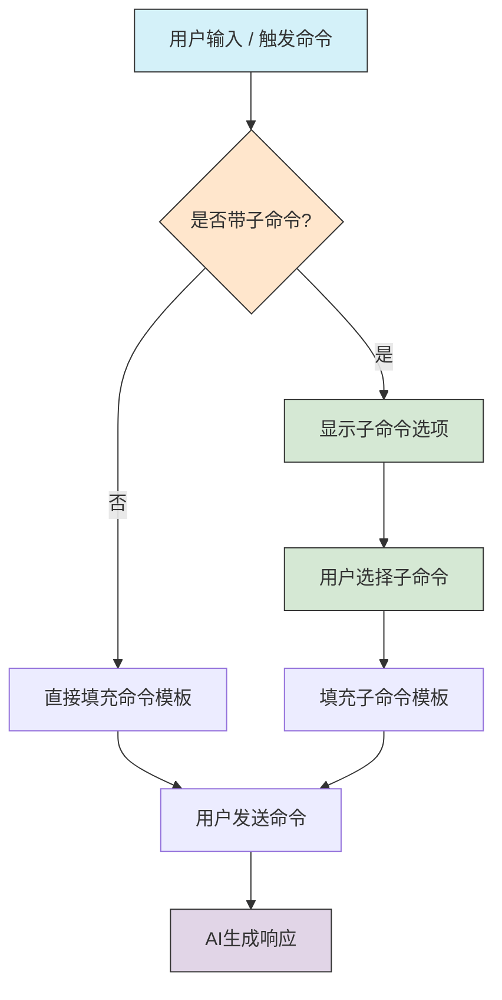
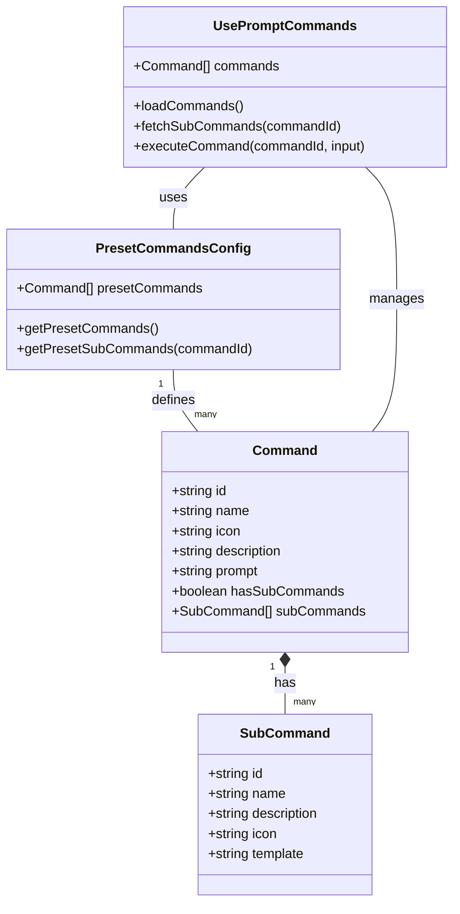

# AI对话助手消息编辑功能

## 功能概述

AI对话助手现在支持编辑已发送的用户消息，并基于编辑后的内容重新生成AI回复。此功能可以帮助用户在发现错误或需要补充信息时，无需重新开始对话。

## 使用方法

1. 将鼠标悬停在任何用户消息上，会显示操作按钮
2. 点击"编辑"按钮（铅笔图标）开始编辑
3. 在文本框中修改消息内容（文本框会根据内容自动调整大小）
4. 点击"发送"按钮提交修改，或点击"取消"放弃修改
5. 发送后，系统会保留原有用户消息（但内容已更新），并基于编辑后的内容重新生成AI回复

## 技术实现

### 数据流程


### 组件交互

1. **用户界面**：ChatBubbleList组件提供编辑界面和用户交互
2. **控制层**：Chat组件处理事件并调用相应的逻辑函数
3. **业务逻辑**：useChat钩子提供编辑消息的核心功能
4. **数据持久化**：编辑后的会话自动保存到IndexedDB

### 核心功能

1. **开始编辑**：将消息状态设置为"editing"，显示编辑界面
2. **保存编辑**：
   - 保存原始消息内容（用于潜在的恢复功能）
   - 更新用户消息内容
   - 标记消息为"已编辑"
   - 删除该消息之后的所有消息
   - 创建新的AI回复消息并生成回复
3. **取消编辑**：恢复消息状态为"completed"，不做任何更改

## 最新更新

- **UI改进**：文本输入框现在会根据内容自动调整大小，最小1行，最大10行
- **按钮文案**：将"保存"按钮改为"发送"，更符合用户习惯
- **流程优化**：编辑后不再创建新的用户消息，而是直接更新原有消息内容

## 注意事项

- 编辑消息会删除该消息之后的所有对话内容，包括AI回复和后续的用户消息
- 编辑功能仅适用于用户消息，不能编辑AI回复
- 编辑过的消息会显示"(已编辑)"标记
- 系统会保存原始消息内容，为将来可能的撤销功能做准备

# AI Assistant Library

AI对话助手前端组件库

## 预设命令系统

AI助手包含一套预设的命令系统，可以通过输入 `/` 来触发命令选择器，选择并使用各种命令。

### 预设命令列表

AI助手内置了以下预设命令：

1. **内容扩写** (`/内容扩写`)
   - 将简短的内容扩展为更详细的文档
   - 适用于丰富草稿内容、扩展文档细节

2. **内容缩写** (`/内容缩写`)
   - 将冗长的内容精简为简洁的摘要
   - 适用于提取文档要点、创建摘要

3. **内容续写** (`/内容续写`)
   - 根据已有内容继续编写后续段落
   - 适用于文档创作、内容延伸

4. **内容重写** (`/内容重写`)
   - 以不同的风格或角度重写现有内容
   - 适用于调整语气、优化表达、改进结构

5. **复杂表单** (`/复杂表单`)
   - 生成企业文档中的各类复杂表格
   - 包含以下子命令：
     - **达标表**：生成符合标准的达标评估表格
     - **偏离表**：生成分析偏离原因与程度的表格

### 命令流程

命令执行流程如下图所示：



### 命令系统架构

命令系统的主要组件关系如下：



### 使用方法

1. 在输入框中输入斜杠 `/` 触发命令菜单
2. 选择所需命令，或继续输入命令名称进行过滤
3. 对于带有子命令的命令，选择后会显示可用的子命令
4. 选择命令后，根据需要提供文本内容或使用已选中的文本
5. 发送命令，AI将根据命令的提示词生成相应内容

### 配置与扩展

预设命令在前端配置，无需依赖后端API。系统使用以下文件进行配置：

- `src/config/presetCommands.ts` - 包含所有预设命令的定义
- `src/components/ai-assistant-library/hooks/usePromptCommands.ts` - 命令系统的核心逻辑

要添加新的预设命令，可以在 `presetCommands.ts` 文件中添加命令定义，系统会自动加载并显示这些命令。

# AI Chat with SSE Streaming

This implementation provides a robust solution for displaying AI chat responses in real-time using Server-Sent Events (SSE) while properly handling Markdown content and addressing common streaming issues.

## Features

- Real-time typing effect for AI responses
- Proper handling of Markdown content with code highlighting
- Robust SSE event parsing
- Handling of incomplete/partial messages
- Clean solution for escaped newlines
- Smooth scrolling and UI updates

## How It Works

### 1. SSE Stream Parser

The core of the implementation is the `sseStreamParser.ts` utility which handles:

- Parsing SSE events from a fetch response stream
- Handling incomplete messages across buffer reads
- Properly accumulating complete messages
- Providing hooks for message updates, completion, and errors

```typescript
// Using the parser in your code
import { fetchSSE } from '@/utils/sseStreamParser';

await fetchSSE('/api/chat', {
  method: 'POST',
  headers: { 'Content-Type': 'application/json' },
  body: JSON.stringify({ messages: [/* your messages */] }),
}, {
  onMessage: (chunk) => {
    // Process each chunk as it arrives
    content += chunk;
    updateUI();
  },
  onComplete: () => {
    // Handle completion
    finishProcessing();
  },
  onError: (error) => {
    // Handle errors
    showErrorMessage(error.message);
  }
});
```

### 2. Addressing Common SSE Issues

#### Partial Messages

The parser accumulates data in a buffer and only processes complete SSE events (those ending with `\n\n`). Any incomplete data is kept in the buffer for the next iteration.

#### Non-standard Format Chunks

By waiting for complete messages with double newlines (`\n\n`), we avoid issues with partial data prefixes like when `"data:"` gets split across chunks.

#### Escaped Newlines in Content

The parser processes complete events rather than splitting on every newline character, preserving escaped newlines (`\n`) in the content.

#### Content Integrity

The implementation preserves the complete content structure by properly handling all edge cases in the SSE stream.

## Components

### StreamingChat.vue

A full-featured chat interface that:
- Shows chat history
- Renders Markdown with code highlighting
- Shows typing indicators
- Provides proper error handling
- Auto-scrolls to new messages

### SSE Parser Utility

A reusable utility that can be used in any project needing SSE streaming capabilities.

## Mock API for Testing

The implementation includes a mock API that simulates streaming responses with configurable delays, allowing for testing without a real backend.

## Usage

1. Import the components:
```typescript
import StreamingChat from '@/components/StreamingChat.vue';
```

2. Use in your template:
```html
<StreamingChat />
```

3. Make sure to include the SSE parser utility and mock API in your project.

## How to Test

1. Try sending a message with the word "markdown" to see formatting examples
2. Try asking about "streaming" or "sse issues" to see an explanation of how the implementation works
3. Observe the real-time typing effect and proper Markdown rendering

## Technical Details

The implementation solves several key challenges:

1. **Parsing SSE format**: Properly handling the `data:` prefix and event boundaries
2. **Buffer management**: Dealing with chunks that might split in the middle of events
3. **Content preservation**: Maintaining newlines and special characters in the content
4. **Reactivity**: Updating the UI smoothly as content arrives
5. **Markdown rendering**: Properly rendering formatted content while it's being received

This approach ensures a smooth, reliable streaming experience with correct rendering of all content.
