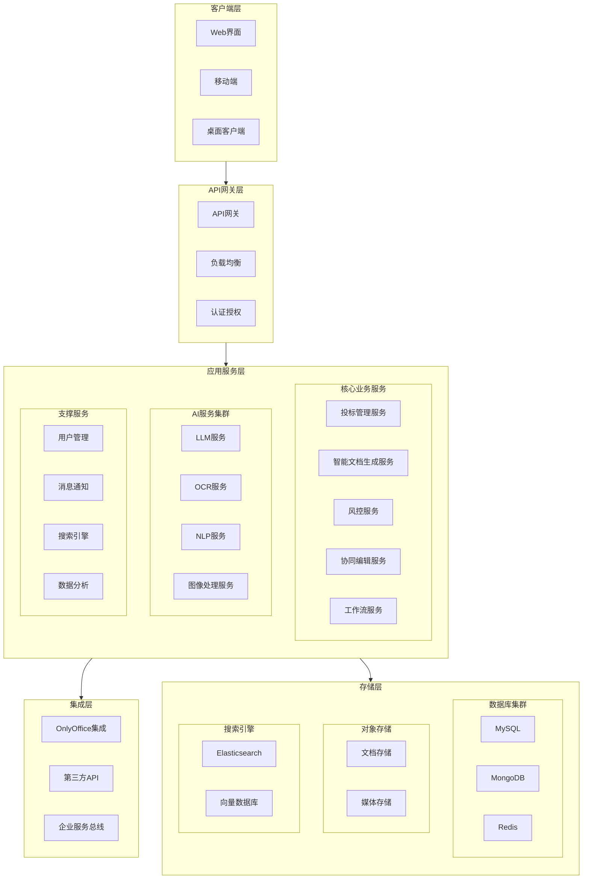
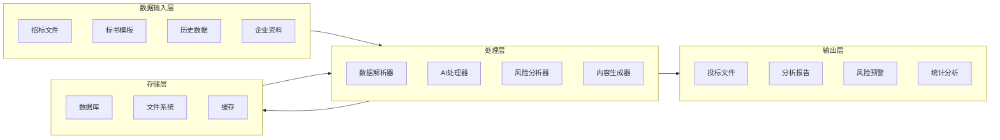
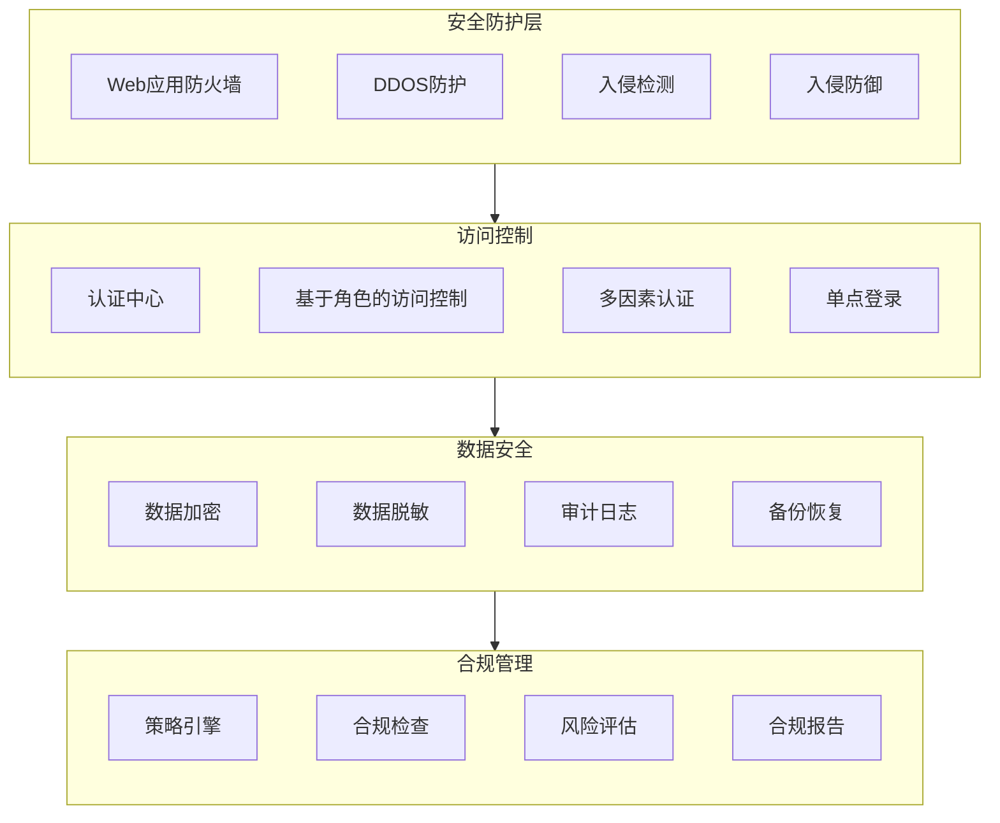
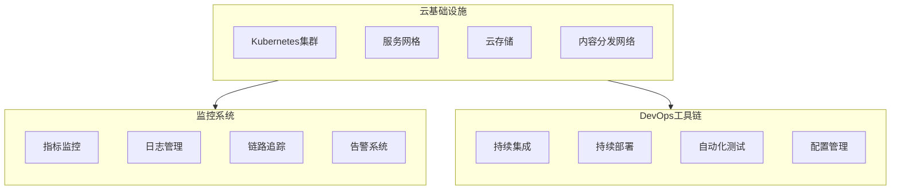

# AI标书管理平台系统架构图

## 整体架构图

```mermaid
graph TB
    subgraph Client["客户端层"]
        WebUI["Web界面"]
        MobileUI["移动端"]
        DesktopUI["桌面客户端"]
    end

    subgraph Gateway["API网关层"]
        APIGateway["API网关"]
        LoadBalancer["负载均衡"]
        Auth["认证授权"]
    end

    subgraph AppServices["应用服务层"]
        direction TB
        subgraph CoreServices["核心业务服务"]
            BidMgmt["投标管理服务"]
            DocGen["智能文档生成服务"]
            RiskControl["风控服务"]
            Collab["协同编辑服务"]
            Workflow["工作流服务"]
        end

        subgraph AIServices["AI服务集群"]
            LLMService["LLM服务"]
            OCR["OCR服务"]
            NLP["NLP服务"]
            ImageProcess["图像处理服务"]
        end

        subgraph SupportServices["支撑服务"]
            UserMgmt["用户管理"]
            NotificationSvc["消息通知"]
            SearchEngine["搜索引擎"]
            Analytics["数据分析"]
        end
    end

    subgraph Integration["集成层"]
        OnlyOffice["OnlyOffice集成"]
        ThirdPartyAPI["第三方API"]
        ESB["企业服务总线"]
    end

    subgraph Storage["存储层"]
        direction TB
        subgraph Databases["数据库集群"]
            MySQL["MySQL"]
            MongoDB["MongoDB"]
            Redis["Redis"]
        end
        
        subgraph ObjectStorage["对象存储"]
            S3["文档存储"]
            MinIO["媒体存储"]
        end

        subgraph Search["搜索引擎"]
            ES["Elasticsearch"]
            VectorDB["向量数据库"]
        end
    end

    Client --> Gateway
    Gateway --> AppServices
    AppServices --> Integration
    AppServices --> Storage
```

## 核心业务模块架构

```mermaid
graph TB
    subgraph BidManagement["投标管理核心模块"]
        direction TB
        ProjectMgmt["项目管理模块"]
        DocEditor["文档编辑模块"]
        RiskWarning["风险预警模块"]
        ComplianceCheck["合规检查模块"]
        BidAnalytics["投标分析模块"]
        KnowledgeBase["知识库管理"]
    end

    subgraph AIEngine["AI引擎模块"]
        direction TB
        LLMCore["LLM核心引擎"]
        RAGSystem["RAG检索增强系统"]
        TextGen["文本生成器"]
        SemanticAnalysis["语义分析器"]
        ImageAnalysis["图像分析器"]
    end

    subgraph DocumentProcessing["文档处理模块"]
        direction TB
        TemplateEngine["模板引擎"]
        ContentExtractor["内容提取器"]
        FormatConverter["格式转换器"]
        VersionControl["版本控制"]
        ChunkManager["分块管理器"]
    end

    subgraph RiskControl["风控系统"]
        direction TB
        RiskModel["风险评分模型"]
        RuleEngine["规则引擎"]
        AlertSystem["预警系统"]
        AuditTrail["审计跟踪"]
    end

    subgraph Collaboration["协同系统"]
        direction TB
        RealTimeEdit["实时编辑"]
        ChangeTracking["变更追踪"]
        CommentSystem["评注系统"]
        ApprovalFlow["审批流程"]
    end

    BidManagement --> AIEngine
    BidManagement --> DocumentProcessing
    BidManagement --> RiskControl
    BidManagement --> Collaboration
```

## 数据流架构

```mermaid
graph LR
    subgraph DataInput["数据输入层"]
        TenderDoc["招标文件"]
        Templates["标书模板"]
        HistoricalData["历史数据"]
        CompanyInfo["企业资料"]
    end

    subgraph Processing["处理层"]
        DataParser["数据解析器"]
        AIProcessor["AI处理器"]
        RiskAnalyzer["风险分析器"]
        ContentGenerator["内容生成器"]
    end

    subgraph Storage["存储层"]
        Database["数据库"]
        FileSystem["文件系统"]
        Cache["缓存"]
    end

    subgraph Output["输出层"]
        BidDoc["投标文件"]
        Reports["分析报告"]
        Warnings["风险预警"]
        Analytics["统计分析"]
    end

    DataInput --> Processing
    Processing --> Storage
    Storage --> Processing
    Processing --> Output
```

## 安全架构

```mermaid
graph TB
    subgraph SecurityLayers["安全防护层"]
        direction TB
        WAF["Web应用防火墙"]
        DDOS["DDOS防护"]
        IDS["入侵检测"]
        IPS["入侵防御"]
    end

    subgraph AccessControl["访问控制"]
        direction TB
        Auth["认证中心"]
        RBAC["基于角色的访问控制"]
        MFA["多因素认证"]
        SSO["单点登录"]
    end

    subgraph DataSecurity["数据安全"]
        direction TB
        Encryption["数据加密"]
        Masking["数据脱敏"]
        Audit["审计日志"]
        Backup["备份恢复"]
    end

    subgraph Compliance["合规管理"]
        direction TB
        PolicyEngine["策略引擎"]
        ComplianceCheck["合规检查"]
        RiskAssessment["风险评估"]
        Reporting["合规报告"]
    end

    SecurityLayers --> AccessControl
    AccessControl --> DataSecurity
    DataSecurity --> Compliance
```

## 部署架构

```mermaid
graph TB
    subgraph CloudInfra["云基础设施"]
        direction TB
        K8s["Kubernetes集群"]
        ServiceMesh["服务网格"]
        CloudStorage["云存储"]
        CDN["内容分发网络"]
    end

    subgraph Monitoring["监控系统"]
        direction TB
        Prometheus["指标监控"]
        Logging["日志管理"]
        Tracing["链路追踪"]
        Alerting["告警系统"]
    end

    subgraph DevOps["DevOps工具链"]
        direction TB
        CI["持续集成"]
        CD["持续部署"]
        Testing["自动化测试"]
        Config["配置管理"]
    end

    CloudInfra --> Monitoring
    CloudInfra --> DevOps
``` 