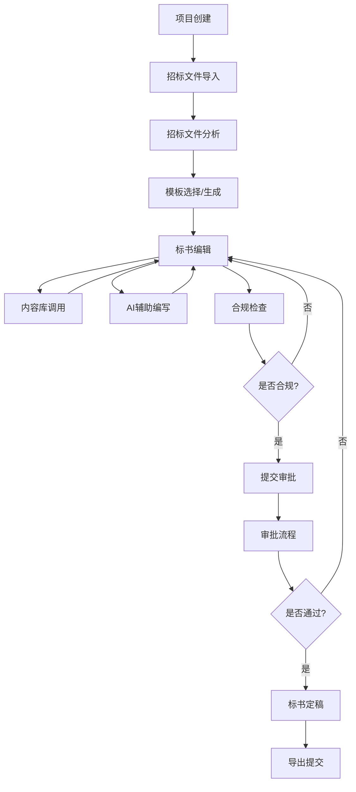
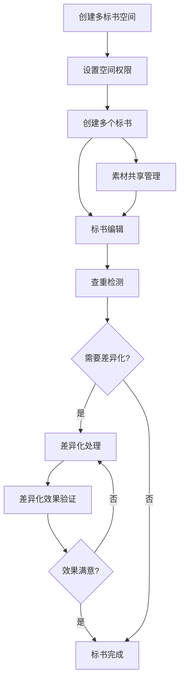
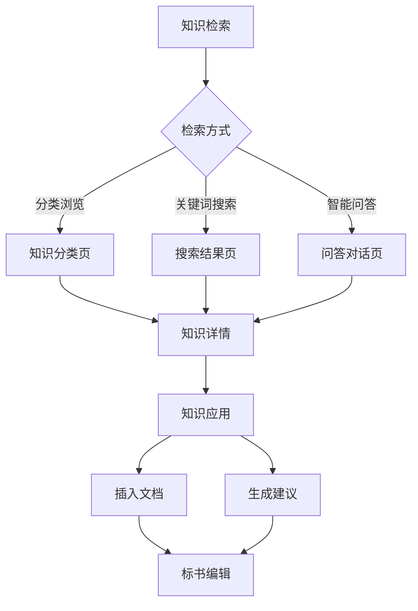

# 标书智能管理平台 - 前端UI结构设计

## 1. 菜单结构设计

### 1.1 主菜单结构

```
├── 仪表盘
├── 项目管理
│   ├── 项目概览
│   ├── 项目创建
│   ├── 项目列表
│   └── 项目看板
├── 标书管理
│   ├── 标书编辑
│   ├── 模板中心
│   ├── 内容库
│   └── 审批中心
├── 智能工具
│   ├── 智能分析
│   ├── 合规检查
│   ├── 风险预警
│   └── 废标分析
├── 陪标管理
│   ├── 多标书空间
│   ├── 查重中心
│   └── 差异化工具
├── 知识中心
│   ├── 法规政策
│   ├── 案例库
│   ├── 行业知识
│   └── 智能问答
├── 数据分析
│   ├── 投标数据
│   ├── 市场分析
│   └── 自定义报表
└── 系统管理
    ├── 用户权限
    ├── 组织架构
    ├── 工作流配置
    ├── 系统集成
    └── AI配置
```

### 1.2 二级菜单与页面关联

#### 1.2.1 仪表盘
- **我的仪表盘**
  - 功能: 个性化数据概览
  - 组件: 自定义卡片、任务进度、项目状态
  - 关联页面: 无二级页面

#### 1.2.2 项目管理
- **项目概览**
  - 功能: 项目全局视图
  - 组件: 项目状态卡、时间轴、团队成员
  - 关联页面: 项目详情、任务详情
- **项目创建**
  - 功能: 新建投标项目
  - 组件: 创建向导、招标文件导入
  - 关联页面: 招标文件分析、模板选择
- **项目列表**
  - 功能: 所有项目管理
  - 组件: 高级筛选表格、批量操作
  - 关联页面: 项目详情
- **项目看板**
  - 功能: 基于状态的项目管理
  - 组件: 拖拽看板、状态流转
  - 关联页面: 项目详情

#### 1.2.3 标书管理
- **标书编辑**
  - 功能: 编辑标书文档
  - 组件: OnlyOffice集成、分块编辑
  - 关联页面: 编辑器、块管理、版本历史
- **模板中心**
  - 功能: 标书模板管理
  - 组件: 模板库、模板编辑器
  - 关联页面: 模板详情、模板编辑
- **内容库**
  - 功能: 企业资料与标准文案管理
  - 组件: 资料分类、快速插入
  - 关联页面: 资料详情、资料编辑
- **审批中心**
  - 功能: 文档审批流程管理
  - 组件: 审批流程图、批注工具
  - 关联页面: 审批详情、批注管理

#### 1.2.4 智能工具
- **智能分析**
  - 功能: AI辅助内容分析
  - 组件: 分析报告、优化建议
  - 关联页面: 分析详情、优化应用
- **合规检查**
  - 功能: 标书合规性检查
  - 组件: 检查报告、问题列表
  - 关联页面: 问题详情、修复向导
- **风险预警**
  - 功能: 标书风险识别与预警
  - 组件: 风险仪表盘、风险清单
  - 关联页面: 风险详情、修改建议
- **废标分析**
  - 功能: 废标案例分析与预防
  - 组件: 废标记录、案例匹配
  - 关联页面: 案例详情、预防建议

#### 1.2.5 陪标管理
- **多标书空间**
  - 功能: 多标书并行管理
  - 组件: 空间管理、统一视图
  - 关联页面: 空间详情、标书对比
- **查重中心**
  - 功能: 标书内容查重
  - 组件: 查重报告、相似度可视化
  - 关联页面: 查重详情、相似内容对比
- **差异化工具**
  - 功能: 内容差异化辅助
  - 组件: 改写工具、差异化建议
  - 关联页面: 改写详情、效果验证

#### 1.2.6 知识中心
- **法规政策**
  - 功能: 招投标法规政策管理
  - 组件: 法规库、更新提醒
  - 关联页面: 法规详情、解读
- **案例库**
  - 功能: 中标/废标案例管理
  - 组件: 案例分类、标签筛选
  - 关联页面: 案例详情、经验总结
- **行业知识**
  - 功能: 行业标准与术语管理
  - 组件: 知识分类、快速查询
  - 关联页面: 知识详情、术语解释
- **智能问答**
  - 功能: 基于知识库的智能问答
  - 组件: 对话界面、知识推荐
  - 关联页面: 问答历史、知识关联

#### 1.2.7 数据分析
- **投标数据**
  - 功能: 投标数据统计分析
  - 组件: 数据仪表盘、趋势图表
  - 关联页面: 指标详情、数据钻取
- **市场分析**
  - 功能: 市场趋势与竞争分析
  - 组件: 市场图表、竞争对手分析
  - 关联页面: 趋势详情、竞争详情
- **自定义报表**
  - 功能: 用户自定义数据分析
  - 组件: 报表设计器、数据筛选
  - 关联页面: 报表详情、数据导出

#### 1.2.8 系统管理
- **用户权限**
  - 功能: 用户与权限管理
  - 组件: 用户列表、角色管理
  - 关联页面: 用户详情、权限配置
- **组织架构**
  - 功能: 部门与组织结构管理
  - 组件: 组织树、部门管理
  - 关联页面: 部门详情、成员管理
- **工作流配置**
  - 功能: 审批工作流定义
  - 组件: 流程设计器、规则配置
  - 关联页面: 流程详情、节点配置
- **系统集成**
  - 功能: 第三方系统集成配置
  - 组件: 集成列表、参数配置
  - 关联页面: 集成详情、日志查看
- **AI配置**
  - 功能: AI服务与参数配置
  - 组件: LLM配置、功能开关
  - 关联页面: 使用统计、提示词管理

## 2. 核心业务流程与界面关系

### 2.1 标书编制流程



#### 界面交互关系
1. **项目创建页面**
   - 交互元素: 创建按钮、表单
   - 跳转关系: → 招标文件导入对话框

2. **招标文件导入对话框**
   - 交互元素: 文件上传、OCR提取
   - 跳转关系: → 招标文件分析页面

3. **招标文件分析页面**
   - 交互元素: 分析结果、关键点标记
   - 跳转关系: → 模板选择页面

4. **模板选择页面**
   - 交互元素: 模板列表、AI生成按钮
   - 跳转关系: → 标书编辑页面

5. **标书编辑页面**
   - 交互元素: 编辑器、目录树、工具栏
   - 跳转关系: → 内容库侧边栏、AI辅助面板、合规检查页面

6. **内容库侧边栏**
   - 交互元素: 资料分类、搜索、插入按钮
   - 跳转关系: → 返回编辑页面

7. **AI辅助面板**
   - 交互元素: 建议列表、应用按钮
   - 跳转关系: → 返回编辑页面

8. **合规检查页面**
   - 交互元素: 问题列表、修复按钮
   - 跳转关系: → 编辑页面或提交审批对话框

9. **提交审批对话框**
   - 交互元素: 审批流程选择、提交按钮
   - 跳转关系: → 审批流程页面

10. **审批流程页面**
    - 交互元素: 流程图、批注列表、审批按钮
    - 跳转关系: → 编辑页面或标书定稿页面

11. **标书定稿页面**
    - 交互元素: 版本信息、导出选项
    - 跳转关系: → 导出对话框

12. **导出对话框**
    - 交互元素: 格式选择、导出按钮
    - 跳转关系: 流程结束

### 2.2 陪标管理流程



#### 界面交互关系
1. **多标书空间管理页面**
   - 交互元素: 创建空间按钮、空间列表
   - 跳转关系: → 空间权限设置对话框

2. **空间权限设置对话框**
   - 交互元素: 用户选择、权限矩阵
   - 跳转关系: → 标书创建页面

3. **标书创建页面**
   - 交互元素: 批量创建选项、模板选择
   - 跳转关系: → 素材共享管理页面、标书编辑页面

4. **素材共享管理页面**
   - 交互元素: 素材列表、共享设置
   - 跳转关系: → 标书编辑页面

5. **查重检测页面**
   - 交互元素: 检测按钮、相似度报告
   - 跳转关系: → 差异化处理页面或标书完成页面

6. **差异化处理页面**
   - 交互元素: 差异化建议、改写工具
   - 跳转关系: → 差异化效果验证页面

7. **差异化效果验证页面**
   - 交互元素: 对比视图、验证结果
   - 跳转关系: → 差异化处理页面或标书完成页面

### 2.3 知识应用流程



#### 界面交互关系
1. **知识中心首页**
   - 交互元素: 分类导航、搜索框、问答入口
   - 跳转关系: → 分类页面、搜索结果页面、问答对话页面

2. **知识分类页面**
   - 交互元素: 分类树、知识列表
   - 跳转关系: → 知识详情页面

3. **搜索结果页面**
   - 交互元素: 结果列表、筛选选项
   - 跳转关系: → 知识详情页面

4. **问答对话页面**
   - 交互元素: 对话框、相关知识推荐
   - 跳转关系: → 知识详情页面

5. **知识详情页面**
   - 交互元素: 内容展示、应用按钮
   - 跳转关系: → 插入文档对话框、生成建议对话框

6. **插入文档对话框**
   - 交互元素: 目标位置选择、插入选项
   - 跳转关系: → 标书编辑页面

7. **生成建议对话框**
   - 交互元素: 建议参数、生成按钮
   - 跳转关系: → 标书编辑页面

## 3. 页面布局与组件关系

### 3.1 主体布局结构

```
+---------------------------------------------------------------+
|                       全局导航栏                               |
+---------------+-----------------------------------------------+
|               |                                               |
|               |                                               |
|               |                                               |
|   侧边菜单栏   |                  内容区域                      |
|               |                                               |
|               |                                               |
|               |                                               |
+---------------+-----------------------------------------------+
|                       全局状态栏                               |
+---------------------------------------------------------------+
```

### 3.2 典型页面布局

#### 3.2.1 列表页面结构

```
+---------------------------------------------------------------+
|  页面标题 + 操作按钮                                           |
+---------------------------------------------------------------+
|  搜索栏 + 筛选条件                                            |
+---------------------------------------------------------------+
|                                                               |
|  数据表格 / 卡片列表                                          |
|                                                               |
+---------------------------------------------------------------+
|  分页控件                                                     |
+---------------------------------------------------------------+
```

#### 3.2.2 详情页面结构

```
+---------------------------------------------------------------+
|  返回 + 页面标题 + 操作按钮                                   |
+---------------------------------------------------------------+
|  基本信息卡片                                                 |
+---------------------------------------------------------------+
|                                                               |
|  Tab页签组                                                    |
|  +-----------------------------------------------------------+|
|  |  Tab内容区域                                              ||
|  |                                                           ||
|  +-----------------------------------------------------------+|
+---------------------------------------------------------------+
```

#### 3.2.3 编辑页面结构

```
+---------------------------------------------------------------+
|  返回 + 页面标题 + 保存按钮                                   |
+---------------------------------------------------------------+
|  +-------------------+-------------------------------------+  |
|  |                   |                                     |  |
|  |  侧边导航/目录     |  编辑区域                           |  |
|  |                   |                                     |  |
|  +-------------------+-------------------------------------+  |
|                                                               |
+---------------------------------------------------------------+
|  底部工具栏                                                   |
+---------------------------------------------------------------+
```

#### 3.2.4 仪表盘页面结构

```
+---------------------------------------------------------------+
|  页面标题 + 时间筛选 + 自定义按钮                             |
+---------------------------------------------------------------+
|  +----------+  +----------+  +----------+  +----------+      |
|  | 卡片 1   |  | 卡片 2   |  | 卡片 3   |  | 卡片 4   |      |
|  +----------+  +----------+  +----------+  +----------+      |
|                                                               |
|  +----------------------------+  +----------------------------+|
|  |                            |  |                            ||
|  | 图表区域 1                 |  | 图表区域 2                 ||
|  |                            |  |                            ||
|  +----------------------------+  +----------------------------+|
|                                                               |
|  +-------------------------------------------------------+    |
|  |                                                       |    |
|  | 数据表格                                              |    |
|  |                                                       |    |
|  +-------------------------------------------------------+    |
+---------------------------------------------------------------+
```

## 4. 用户角色与界面关系

### 4.1 用户角色定义

1. **系统管理员**
   - 权限: 全部功能
   - 主要使用: 系统管理、用户权限、配置管理

2. **项目经理**
   - 权限: 项目管理、标书管理、审批、数据分析
   - 主要使用: 项目创建、项目监控、审批流程

3. **标书编辑人员**
   - 权限: 标书编辑、内容库、智能工具
   - 主要使用: 标书编辑、模板应用、智能辅助

4. **审核人员**
   - 权限: 审批流程、合规检查、评审
   - 主要使用: 审批中心、批注工具、合规检查

5. **知识管理员**
   - 权限: 知识中心、内容库管理
   - 主要使用: 知识维护、案例管理、法规更新

### 4.2 角色对应的菜单可见性

| 菜单项 | 系统管理员 | 项目经理 | 标书编辑人员 | 审核人员 | 知识管理员 |
|--------|------------|----------|-------------|----------|------------|
| 仪表盘 | ✓ | ✓ | ✓ | ✓ | ✓ |
| 项目管理 | ✓ | ✓ | ✓ | ✓ | - |
| 标书管理 | ✓ | ✓ | ✓ | ✓ | - |
| 智能工具 | ✓ | ✓ | ✓ | ✓ | - |
| 陪标管理 | ✓ | ✓ | ✓ | - | - |
| 知识中心 | ✓ | ✓ | ✓ | ✓ | ✓ |
| 数据分析 | ✓ | ✓ | - | - | ✓ |
| 系统管理 | ✓ | - | - | - | - |

### 4.3 角色特定的仪表盘布局

#### 4.3.1 项目经理仪表盘
- 项目状态概览
- 审批待办事项
- 团队工作量统计
- 投标成功率图表
- 近期重要截止日期

#### 4.3.2 标书编辑人员仪表盘
- 个人任务列表
- 编辑中的文档
- 智能工具推荐
- 内容库更新提醒
- 协作动态

#### 4.3.3 审核人员仪表盘
- 待审批文档
- 合规检查统计
- 风险预警提醒
- 审批历史记录
- 法规更新提醒

## 5. 移动端界面规划

### 5.1 移动端核心功能

1. **项目监控**
   - 项目状态查看
   - 关键指标监控
   - 消息通知

2. **审批处理**
   - 查看待审批项
   - 简单审批操作
   - 添加审批意见

3. **文档查看**
   - 标书文档预览
   - 添加简单批注
   - 轻量级编辑

4. **知识查询**
   - 智能问答
   - 知识库检索
   - 法规快查

### 5.2 移动端导航结构

```
底部标签导航:
+---------------+---------------+---------------+---------------+
|    首页       |    项目       |    消息       |    我的       |
+---------------+---------------+---------------+---------------+
```

### 5.3 移动端与桌面端的数据同步

- 实时通知同步
- 审批状态同步
- 文档批注同步
- 任务状态同步 