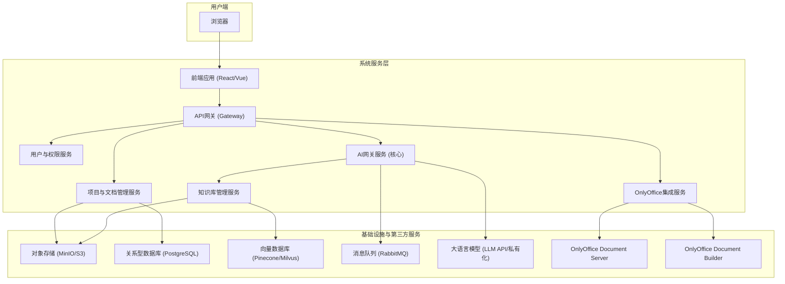
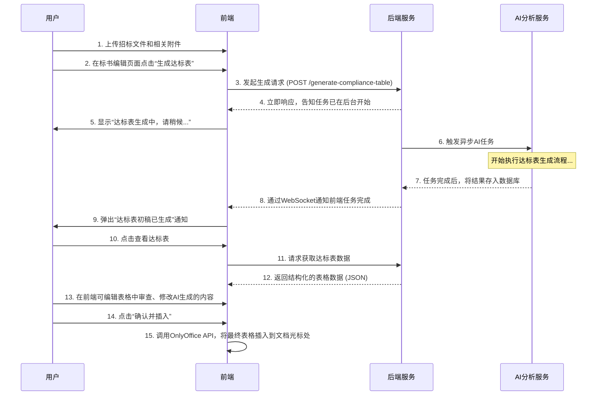
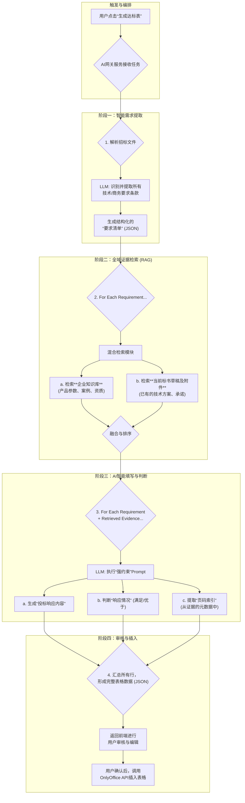

# AI智能标书协同平台 - 核心能力

## 1. 项目概述

### 1.1. 项目目标
​	本项目旨在打造一个基于OnlyOffice的在线标书协同编辑平台。平台将深度融合大语言模型（LLM）能力，解决传统标书制作过程中耗时、易错、协同困难的核心痛点。我们的目标是实现标书内容生成的智能化、审查的自动化和团队协作的高效化。

### 1.2. 核心价值
*   **效率提升**: 通过AI自动生成、填充和润色，将标书撰写时间缩短50%以上。
*   **风险控制**: 通过AI自动进行格式、错别字及废标项检查，最大限度避免因低级错误导致的废标。
*   **知识沉淀**: 将企业的历史项目经验、技术方案和资质文件结构化为可复用的知识库，赋能新项目。
*   **协同无间**: 基于OnlyOffice提供业界顶级的实时在线协同编辑体验。

### 1.3. 目标用户
*   投标项目经理
*   标书制作与撰写人员
*   企业销售与售前团队
*   法务与合规审核人员

---

## 2. 系统顶层设计

### 2.1. 技术架构
本平台采用**微服务架构**，确保各模块职责单一、可独立扩展和维护。

### 2.2. 技术选型

*   **前端**: Vue3 + ElementUI
*   **后端**: Python (FastAPI) 
*   **数据库**: PostgreSQL (业务数据), Pinecone/Milvus (向量数据)
*   **对象存储**: MinIO (文档、知识库源文件)
*   **消息队列**: RabbitMQ (AI任务异步处理)
*   **AI核心**: LangChain / LlamaIndex 框架等, a16z-infra/bge-large-zh-v1.5 (Embedding模型)等
*   **文档处理**: OnlyOffice Document Server (在线编辑), OnlyOffice Document Builder (后端编程修改)
*   **部署**: Docker Compose / Kubernetes

---

## 3. 核心场景技术实现详述

### 场景一：智能内容生成 (以“生成项目经验”为例)

**目标**: 用户在标书中指定位置，根据简单要求（如“近三年银行数据中心案例”），一键生成符合招标文件要求的、图文并茂的项目经验描述。

**技术实现流程**:

1.  **前端触发**: 用户在OnlyOffice编辑器中通过自定义按钮触发“生成项目经验”功能，并在弹窗中输入核心需求。
2.  **后端接收**: API网关将请求转发至**AI网关服务**，任务进入消息队列，立即返回前端“生成中”状态。
3.  **查询重写**: AI网关服务消费任务，首先调用LLM对用户需求进行优化和扩展，例如将“银行数据中心案例”扩展为更丰富的语义关键词。
4.  **混合检索 (RAG)**:
    *   **AI网关服务**调用**知识库管理服务**。
    *   **知识库服务**执行混合检索：
        *   **向量检索**: 在向量数据库(Milvus)中搜索语义最相关的历史项目描述文本块。
        *   **关键词检索**: 在关系型数据库(PostgreSQL)中精确查找项目元数据（如行业=银行，项目类型=数据中心，年份>2022）。
    *   通过RRF算法融合排序，返回最相关的Top-K个项目信息（包含文本描述、项目金额、客户评价、相关图片路径等）。
5.  **强约束Prompt生成**: AI网关服务将检索到的高质量上下文，结合用户原始需求，构建一个“强约束”Prompt，指令LLM严格依据提供的资料生成一段新的项目经验描述。
6.  **LLM生成与引用溯源**:
    *   LLM返回生成的文本内容，并**强制要求其提供内容所引用的来源ID**。
    *   **事实一致性校验**: AI网关服务进行一次快速的交叉验证，确保生成内容中的关键信息（如金额、日期）与引用原文一致。
7.  **前端插入**: AI任务完成后，通过WebSocket通知前端。前端调用OnlyOffice的JavaScript API (`Api.PasteContent`)，将AI生成的、格式化好的内容无缝插入到用户光标所在位置。

---

### 场景二：格式合规性检查

**目标**: 一键分析整篇标书，对照招标文件的格式要求，自动定位并高亮所有不合规之处。

**技术实现流程**:
1.  **规则提取 (首次)**:
    *   用户上传**招标文件**后，**AI网关服务**会对其进行解析，通过特定的Prompt让LLM提取所有格式要求（字体、字号、页边距、行间距等），形成一份结构化的JSON Checklist，存入数据库。
2.  **检查触发**: 用户在标书编辑界面点击“格式合规性检查”。
3.  **文档解析与预处理**:
    *   **OnlyOffice集成服务**通过`Document Builder`在后端打开当前最新版本的**投标书**`.docx`文件。
    *   服务遍历文档的每一个段落、表格和运行块(Run)，将其转换为**保留格式元数据的Markdown或自定义JSON格式**。例如，一个段落被转换为 `{"text": "...", "metadata": {"font": "宋体", "size": "12pt", "is_bold": false}}`。
4.  **逐项比对**: 
    *   AI网关服务加载之前提取的格式Checklist。
    *   遍历Checklist中的每一条规则，再遍历文档的所有切片，使用LLM判断切片是否符合规则。Prompt示例：`“规则：字体为宋体。内容：{"text": "...", "metadata": {"font": "微软雅黑"}}。请判断是否符合规则？”`
5.  **注入书签与生成报告**:
    *   对于每一个不合规的文本片段，AI服务调用`Document Builder`的API，在该位置**动态插入一个唯一的、隐藏的Bookmark**（如`bookmarkId="err-format-uuid1"`）。
    *   所有检查完成后，生成一份包含所有不合规项描述及对应`bookmarkId`的JSON报告。
6.  **前端定位与高亮**:
    *   前端收到报告后，在侧边栏UI中展示所有问题。
    *   当用户点击任一问题时，前端调用OnlyOffice的JavaScript API `Api.GoToBookmark("err-format-uuid1")`，编辑器将**自动滚动并选中**标书中对应的错误位置。

---

### 场景三：废标项（致命缺陷）检查

**目标**: 模拟评标专家，通读招标文件和投标书，找出可能导致直接废标的致命缺陷，如硬性条款未响应、前后矛盾等。

**技术实现流程**:
1.  **硬性条款提取**: 与格式检查类似，AI首先从**招标文件**中提取所有“必须”、“不得”、“要求”、“否则视为无效投标”等硬性条款，形成废标项Checklist。
2.  **多维度检查**: AI网关服务启动一个复合检查任务，包含多个子任务：
    *   **响应度检查**: 遍历Checklist中的每一条，使用RAG在**投标书**中检索是否有内容进行了响应。LLM负责判断响应是否充分。
    *   **矛盾检查**:
        *   **关键信息提取**: AI从投标书中提取所有关键实体信息（如报价总价、工期、法人代表姓名、关键技术参数），存为一个结构化对象。
        *   **交叉验证**: LLM被要求检查这个对象内部以及对象与正文描述之间是否存在逻辑矛盾。例如，`“报价清单总价为500万，但正文承诺函中写的是伍佰零壹万元，请判断是否存在矛盾。”`
    *   **资质文件检查**: AI检查投标文件中提到的所有必需资质（如ISO认证、特定人员证书），再通过RAG在知识库或附件列表中确认是否已上传对应的证明材料。
3.  **高优先级告警**: 废标项检查的结果将以最高优先级的告警形式呈现给用户，清晰说明问题、潜在的严重后果以及在文档中的位置（同样通过注入Bookmark实现定位）。

---

### 场景四：保障事实一致性的核心策略

**目标**: 在所有内容生成场景中，确保AI生成的内容严格忠于企业知识库，杜绝“幻觉”。

**技术实现策略**:
1.  **检索质量是前提**: 采用上文提到的**混合检索**策略，确保检索返回的上下文是最相关、最准确的。
2.  **强约束Prompt**: 设计极其严格的Prompt，明确告知LLM其角色是“信息整合员”而非“创作者”，并提供“如果资料不足，必须回答无法找到”的指令。
3.  **引用溯源 (Citation) - 最关键的防线**:
    *   **强制要求**: 强制LLM的每一个关键论断或数据点都必须附带其来源的ID（即知识库中对应切片的ID）。
    *   **生成后验证 (Post-generation Verification)**: 这是我们系统的“事实检查器”。在LLM返回带引用的回答后，系统会启动一个快速的验证流程：
        *   **For each statement in LLM_output:**
        *   **Retrieve the source_chunk using the citation_id.**
        *   **Call LLM again with a simple prompt: `“Statement: ‘{statement}’. Source: ‘{source_chunk}’. Does the statement factually align with the source? Answer YES or NO.”`**
        *   **If NO, flag the statement as a potential hallucination and require human review.**
4.  **人工反馈闭环**: 用户可以对生成内容的准确性进行评价。被标记为“不准确”的内容及其上下文将被记录下来，用于未来对Prompt进行迭代优化或对模型进行微调。

---

### 场景五：AI自动生成达标表 (核心功能)

**目标**: 实现“一键生成达标表”功能。系统需自动、完整地解析招标文件的要求，智能匹配企业知识库与当前标书草稿中的响应内容，并生成一个包含精确页码索引的达标表初稿，供用户审核与一键插入。

#### 5.1. 业务流程图

#### 5.2. 技术实现图及详述

**技术实现详述**:

1.  **智能需求提取**: 
    *   当任务启动，**AI网关服务**首先对用户上传的**招标文件**进行深度解析。它会使用一个专门训练过的Prompt，让LLM扮演“标书需求分析专家”的角色，从复杂的自然语言描述中，精准地抽取出所有需要被一一响应的、可量化的技术和商务要求，并形成一个包含`requirementId`和`description`的JSON数组，即“要求清单”。

2.  **全域证据检索**: 
    *   系统遍历“要求清单”中的每一项。对于每一项要求（例如，“服务器内存需≥64GB”），**混合检索模块**会并发地在两个数据源中进行搜索：
        *   **企业知识库**: 通过向量和关键词检索，查找产品手册中关于服务器内存的规格说明、过往项目中类似配置的描述等。
        *   **当前项目文档**: 对用户已经上传或编写的**投标书草稿**及其所有附件进行实时索引，从中查找相关的承诺和描述。
    *   这一步的核心是**确保证据的全面性**，既利用了标准化的复用知识，也兼顾了本次投标的个性化内容。

3.  **AI智能填写与判断**: 
    *   检索到的最相关的证据片段（包含其**元数据，尤其是来源文件名和页码**）会和原始要求一起，被打包成一个精密的“强约束”Prompt，发送给LLM。
    *   LLM的任务被严格限定：
        *   **生成响应内容**: 根据证据，总结出一句专业的响应描述。例：“本次投标配置的XX服务器内存为128GB，满足要求。”
        *   **判断响应情况**: 对比要求和证据，给出“满足”或“优于”的判断。
        *   **提取页码索引**: 从证据的元数据中，准确无误地提取出来源信息。例：“详见《技术方案分册》第25页”或“详见附件三《XX产品白皮书》第8页”。

4.  **审核与插入**: 
    *   所有要求处理完毕后，一个完整的达标表数据（JSON格式）就生成了。**AI网关服务**将其存入数据库，并通知前端。
    *   前端获取该JSON数据，并渲染成一个**可交互、可编辑的表格**，让用户进行最终的审核和微调。
    *   用户确认无误后，前端调用OnlyOffice的 `Api.InsertTable()` 方法，将数据填充到一个新创建的表格中，并直接插入到当前文档的光标位置，完成闭环。

#### 5.3. 关键挑战与解决方案
*   **挑战1：页码索引的准确性**
    *   **解决方案**: 在文档入库进行切片和向量化时，必须使用能够提取精确元数据的解析工具（如Unstructured.io）。每个文本块(chunk)的元数据中必须包含其原始的`source_document`和`page_number`。这是确保索引准确无误的基石。
*   **挑战2：如何处理未找到证据的条款**
    *   **解决方案**: 如果AI对某一条款未能找到任何相关证据，不能“凭空捏造”。系统应在该行的“响应内容”中自动填充“待补充”，并在“响应情况”中标注为“待确认”，以高亮形式提醒用户必须手动处理此项。
*   **挑战3：需求的复杂性与多样性**
    *   **解决方案**: 持续优化用于“需求提取”的Prompt，并通过Few-shot Learning的方式，给LLM提供多种复杂需求的示例，提升其在真实场景下识别各种隐含、非标需求的能力。

---

## 4. 非功能性需求

*   **安全性**:
    *   所有数据传输使用TLS加密。
    *   文档和知识库数据在对象存储中进行静态加密。
    *   提供私有化部署方案，确保企业数据不出内网。
    *   基于角色的精细化访问控制（RBAC）。
*   **性能**:
    *   所有AI分析任务必须异步处理，确保前端无阻塞。
    *   对高频查询的知识库内容和AI结果建立缓存机制。
*   **可扩展性**:
    *   微服务架构允许对高负载服务（如AI网关、OnlyOffice）进行独立水平扩展。

---
**说明书完**