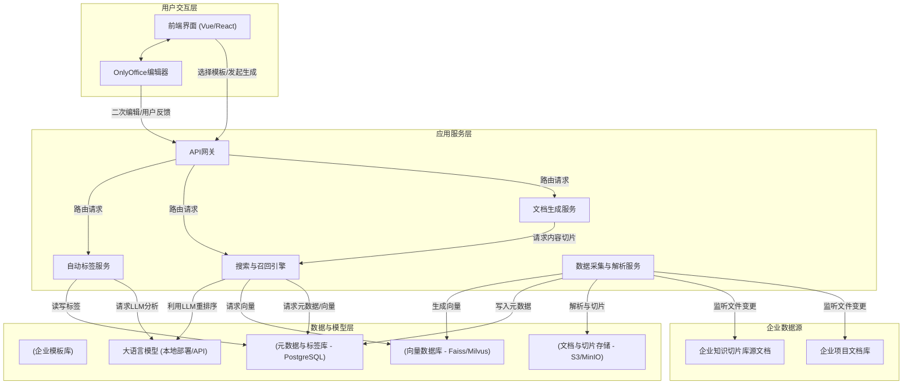

# 文档智能辅助生成系统：实现方案

## 1. 核心目标与执行摘要

**核心目标：** 基于企业现有的知识资产（标准化模板、项目文档库、知识切片库），构建一个智能辅助生成系统。该系统需支持**全自动**和**半自动**两种模式，将高度相关、保留原始样式的素材切片精准插入至选定模板的指定位置，快速生成符合最新企业规范的、可直接交付的Word文档。

**执行摘要：** 本方案提出一个多层次、模块化的系统架构，以应对文档智能生成的挑战。方案核心是**一个以规则为主、AI为辅的多级召回引擎**，确保内容召回的精准性、合规性和相关性。系统将实现数据的自动化采集、深度解析与多维度标签化，并通过先进的文档处理技术，确保最终生成文档的格式保真性。同时，方案涵盖了从用户交互、安全合规到分阶段实施的完整路线图，旨在打造一个高效、安全且可持续优化的企业级文档自动化解决方案。

---

## 2. 系统架构设计

### 2.1. 总体架构图



### 2.2. 核心模块分解

1.  **数据采集与解析服务 (Ingest Service):**
    *   **职责:** 自动监控、获取、解析、切片并存储所有相关的企业文档。
    *   **关键技术:** 文件系统监听、文档格式解析（Tika, python-docx, PyMuPDF）、内容切片算法、异步任务队列（Celery/RabbitMQ）。

2.  **自动标签服务 (Tagging Service):**
    *   **职责:** 为项目、文档、章节、段落等各粒度内容生成全面、精准的标签。
    *   **关键技术:** 规则引擎、自然语言处理（NLP）、主题建模、关键词提取、大语言模型（LLM）API。

3.  **搜索与召回引擎 (Recall Engine):**
    *   **职责:** 实现核心的五级召回策略，精准定位最相关的内容切片。
    *   **关键技术:** 混合搜索（关键词+向量）、加权排序算法、LLM重排序。

4.  **文档生成服务 (Generation Service):**
    *   **职责:** 将召回的内容切片无损地插入到目标模板中，生成最终的Word文档。
    *   **关键技术:** OpenXML SDK (`.NET`) 或 `python-docx` (`Python`)、`pandoc`（用于格式转换）、模板处理引擎。

5.  **前端与编辑器集成:**
    *   **职责:** 提供用户操作界面，集成OnlyOffice进行文档的二次编辑与反馈。
    *   **关键技术:** Vue/React、OnlyOffice Document Server API。

### 2.3. 技术栈推荐

| 模块/层面         | 推荐技术                                     | 备注                                           |
| ----------------- | -------------------------------------------- | ---------------------------------------------- |
| **前端**          | Vue 3 + TypeScript, Element Plus/Ant Design  | 成熟稳定，生态丰富。                           |
| **后端**          | Python (FastAPI/Django) 或 .NET Core         | Python拥有强大的NLP和ML生态，.NET在文档处理上具优势。 |
| **向量数据库**    | Milvus / Faiss                               | 高性能向量检索。                               |
| **元数据数据库**  | PostgreSQL                                   | 强大的关系型数据库，支持JSONB存储灵活元数据。  |
| **文件存储**      | MinIO / Ceph / 阿里云OSS                     | 分布式对象存储，便于扩展。                     |
| **大语言模型**    | ChatGLM, Llama等 (本地私有化部署)            | 保证数据安全与合规。                           |
| **文档处理**      | `python-docx`, `PyMuPDF`, `pandoc`, Apache Tika | 处理多种文档格式。                             |
| **任务队列**      | Celery + RabbitMQ/Redis                      | 处理耗时的数据采集与解析任务。                 |
| **编辑器**        | OnlyOffice Document Server                   | 提供强大的在线Word编辑能力。                   |

---

## 3. 核心模块实现详解

### 3.1. 数据采集与知识库构建

此模块的目标是构建一个持续更新、结构化、标签丰富的知识库。

1.  **自动化文档同步:**
    *   部署一个后台服务，使用`watchdog` (Python)等库实时监控企业项目文档库和知识库源文件夹。
    *   当检测到新文件创建、旧文件更新时，触发异步解析任务。

2.  **深度解析与“带样式”切片:**
    *   **Word文档 (.docx):** 使用`python-docx`库进行解析。**关键点：** 按章节（如`<h1>`, `<h2>`等标题）进行切片。为保证“原样插入”，每个切片将保存为一个独立的、小型的`.docx`文件。这样做可以100%保留原始样式、图片、表格和排版。
    *   **PDF文档 (.pdf):** 使用`PyMuPDF`提取文本和图片。由于PDF格式的复杂性，样式保留是难点。优先提取文本内容，对于图表则尽力提取为图片。
    *   **Markdown文档 (.md):** 纯文本，易于解析。

3.  **存储策略:**
    *   **文件存储 (MinIO):** 存储原始文档、切片后的`.docx`文件块、提取出的图片等。
    *   **元数据与标签库 (PostgreSQL):**
        *   `documents`表：存储文档元数据（`doc_id`, `doc_title`, `project_id`, `bu`, `category`, `doc_type`, `version`, `source_path`, `created_at`）。
        *   `chunks`表：存储切片信息（`chunk_id`, `doc_id`, `chunk_type` (章节/段落), `chunk_title`, `storage_path` (指向MinIO中的文件块), `text_content_hash`）。
        *   `tags`表 和 `chunk_tags`关联表：实现多维度标签。
    *   **向量数据库 (Milvus):** 存储每个`chunk_id`对应的文本内容嵌入（Embedding）。

### 3.2. 自动化多维度标签服务

1.  **规则化标签提取:**
    *   从文档的存储路径中提取标签，如 `/BU-A/品类-B/子品类-C/项目-D/技术方案.docx` 可自动提取 `BU`, `品类`, `子品类`, `项目` 等标签。
    *   读取Word文档的内置属性（作者、标题、摘要等）。

2.  **AI辅助标签生成:**
    *   对每个切片的文本内容，调用LLM进行分析。
    *   **Prompt示例:**
        ```
        你是一个文档分析专家。请根据以下文本内容，提取其核心主题和关键词，并将其分类到以下维度：[技术领域, 业务功能, 关键组件]。如果内容是一个解决方案，请明确指出它解决了什么问题。
        
        文本内容：
        "{chunk_text_content}"
        
        输出格式（JSON）：
        {
          "themes": ["...", "..."],
          "keywords": ["...", "..."],
          "classifications": {
            "tech_domain": "...",
            "business_function": "...",
            "key_component": "..."
          },
          "problem_solved": "..."
        }
        ```
    *   将LLM返回的结构化信息作为标签存入`tags`表。

3.  **动态标签/分类创建:**
    *   当LLM返回一个新的、不存在于`tags`表中的标签时，系统应自动创建该标签及其所属分类，确保知识体系的动态扩展。

### 3.3. 搜索与召回引擎

这是系统的“大脑”，严格按照五级策略执行。

#### 3.3.1. 定义“相关度”

相关度不是单一维度，而是一个综合加权分数，确保召回结果的精准性。

**`RelevanceScore = w1 * MetadataScore + w2 * SemanticScore + w3 * RecencyScore`**

*   **`MetadataScore` (元数据匹配分, w1=0.5):**
    *   基于标签的匹配度。完全匹配`BU`, `子产品`, `文档类型`, `章节标题`等关键标签的切片获得高分。这是规则化强相关性的核心保证。
*   **`SemanticScore` (语义相似分, w2=0.3):**
    *   基于向量的余弦相似度。将被检索的章节标题/描述生成Embedding，与向量库中的切片进行比对。
*   **`RecencyScore` (新近度分, w3=0.2):**
    *   一个随时间衰减的分数，确保优先召回最新版本的文档内容。`Score = exp(-k * days_since_creation)`.

#### 3.3.2. 实现五级召回策略

这是一个串行执行的流程，上一级未命中时，进入下一级。

1.  **级别一：当前项目内优先**
    *   **查询逻辑:** `SELECT * FROM chunks WHERE doc_id IN (SELECT doc_id FROM documents WHERE project_id = :current_project_id) ORDER BY RelevanceScore DESC LIMIT 1;`
    *   **说明:** 在当前项目的所有文档切片中，计算相关度分数，取最高者。

2.  **级别二：同类项目近期内容**
    *   **查询逻辑:** `SELECT * FROM chunks WHERE doc_id IN (SELECT doc_id FROM documents WHERE bu = :current_bu AND sub_product = :current_sub_product AND project_id != :current_project_id AND status = 'completed') ORDER BY document_creation_date DESC, RelevanceScore DESC LIMIT 1;`
    *   **说明:** 范围缩小到同BU、同子产品的已完结项目，按项目完结时间倒序、再按相关度排序，取最高者。

3.  **级别三：其他项目最新内容**
    *   **查询逻辑:** `SELECT * FROM chunks WHERE doc_id IN (SELECT doc_id FROM documents WHERE doc_type = :current_doc_type) ORDER BY document_version DESC, RelevanceScore DESC LIMIT 1;`
    *   **说明:** 在所有项目中，寻找相同文档类型的切片，按文档版本和相关度排序，取最高者。

4.  **级别四：企业知识库（RAG + LLM Re-rank）**
    *   **第一步 (向量检索):** 基于当前要填充的章节标题和上下文，生成一个描述性的搜索查询（例如：“关于在金融系统中实现高并发交易处理的技术方案章节”），在整个知识库向量数据库中进行Top-K（如K=10）的向量召回。
    *   **第二步 (LLM 重排序):** 将召回的10个候选切片的文本内容提交给LLM。**关键：** 此处不让LLM生成内容，只让它做选择题，以满足“不加工”的要求。
    *   **Prompt示例:**
        ```
        你是一个信息检索专家。我正在编写一份关于“{当前文档主题}”的文档，需要为“{当前章节标题}”这一章节寻找最相关的内容。以下是10个候选文本块，请判断哪一个与我的需求最相关。请只返回最相关文本块的ID（例如 'chunk_id_123'），不要进行任何解释或修改。
        
        Context: 
        我当前的项目是“{项目描述}”，属于“{BU}”部门的“{子产品}”线。
        
        Candidates:
        - chunk_id_123: "{文本内容...}"
        - chunk_id_456: "{文本内容...}"
        ...
        
        最相关的Chunk ID是：
        ```
    *   根据LLM返回的ID，确定最终召回的切片。

5.  **级别五：未找到**
    *   若以上四级均无结果，则向前端返回“未找到相关内容”的提示，在半自动模式下允许用户手动编写或从其他地方粘贴。

### 3.4. 文档生成服务

1.  **模板处理:** 加载用户选择的企业标准化`.docx`模板。模板中应包含可识别的占位符（例如 `[INSERT_CHAPTER_1]`）。

2.  **内容无损插入:**
    *   当召回一个内容切片时（它是一个独立的`.docx`文件），使用OpenXML SDK或`python-docx`的底层API，读取该切片文件的XML结构。
    *   在主模板文档中找到对应的占位符，将其替换为切片文件的完整XML内容。这是实现图片、表格、样式**100%保真**的关键。

3.  **格式转换:**
    *   对于从PDF或Markdown召回的内容，先通过`pandoc`命令行工具将其转换为`.docx`格式：`pandoc source.md -o output.docx`。
    *   然后将这个新生成的`output.docx`作为切片文件，执行上述的无损插入逻辑。**需告知用户：** 跨格式转换可能存在样式兼容性问题。

4.  **目录更新:** 所有内容插入完毕后，必须程序化地指示Word在打开时更新目录（TOC）域，以确保页码和章节标题的正确性。

### 3.5. 前端与OnlyOffice集成

1.  **交互模式:**
    *   **全自动:** 用户选择模板后，后端自动完成所有章节的召回和填充，直接生成完整文档。
    *   **半自动:** 系统逐个章节进行召回。如果找到内容，会向用户展示召回内容的预览，并提供“采纳”、“跳过”、“手动编辑”选项。如果未找到，直接提示用户手动编辑。

2.  **OnlyOffice集成:**
    *   生成后的`.docx`文档加载到嵌入式OnlyOffice编辑器中。
    *   在编辑器界面旁，提供一个反馈工具栏。用户可以选中某段AI填充的内容，点击“不相关”或“版本错误”等按钮。
    *   该反馈数据将回传给后端，用于未来优化`RelevanceScore`的权重和召回模型的 fine-tuning。

---

## 4. 安全与合规方案

1.  **权限控制 (RBAC):**
    *   **角色定义:** 定义“系统管理员”、“BU管理员”、“项目经理”、“普通用户”等角色。
    *   **数据隔离:** 实施严格的数据访问策略。用户默认只能访问自己所在项目、所在BU的文档。高级别角色可配置更广泛的访问权限。所有数据库查询都必须强制加入权限过滤条件。

2.  **数据安全:**
    *   **传输加密:** 所有API通信、与数据库和对象存储的连接均使用TLS 1.3加密。
    *   **存储加密:** 对对象存储(MinIO)和数据库(PostgreSQL)启用静态数据加密。
    *   **敏感信息:** 实施敏感信息检测流程，对于包含PII或高度机密的文档，在标签中进行特殊标记，并限制其召回范围。

3.  **审计日志:**
    *   记录所有关键操作：文档生成、内容召回、用户编辑、权限变更等。
    *   日志包含操作人、时间、IP地址、操作对象等信息，便于追溯与审计。

---

## 5. 实施路线图 (分阶段交付)

1.  **第一阶段 (MVP - 核心功能验证, ~3个月):**
    *   **目标:** 跑通核心流程，验证方案可行性。
    *   **内容:**
        *   手动上传文档和模板。
        *   实现数据解析和基于规则的标签。
        *   实现**级别1-3**的规则化召回引擎。
        *   实现基于`.docx`切片的内容无损插入。
        *   集成OnlyOffice进行文档预览。

2.  **第二阶段 (自动化与AI增强, ~3个月):**
    *   **目标:** 减少人工操作，引入AI能力。
    *   **内容:**
        *   开发自动化文档同步服务。
        *   集成LLM实现AI辅助标签和**级别4**的RAG召回。
        *   开发半自动交互模式，允许用户选择和干预。
        *   初步实现PDF和Markdown的格式转换。

3.  **第三阶段 (企业级完善, ~2个月):**
    *   **目标:** 提升系统安全性、健壮性和用户体验。
    *   **内容:**
        *   全面实施RBAC权限控制模型。
        *   建立完整的用户反馈闭环，数据可用于模型优化。
        *   开发系统监控和审计后台。
        *   对召回和生成性能进行深度优化。

---

## 6. 结论

本方案通过模块化的设计、以规则为主AI为辅的召回策略、以及对内容样式保真的技术处理，为构建一个企业级文档智能辅助生成系统提供了全面、可行、且可扩展的蓝图。遵循此方案，能够有效利用企业现有知识资产，大幅提升标准化文档的编写效率和规范性，同时保证了企业数据的安全可控。

