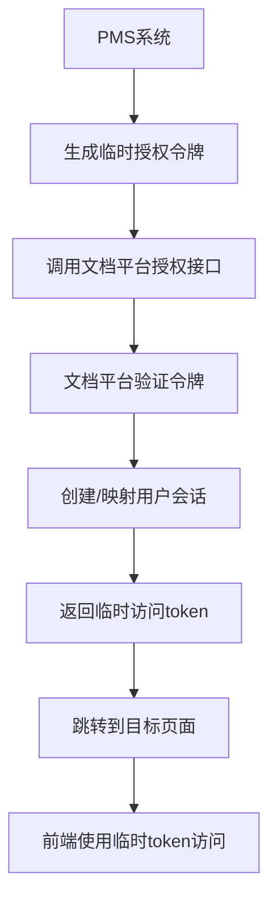

# PMS系统与文档协作平台对接技术方案

## 1. 背景分析

### 1.1 现状描述

**PMS系统**：
- 基于LDAP认证的项目管理系统
- 用户身份和权限已通过LDAP验证
- 需要唤起文档协作平台的特定功能页面

**文档协作平台**：
- 自建用户体系和权限管理
- 数据结构：分类 -> 项目 -> 文档的层级关系
- 基于Vue3 + Spring Boot的单体应用架构
- 当前使用localStorage存储token进行身份验证

### 1.2 核心需求

1. **跨系统身份认证**：PMS系统用户能够无缝访问文档平台功能
2. **数据层级传递**：正确传递分类、项目、文档的层级关系
3. **权限控制一致性**：确保跨系统访问的权限控制
4. **避免登录拦截**：防止因token缺失导致的登录页面跳转

### 1.3 问题分析

**原方案中的不合理之处**：

1. **APP Key认证的局限性**：
   - APP Key只能验证系统身份，无法传递具体用户信息
   - 无法解决用户级别的权限控制问题
   - 不符合"分类->项目->文档"的用户权限体系

2. **前端token检查冲突**：
   - Vue3前端路由守卫会检查localStorage中的token
   - APP Key无法替代用户token进行前端状态管理
   - 会导致未登录状态被拦截到登录页面

3. **权限映射复杂性**：
   - LDAP用户与文档平台用户体系的映射关系复杂
   - 需要维护两套权限体系的同步机制

## 2. 技术方案设计

### 2.1 整体架构

采用**临时授权令牌 + 用户映射**的方案，避免引入第三方服务：



### 2.2 核心组件

1. **临时授权令牌服务**：生成和验证跨系统访问令牌
2. **用户映射服务**：LDAP用户与文档平台用户的映射
3. **权限同步服务**：同步和转换权限信息
4. **前端路由增强**：支持临时token的路由守卫

## 3. 详细实现方案

### 3.1 后端实现

#### 3.1.1 临时授权令牌实体

```java
// src/main/java/com/jjw/biaoshu/entity/TempAuthToken.java
package com.jjw.biaoshu.entity;

import javax.persistence.*;
import java.time.LocalDateTime;

@Entity
@Table(name = "temp_auth_tokens")
public class TempAuthToken {
    @Id
    @GeneratedValue(strategy = GenerationType.IDENTITY)
    private Long id;

    @Column(name = "token", unique = true, nullable = false)
    private String token;

    @Column(name = "source_system", nullable = false)
    private String sourceSystem; // PMS

    @Column(name = "source_user_id", nullable = false)
    private String sourceUserId; // LDAP用户ID

    @Column(name = "source_username", nullable = false)
    private String sourceUsername; // LDAP用户名

    @Column(name = "target_path")
    private String targetPath; // 目标页面路径

    @Column(name = "context_data", columnDefinition = "TEXT")
    private String contextData; // JSON格式的上下文数据

    @Column(name = "expires_at", nullable = false)
    private LocalDateTime expiresAt;

    @Column(name = "used", nullable = false)
    private Boolean used = false;

    @Column(name = "created_at", nullable = false)
    private LocalDateTime createdAt;

    // 构造函数、getter、setter省略
}
```

#### 3.1.2 用户映射实体

```java
// src/main/java/com/jjw/biaoshu/entity/UserMapping.java
package com.jjw.biaoshu.entity;

import javax.persistence.*;
import java.time.LocalDateTime;

@Entity
@Table(name = "user_mappings")
public class UserMapping {
    @Id
    @GeneratedValue(strategy = GenerationType.IDENTITY)
    private Long id;

    @Column(name = "ldap_user_id", unique = true, nullable = false)
    private String ldapUserId;

    @Column(name = "ldap_username", nullable = false)
    private String ldapUsername;

    @Column(name = "platform_user_id")
    private String platformUserId;

    @Column(name = "platform_username")
    private String platformUsername;

    @Column(name = "user_info", columnDefinition = "TEXT")
    private String userInfo; // JSON格式的用户信息

    @Column(name = "permissions", columnDefinition = "TEXT")
    private String permissions; // JSON格式的权限信息

    @Column(name = "created_at", nullable = false)
    private LocalDateTime createdAt;

    @Column(name = "updated_at")
    private LocalDateTime updatedAt;

    // 构造函数、getter、setter省略
}
```

#### 3.1.3 临时授权服务

```java
// src/main/java/com/jjw/biaoshu/service/TempAuthService.java
package com.jjw.biaoshu.service;

import com.jjw.biaoshu.entity.TempAuthToken;
import com.jjw.biaoshu.entity.UserMapping;
import org.springframework.stereotype.Service;
import org.springframework.transaction.annotation.Transactional;

import java.time.LocalDateTime;
import java.util.UUID;
import java.util.Map;

@Service
public class TempAuthService {

    private final TempAuthTokenRepository tempAuthTokenRepository;
    private final UserMappingService userMappingService;
    private final JwtTokenService jwtTokenService;

    public TempAuthService(TempAuthTokenRepository tempAuthTokenRepository,
                          UserMappingService userMappingService,
                          JwtTokenService jwtTokenService) {
        this.tempAuthTokenRepository = tempAuthTokenRepository;
        this.userMappingService = userMappingService;
        this.jwtTokenService = jwtTokenService;
    }

    /**
     * 生成临时授权令牌
     */
    public String generateTempToken(String sourceSystem, String sourceUserId,
                                   String sourceUsername, String targetPath,
                                   Map<String, Object> contextData) {
        String token = UUID.randomUUID().toString().replace("-", "");

        TempAuthToken tempToken = new TempAuthToken();
        tempToken.setToken(token);
        tempToken.setSourceSystem(sourceSystem);
        tempToken.setSourceUserId(sourceUserId);
        tempToken.setSourceUsername(sourceUsername);
        tempToken.setTargetPath(targetPath);
        tempToken.setContextData(JsonUtils.toJson(contextData));
        tempToken.setExpiresAt(LocalDateTime.now().plusMinutes(10)); // 10分钟有效期
        tempToken.setCreatedAt(LocalDateTime.now());

        tempAuthTokenRepository.save(tempToken);
        return token;
    }

    /**
     * 验证并消费临时令牌
     */
    @Transactional
    public AuthResult validateAndConsumeTempToken(String token) {
        TempAuthToken tempToken = tempAuthTokenRepository.findByToken(token);

        if (tempToken == null) {
            throw new IllegalArgumentException("Invalid temp token");
        }

        if (tempToken.getUsed()) {
            throw new IllegalArgumentException("Temp token already used");
        }

        if (tempToken.getExpiresAt().isBefore(LocalDateTime.now())) {
            throw new IllegalArgumentException("Temp token expired");
        }

        // 标记为已使用
        tempToken.setUsed(true);
        tempAuthTokenRepository.save(tempToken);

        // 获取或创建用户映射
        UserMapping userMapping = userMappingService.getOrCreateUserMapping(
            tempToken.getSourceUserId(),
            tempToken.getSourceUsername()
        );

        // 生成正式的访问token
        String accessToken = jwtTokenService.generateToken(userMapping);

        return new AuthResult(accessToken, userMapping, tempToken.getTargetPath(),
                             tempToken.getContextData());
    }
}
```

#### 3.1.4 用户映射服务

```java
// src/main/java/com/jjw/biaoshu/service/UserMappingService.java
package com.jjw.biaoshu.service;

import com.jjw.biaoshu.entity.UserMapping;
import org.springframework.stereotype.Service;

import java.time.LocalDateTime;
import java.util.Arrays;
import java.util.List;

@Service
public class UserMappingService {

    private final UserMappingRepository userMappingRepository;

    public UserMappingService(UserMappingRepository userMappingRepository) {
        this.userMappingRepository = userMappingRepository;
    }

    /**
     * 获取或创建用户映射
     */
    public UserMapping getOrCreateUserMapping(String ldapUserId, String ldapUsername) {
        UserMapping mapping = userMappingRepository.findByLdapUserId(ldapUserId);

        if (mapping == null) {
            mapping = createUserMapping(ldapUserId, ldapUsername);
        } else {
            // 更新最后访问时间
            mapping.setUpdatedAt(LocalDateTime.now());
            userMappingRepository.save(mapping);
        }

        return mapping;
    }

    /**
     * 创建新的用户映射
     */
    private UserMapping createUserMapping(String ldapUserId, String ldapUsername) {
        UserMapping mapping = new UserMapping();
        mapping.setLdapUserId(ldapUserId);
        mapping.setLdapUsername(ldapUsername);

        // 生成平台用户ID（可以与LDAP用户ID相同，或者生成新的）
        mapping.setPlatformUserId("platform_" + ldapUserId);
        mapping.setPlatformUsername(ldapUsername);

        // 设置默认用户信息
        UserInfo userInfo = new UserInfo();
        userInfo.setName(ldapUsername);
        userInfo.setRole("EXTERNAL_USER");
        userInfo.setDepartment("外部系统用户");
        userInfo.setEmail(ldapUsername + "@external.com");
        mapping.setUserInfo(JsonUtils.toJson(userInfo));

        // 设置默认权限（可以根据LDAP用户信息动态设置）
        List<String> permissions = Arrays.asList(
            "project:view",
            "document:view",
            "document:edit"
        );
        mapping.setPermissions(JsonUtils.toJson(permissions));

        mapping.setCreatedAt(LocalDateTime.now());
        mapping.setUpdatedAt(LocalDateTime.now());

        return userMappingRepository.save(mapping);
    }
}
```

#### 3.1.5 授权控制器

```java
// src/main/java/com/jjw/biaoshu/controller/AuthController.java
package com.jjw.biaoshu.controller;

import com.jjw.biaoshu.service.TempAuthService;
import org.springframework.web.bind.annotation.*;
import org.springframework.http.ResponseEntity;

import java.util.Map;

@RestController
@RequestMapping("/api/auth")
public class AuthController {

    private final TempAuthService tempAuthService;

    public AuthController(TempAuthService tempAuthService) {
        this.tempAuthService = tempAuthService;
    }

    /**
     * 生成临时授权令牌（供PMS系统调用）
     */
    @PostMapping("/temp-token")
    public ResponseEntity<Map<String, String>> generateTempToken(
            @RequestBody TempTokenRequest request) {

        // 验证请求来源（可以通过IP白名单、API密钥等方式）
        validateRequestSource(request);

        String token = tempAuthService.generateTempToken(
            request.getSourceSystem(),
            request.getSourceUserId(),
            request.getSourceUsername(),
            request.getTargetPath(),
            request.getContextData()
        );

        // 生成访问URL
        String accessUrl = "/auth/external?token=" + token;

        return ResponseEntity.ok(Map.of(
            "token", token,
            "accessUrl", accessUrl,
            "expiresIn", "600" // 10分钟
        ));
    }

    /**
     * 外部系统访问入口
     */
    @GetMapping("/external")
    public ResponseEntity<String> externalAccess(@RequestParam String token) {
        try {
            AuthResult result = tempAuthService.validateAndConsumeTempToken(token);

            // 返回HTML页面，自动设置token并跳转
            String html = generateRedirectHtml(result);
            return ResponseEntity.ok()
                .header("Content-Type", "text/html; charset=utf-8")
                .body(html);

        } catch (Exception e) {
            return ResponseEntity.badRequest()
                .body("<html><body><h1>访问失败</h1><p>" + e.getMessage() + "</p></body></html>");
        }
    }

    private String generateRedirectHtml(AuthResult result) {
        return String.format("""
            <!DOCTYPE html>
            <html>
            <head>
                <meta charset="utf-8">
                <title>正在跳转...</title>
            </head>
            <body>
                <div style="text-align: center; margin-top: 100px;">
                    <h2>正在为您跳转到目标页面...</h2>
                    <p>如果页面没有自动跳转，请<a href="%s">点击这里</a></p>
                </div>
                <script>
                    // 设置token到localStorage
                    localStorage.setItem('token', '%s');
                    localStorage.setItem('user', '%s');

                    // 跳转到目标页面
                    setTimeout(function() {
                        window.location.href = '%s';
                    }, 1000);
                </script>
            </body>
            </html>
            """,
            result.getTargetPath() != null ? result.getTargetPath() : "/dashboard",
            result.getAccessToken(),
            JsonUtils.toJson(result.getUserMapping().getUserInfo()),
            result.getTargetPath() != null ? result.getTargetPath() : "/dashboard"
        );
    }

    private void validateRequestSource(TempTokenRequest request) {
        // 这里可以实现IP白名单、API密钥验证等安全措施
        // 简单示例：检查来源系统
        if (!"PMS".equals(request.getSourceSystem())) {
            throw new IllegalArgumentException("Invalid source system");
        }
    }
}
```

### 3.2 前端实现

#### 3.2.1 增强的路由守卫

```typescript
// src/router/index.ts (修改现有文件)
import { createRouter, createWebHistory } from 'vue-router'
import type { RouteRecordRaw } from 'vue-router'
import NProgress from 'nprogress'
import 'nprogress/nprogress.css'
import { useAuthStore } from '@/store/auth'

// ... 现有路由配置保持不变 ...

const router = createRouter({
  history: createWebHistory(),
  routes
})

// 增强的导航守卫
router.beforeEach(async (to, from, next) => {
  NProgress.start()
  const authStore = useAuthStore()

  // 检查是否是外部系统访问
  if (to.query.token && typeof to.query.token === 'string') {
    // 外部系统访问，验证临时token
    try {
      await authStore.validateExternalToken(to.query.token as string)
      // 移除URL中的token参数，跳转到目标页面
      const targetPath = to.path === '/auth/external' ? '/dashboard' : to.path
      next({ path: targetPath, replace: true })
      return
    } catch (error) {
      console.error('External token validation failed:', error)
      next('/login')
      return
    }
  }

  const requiresAuth = to.matched.some(record => record.meta.requiresAuth)

  if (requiresAuth && !authStore.isAuthenticated) {
    next('/login')
  } else if (to.path === '/login' && authStore.isAuthenticated) {
    next('/')
  } else {
    next()
  }
})

router.afterEach(() => {
  NProgress.done()
})

export default router
```

#### 3.2.2 增强的认证Store

```typescript
// src/store/auth.ts (修改现有文件)
import { defineStore } from 'pinia'
import request from '@/utils/request'

interface MockUser {
  id: string;
  username: string;
  name: string;
  role: string;
  department: string;
  email: string;
  phone: string;
  avatar: string;
  permissions: string[];
}

interface AuthState {
  isAuthenticated: boolean;
  user: MockUser | null;
  token: string | null;
  isExternalUser: boolean; // 新增：标识是否为外部用户
}

export const useAuthStore = defineStore('auth', {
  state: (): AuthState => ({
    isAuthenticated: false,
    user: null,
    token: null,
    isExternalUser: false
  }),

  actions: {
    // ... 现有的login方法保持不变 ...

    /**
     * 验证外部系统token
     */
    async validateExternalToken(token: string): Promise<void> {
      try {
        const response = await request.post('/api/auth/validate-external', { token })

        if (response.success) {
          this.isAuthenticated = true
          this.user = response.user
          this.token = response.accessToken
          this.isExternalUser = true

          // 存储到localStorage
          localStorage.setItem('token', this.token)
          localStorage.setItem('user', JSON.stringify(this.user))
          localStorage.setItem('isExternalUser', 'true')

          console.log('External authentication successful:', this.user)
        } else {
          throw new Error(response.message || 'External authentication failed')
        }
      } catch (error) {
        console.error('External token validation error:', error)
        throw error
      }
    },

    /**
     * 初始化认证状态（修改现有方法）
     */
    initializeAuth() {
      const token = localStorage.getItem('token')
      const user = localStorage.getItem('user')
      const isExternalUser = localStorage.getItem('isExternalUser') === 'true'

      if (token && user) {
        try {
          this.token = token
          this.user = JSON.parse(user)
          this.isAuthenticated = true
          this.isExternalUser = isExternalUser
          console.log('Auth initialized from localStorage')
        } catch (e) {
          console.error('Failed to parse user from localStorage', e)
          this.logout()
        }
      }
    },

    /**
     * 登出（修改现有方法）
     */
    logout() {
      this.isAuthenticated = false
      this.user = null
      this.token = null
      this.isExternalUser = false
      localStorage.removeItem('token')
      localStorage.removeItem('user')
      localStorage.removeItem('isExternalUser')
      console.log('Logged out')
    }
  }
})
```

#### 3.2.3 增强的请求拦截器

```typescript
// src/utils/request.ts (修改现有文件)
import axios from 'axios'
import type { AxiosInstance, AxiosRequestConfig, AxiosResponse } from 'axios'
import { ElMessage } from 'element-plus'
import router from '@/router'

// 创建 axios 实例
const service: AxiosInstance = axios.create({
  baseURL: import.meta.env.VITE_API_BASE_URL || '',
  timeout: 15000,
  headers: {
    'Content-Type': 'application/json'
  }
})

// 请求拦截器
service.interceptors.request.use(
  (config) => {
    // 从localStorage获取token
    const token = localStorage.getItem('token')
    if (token) {
      config.headers['Authorization'] = `Bearer ${token}`
    }

    // 添加外部用户标识
    const isExternalUser = localStorage.getItem('isExternalUser') === 'true'
    if (isExternalUser) {
      config.headers['X-External-User'] = 'true'
    }

    return config
  },
  (error) => {
    console.error('Request error:', error)
    return Promise.reject(error)
  }
)

// 响应拦截器
service.interceptors.response.use(
  (response: AxiosResponse) => {
    const res = response.data

    if (response.status !== 200) {
      ElMessage.error(res.message || 'Error')
      return Promise.reject(new Error(res.message || 'Error'))
    }

    return res
  },
  (error) => {
    console.error('Response error:', error)

    // 401错误处理
    if (error.response?.status === 401) {
      const isExternalUser = localStorage.getItem('isExternalUser') === 'true'

      if (isExternalUser) {
        // 外部用户token失效，显示提示信息而不是跳转登录页
        ElMessage.error('访问权限已过期，请重新从源系统访问')
        // 清除本地存储
        localStorage.removeItem('token')
        localStorage.removeItem('user')
        localStorage.removeItem('isExternalUser')
        // 跳转到一个提示页面而不是登录页
        router.push('/external-session-expired')
      } else {
        // 普通用户跳转到登录页
        ElMessage.error('登录已过期，请重新登录')
        router.push('/login')
      }
    } else {
      ElMessage.error(error.message || 'Request failed')
    }

    return Promise.reject(error)
  }
)

// ... 其余代码保持不变 ...

export default request
```

### 3.3 PMS系统集成示例

#### 3.3.1 PMS系统调用示例

```java
// PMS系统中的调用代码示例
@Service
public class DocumentPlatformService {

    private final RestTemplate restTemplate;
    private final String documentPlatformBaseUrl;

    public String generateDocumentAccessUrl(String userId, String username,
                                          String targetPath, Map<String, Object> contextData) {

        TempTokenRequest request = new TempTokenRequest();
        request.setSourceSystem("PMS");
        request.setSourceUserId(userId);
        request.setSourceUsername(username);
        request.setTargetPath(targetPath);
        request.setContextData(contextData);

        try {
            ResponseEntity<Map> response = restTemplate.postForEntity(
                documentPlatformBaseUrl + "/api/auth/temp-token",
                request,
                Map.class
            );

            if (response.getStatusCode().is2xxSuccessful()) {
                Map<String, String> result = response.getBody();
                return documentPlatformBaseUrl + result.get("accessUrl");
            } else {
                throw new RuntimeException("Failed to generate access URL");
            }
        } catch (Exception e) {
            log.error("Error generating document access URL", e);
            throw new RuntimeException("无法生成文档平台访问链接");
        }
    }
}
```

#### 3.3.2 前端调用示例

```javascript
// PMS系统前端调用示例
function openDocumentPlatform(projectId, documentId) {
    const contextData = {
        projectId: projectId,
        documentId: documentId,
        categoryId: getCurrentCategoryId(),
        // 其他上下文信息
    };

    const targetPath = `/document/library/${projectId}/documents`;

    // 调用后端API生成访问链接
    fetch('/api/document-platform/access-url', {
        method: 'POST',
        headers: {
            'Content-Type': 'application/json',
            'Authorization': 'Bearer ' + getCurrentUserToken()
        },
        body: JSON.stringify({
            targetPath: targetPath,
            contextData: contextData
        })
    })
    .then(response => response.json())
    .then(data => {
        if (data.success) {
            // 在新窗口中打开文档平台
            window.open(data.accessUrl, '_blank');
        } else {
            alert('无法打开文档平台：' + data.message);
        }
    })
    .catch(error => {
        console.error('Error:', error);
        alert('系统错误，请稍后重试');
    });
}
```

## 4. 安全性考虑

### 4.1 令牌安全

1. **短期有效性**：临时令牌有效期设置为10分钟
2. **一次性使用**：令牌使用后立即失效
3. **来源验证**：验证请求来源的合法性
4. **传输安全**：使用HTTPS确保传输安全

### 4.2 权限控制

1. **最小权限原则**：外部用户默认只有基础查看权限
2. **权限映射**：根据LDAP用户信息动态设置权限
3. **会话管理**：外部用户会话独立管理
4. **审计日志**：记录所有外部访问行为

### 4.3 数据保护

1. **敏感信息过滤**：限制外部用户访问敏感数据
2. **操作限制**：限制外部用户的操作范围
3. **数据隔离**：确保不同来源用户的数据隔离

## 5. 部署和配置

### 5.1 数据库配置

```sql
-- 创建临时授权令牌表
CREATE TABLE temp_auth_tokens (
    id BIGINT AUTO_INCREMENT PRIMARY KEY,
    token VARCHAR(64) UNIQUE NOT NULL,
    source_system VARCHAR(50) NOT NULL,
    source_user_id VARCHAR(100) NOT NULL,
    source_username VARCHAR(100) NOT NULL,
    target_path VARCHAR(500),
    context_data TEXT,
    expires_at DATETIME NOT NULL,
    used BOOLEAN DEFAULT FALSE,
    created_at DATETIME NOT NULL,
    INDEX idx_token (token),
    INDEX idx_expires_at (expires_at),
    INDEX idx_source_user (source_user_id)
);

-- 创建用户映射表
CREATE TABLE user_mappings (
    id BIGINT AUTO_INCREMENT PRIMARY KEY,
    ldap_user_id VARCHAR(100) UNIQUE NOT NULL,
    ldap_username VARCHAR(100) NOT NULL,
    platform_user_id VARCHAR(100),
    platform_username VARCHAR(100),
    user_info TEXT,
    permissions TEXT,
    created_at DATETIME NOT NULL,
    updated_at DATETIME,
    INDEX idx_ldap_user_id (ldap_user_id),
    INDEX idx_platform_user_id (platform_user_id)
);
```

### 5.2 应用配置

```yaml
# application.yml
spring:
  datasource:
    url: jdbc:mysql://localhost:3306/biaoshu?useUnicode=true&characterEncoding=utf8
    username: ${DB_USERNAME:root}
    password: ${DB_PASSWORD:password}

  jpa:
    hibernate:
      ddl-auto: update
    show-sql: false

# 外部系统集成配置
external:
  auth:
    token-expiry-minutes: 10
    allowed-source-systems:
      - PMS
    ip-whitelist:
      - 192.168.1.0/24
      - 10.0.0.0/8
```

## 6. 测试方案

### 6.1 单元测试

```java
@SpringBootTest
class TempAuthServiceTest {

    @Autowired
    private TempAuthService tempAuthService;

    @Test
    void testGenerateTempToken() {
        String token = tempAuthService.generateTempToken(
            "PMS", "user001", "testuser", "/dashboard", Map.of()
        );
        assertNotNull(token);
        assertEquals(32, token.length());
    }

    @Test
    void testValidateAndConsumeTempToken() {
        // 生成令牌
        String token = tempAuthService.generateTempToken(
            "PMS", "user001", "testuser", "/dashboard", Map.of()
        );

        // 验证令牌
        AuthResult result = tempAuthService.validateAndConsumeTempToken(token);
        assertNotNull(result);
        assertNotNull(result.getAccessToken());

        // 再次验证应该失败（一次性使用）
        assertThrows(IllegalArgumentException.class, () -> {
            tempAuthService.validateAndConsumeTempToken(token);
        });
    }
}
```

### 6.2 集成测试

```java
@SpringBootTest(webEnvironment = SpringBootTest.WebEnvironment.RANDOM_PORT)
class AuthControllerIntegrationTest {

    @Autowired
    private TestRestTemplate restTemplate;

    @Test
    void testTempTokenGeneration() {
        TempTokenRequest request = new TempTokenRequest();
        request.setSourceSystem("PMS");
        request.setSourceUserId("user001");
        request.setSourceUsername("testuser");
        request.setTargetPath("/dashboard");

        ResponseEntity<Map> response = restTemplate.postForEntity(
            "/api/auth/temp-token", request, Map.class
        );

        assertEquals(HttpStatus.OK, response.getStatusCode());
        assertNotNull(response.getBody().get("token"));
        assertNotNull(response.getBody().get("accessUrl"));
    }
}
```

## 7. 监控和运维

### 7.1 日志记录

```java
@Component
public class ExternalAccessLogger {

    private static final Logger logger = LoggerFactory.getLogger(ExternalAccessLogger.class);

    public void logTokenGeneration(String sourceSystem, String sourceUserId, String targetPath) {
        logger.info("External token generated - System: {}, User: {}, Target: {}",
                   sourceSystem, sourceUserId, targetPath);
    }

    public void logTokenValidation(String token, boolean success, String reason) {
        logger.info("External token validation - Token: {}, Success: {}, Reason: {}",
                   token.substring(0, 8) + "...", success, reason);
    }

    public void logExternalAccess(String userId, String targetPath, String userAgent) {
        logger.info("External user access - User: {}, Path: {}, UserAgent: {}",
                   userId, targetPath, userAgent);
    }
}
```

### 7.2 清理任务

```java
@Component
public class TokenCleanupTask {

    @Autowired
    private TempAuthTokenRepository tempAuthTokenRepository;

    @Scheduled(fixedRate = 300000) // 每5分钟执行一次
    public void cleanupExpiredTokens() {
        int deletedCount = tempAuthTokenRepository.deleteByExpiresAtBefore(LocalDateTime.now());
        if (deletedCount > 0) {
            log.info("Cleaned up {} expired temp tokens", deletedCount);
        }
    }
}
```

## 8. 总结

本方案通过**临时授权令牌 + 用户映射**的方式，实现了PMS系统与文档协作平台的无缝对接，具有以下优势：

1. **安全性高**：临时令牌短期有效，一次性使用，确保安全性
2. **实现简单**：无需引入第三方服务，基于现有技术栈实现
3. **用户体验好**：用户无需重复登录，自动跳转到目标页面
4. **权限可控**：支持细粒度的权限控制和映射
5. **可扩展性强**：支持多个外部系统的接入

该方案避免了原始APP Key方案的问题，通过临时令牌机制解决了前端token检查的冲突，同时保证了用户级别的权限控制和数据安全。

## 9. 附录：完整代码实现

### 9.1 工具类和数据传输对象

#### 9.1.1 JSON工具类

```java
// src/main/java/com/jjw/biaoshu/util/JsonUtils.java
package com.jjw.biaoshu.util;

import com.fasterxml.jackson.core.JsonProcessingException;
import com.fasterxml.jackson.databind.ObjectMapper;
import com.fasterxml.jackson.datatype.jsr310.JavaTimeModule;

public class JsonUtils {

    private static final ObjectMapper objectMapper = new ObjectMapper();

    static {
        objectMapper.registerModule(new JavaTimeModule());
    }

    public static String toJson(Object obj) {
        try {
            return objectMapper.writeValueAsString(obj);
        } catch (JsonProcessingException e) {
            throw new RuntimeException("Failed to convert object to JSON", e);
        }
    }

    public static <T> T fromJson(String json, Class<T> clazz) {
        try {
            return objectMapper.readValue(json, clazz);
        } catch (JsonProcessingException e) {
            throw new RuntimeException("Failed to parse JSON", e);
        }
    }
}
```

#### 9.1.2 数据传输对象

```java
// src/main/java/com/jjw/biaoshu/dto/TempTokenRequest.java
package com.jjw.biaoshu.dto;

import javax.validation.constraints.NotBlank;
import javax.validation.constraints.NotNull;
import java.util.Map;

public class TempTokenRequest {

    @NotBlank(message = "Source system is required")
    private String sourceSystem;

    @NotBlank(message = "Source user ID is required")
    private String sourceUserId;

    @NotBlank(message = "Source username is required")
    private String sourceUsername;

    private String targetPath;

    private Map<String, Object> contextData;

    // 构造函数
    public TempTokenRequest() {}

    // Getter和Setter方法
    public String getSourceSystem() { return sourceSystem; }
    public void setSourceSystem(String sourceSystem) { this.sourceSystem = sourceSystem; }

    public String getSourceUserId() { return sourceUserId; }
    public void setSourceUserId(String sourceUserId) { this.sourceUserId = sourceUserId; }

    public String getSourceUsername() { return sourceUsername; }
    public void setSourceUsername(String sourceUsername) { this.sourceUsername = sourceUsername; }

    public String getTargetPath() { return targetPath; }
    public void setTargetPath(String targetPath) { this.targetPath = targetPath; }

    public Map<String, Object> getContextData() { return contextData; }
    public void setContextData(Map<String, Object> contextData) { this.contextData = contextData; }
}
```

```java
// src/main/java/com/jjw/biaoshu/dto/AuthResult.java
package com.jjw.biaoshu.dto;

import com.jjw.biaoshu.entity.UserMapping;

public class AuthResult {

    private String accessToken;
    private UserMapping userMapping;
    private String targetPath;
    private String contextData;

    public AuthResult(String accessToken, UserMapping userMapping, String targetPath, String contextData) {
        this.accessToken = accessToken;
        this.userMapping = userMapping;
        this.targetPath = targetPath;
        this.contextData = contextData;
    }

    // Getter方法
    public String getAccessToken() { return accessToken; }
    public UserMapping getUserMapping() { return userMapping; }
    public String getTargetPath() { return targetPath; }
    public String getContextData() { return contextData; }
}
```

```java
// src/main/java/com/jjw/biaoshu/dto/UserInfo.java
package com.jjw.biaoshu.dto;

public class UserInfo {
    private String id;
    private String username;
    private String name;
    private String role;
    private String department;
    private String email;
    private String phone;
    private String avatar;

    // 构造函数
    public UserInfo() {}

    // Getter和Setter方法
    public String getId() { return id; }
    public void setId(String id) { this.id = id; }

    public String getUsername() { return username; }
    public void setUsername(String username) { this.username = username; }

    public String getName() { return name; }
    public void setName(String name) { this.name = name; }

    public String getRole() { return role; }
    public void setRole(String role) { this.role = role; }

    public String getDepartment() { return department; }
    public void setDepartment(String department) { this.department = department; }

    public String getEmail() { return email; }
    public void setEmail(String email) { this.email = email; }

    public String getPhone() { return phone; }
    public void setPhone(String phone) { this.phone = phone; }

    public String getAvatar() { return avatar; }
    public void setAvatar(String avatar) { this.avatar = avatar; }
}
```

### 9.2 Repository接口

```java
// src/main/java/com/jjw/biaoshu/repository/TempAuthTokenRepository.java
package com.jjw.biaoshu.repository;

import com.jjw.biaoshu.entity.TempAuthToken;
import org.springframework.data.jpa.repository.JpaRepository;
import org.springframework.data.jpa.repository.Modifying;
import org.springframework.data.jpa.repository.Query;
import org.springframework.stereotype.Repository;

import java.time.LocalDateTime;

@Repository
public interface TempAuthTokenRepository extends JpaRepository<TempAuthToken, Long> {

    TempAuthToken findByToken(String token);

    @Modifying
    @Query("DELETE FROM TempAuthToken t WHERE t.expiresAt < :now")
    int deleteByExpiresAtBefore(LocalDateTime now);

    @Modifying
    @Query("DELETE FROM TempAuthToken t WHERE t.used = true AND t.createdAt < :cutoffTime")
    int deleteUsedTokensOlderThan(LocalDateTime cutoffTime);
}
```

```java
// src/main/java/com/jjw/biaoshu/repository/UserMappingRepository.java
package com.jjw.biaoshu.repository;

import com.jjw.biaoshu.entity.UserMapping;
import org.springframework.data.jpa.repository.JpaRepository;
import org.springframework.stereotype.Repository;

import java.util.Optional;

@Repository
public interface UserMappingRepository extends JpaRepository<UserMapping, Long> {

    UserMapping findByLdapUserId(String ldapUserId);

    Optional<UserMapping> findByPlatformUserId(String platformUserId);

    boolean existsByLdapUserId(String ldapUserId);
}
```

### 9.3 JWT Token服务

```java
// src/main/java/com/jjw/biaoshu/service/JwtTokenService.java
package com.jjw.biaoshu.service;

import com.jjw.biaoshu.entity.UserMapping;
import com.jjw.biaoshu.util.JsonUtils;
import io.jsonwebtoken.Claims;
import io.jsonwebtoken.Jwts;
import io.jsonwebtoken.SignatureAlgorithm;
import io.jsonwebtoken.security.Keys;
import org.springframework.beans.factory.annotation.Value;
import org.springframework.stereotype.Service;

import javax.crypto.SecretKey;
import java.time.LocalDateTime;
import java.time.ZoneId;
import java.util.Date;
import java.util.HashMap;
import java.util.Map;

@Service
public class JwtTokenService {

    @Value("${jwt.secret:mySecretKey}")
    private String secret;

    @Value("${jwt.expiration:3600}")
    private Long expiration; // 默认1小时

    private SecretKey getSigningKey() {
        return Keys.hmacShaKeyFor(secret.getBytes());
    }

    public String generateToken(UserMapping userMapping) {
        Map<String, Object> claims = new HashMap<>();
        claims.put("userId", userMapping.getPlatformUserId());
        claims.put("username", userMapping.getPlatformUsername());
        claims.put("ldapUserId", userMapping.getLdapUserId());
        claims.put("userInfo", userMapping.getUserInfo());
        claims.put("permissions", userMapping.getPermissions());
        claims.put("isExternal", true);

        return createToken(claims, userMapping.getPlatformUserId());
    }

    private String createToken(Map<String, Object> claims, String subject) {
        Date now = new Date();
        Date expiryDate = new Date(now.getTime() + expiration * 1000);

        return Jwts.builder()
                .setClaims(claims)
                .setSubject(subject)
                .setIssuedAt(now)
                .setExpiration(expiryDate)
                .signWith(getSigningKey(), SignatureAlgorithm.HS512)
                .compact();
    }

    public Claims getClaimsFromToken(String token) {
        return Jwts.parserBuilder()
                .setSigningKey(getSigningKey())
                .build()
                .parseClaimsJws(token)
                .getBody();
    }

    public String getUserIdFromToken(String token) {
        Claims claims = getClaimsFromToken(token);
        return claims.getSubject();
    }

    public boolean isTokenExpired(String token) {
        Claims claims = getClaimsFromToken(token);
        Date expiration = claims.getExpiration();
        return expiration.before(new Date());
    }

    public boolean validateToken(String token) {
        try {
            return !isTokenExpired(token);
        } catch (Exception e) {
            return false;
        }
    }
}
```

### 9.4 配置类

```java
// src/main/java/com/jjw/biaoshu/config/ExternalAuthConfig.java
package com.jjw.biaoshu.config;

import org.springframework.boot.context.properties.ConfigurationProperties;
import org.springframework.context.annotation.Configuration;

import java.util.List;

@Configuration
@ConfigurationProperties(prefix = "external.auth")
public class ExternalAuthConfig {

    private int tokenExpiryMinutes = 10;
    private List<String> allowedSourceSystems;
    private List<String> ipWhitelist;

    // Getter和Setter方法
    public int getTokenExpiryMinutes() { return tokenExpiryMinutes; }
    public void setTokenExpiryMinutes(int tokenExpiryMinutes) { this.tokenExpiryMinutes = tokenExpiryMinutes; }

    public List<String> getAllowedSourceSystems() { return allowedSourceSystems; }
    public void setAllowedSourceSystems(List<String> allowedSourceSystems) { this.allowedSourceSystems = allowedSourceSystems; }

    public List<String> getIpWhitelist() { return ipWhitelist; }
    public void setIpWhitelist(List<String> ipWhitelist) { this.ipWhitelist = ipWhitelist; }
}
```

### 9.5 前端外部会话过期页面

```vue
<!-- src/views/ExternalSessionExpired.vue -->
<template>
  <div class="external-session-expired">
    <div class="container">
      <div class="icon">
        <el-icon :size="80" color="#f56c6c">
          <WarningFilled />
        </el-icon>
      </div>

      <h1>访问权限已过期</h1>

      <div class="message">
        <p>您的访问权限已过期，请返回源系统重新访问。</p>
        <p>如果您是通过其他系统跳转过来的，请关闭此页面并重新从源系统进入。</p>
      </div>

      <div class="actions">
        <el-button type="primary" @click="closeWindow">
          关闭页面
        </el-button>
        <el-button @click="goHome">
          返回首页
        </el-button>
      </div>

      <div class="help">
        <p>如果您需要帮助，请联系系统管理员。</p>
      </div>
    </div>
  </div>
</template>

<script setup lang="ts">
import { WarningFilled } from '@element-plus/icons-vue'
import { useRouter } from 'vue-router'

const router = useRouter()

const closeWindow = () => {
  // 尝试关闭窗口
  if (window.opener) {
    window.close()
  } else {
    // 如果无法关闭，跳转到一个空白页面
    window.location.href = 'about:blank'
  }
}

const goHome = () => {
  // 清除所有本地存储
  localStorage.clear()
  sessionStorage.clear()

  // 跳转到首页
  router.push('/')
}
</script>

<style scoped>
.external-session-expired {
  min-height: 100vh;
  display: flex;
  align-items: center;
  justify-content: center;
  background: linear-gradient(135deg, #667eea 0%, #764ba2 100%);
  padding: 20px;
}

.container {
  background: white;
  border-radius: 12px;
  padding: 40px;
  text-align: center;
  max-width: 500px;
  box-shadow: 0 10px 30px rgba(0, 0, 0, 0.2);
}

.icon {
  margin-bottom: 20px;
}

h1 {
  color: #303133;
  margin-bottom: 20px;
  font-size: 24px;
}

.message {
  margin-bottom: 30px;
  color: #606266;
  line-height: 1.6;
}

.message p {
  margin-bottom: 10px;
}

.actions {
  margin-bottom: 20px;
}

.actions .el-button {
  margin: 0 10px;
}

.help {
  color: #909399;
  font-size: 14px;
}
</style>
```

### 9.6 路由配置更新

```typescript
// 在src/router/index.ts中添加新路由
const routes: Array<RouteRecordRaw> = [
  // ... 现有路由 ...

  {
    path: '/external-session-expired',
    name: 'ExternalSessionExpired',
    component: () => import('../views/ExternalSessionExpired.vue'),
    meta: { title: '访问权限已过期', hidden: true }
  }
]
```

### 9.7 完整的实体类实现

```java
// 完整的TempAuthToken实体类
package com.jjw.biaoshu.entity;

import javax.persistence.*;
import java.time.LocalDateTime;

@Entity
@Table(name = "temp_auth_tokens")
public class TempAuthToken {
    @Id
    @GeneratedValue(strategy = GenerationType.IDENTITY)
    private Long id;

    @Column(name = "token", unique = true, nullable = false, length = 64)
    private String token;

    @Column(name = "source_system", nullable = false, length = 50)
    private String sourceSystem;

    @Column(name = "source_user_id", nullable = false, length = 100)
    private String sourceUserId;

    @Column(name = "source_username", nullable = false, length = 100)
    private String sourceUsername;

    @Column(name = "target_path", length = 500)
    private String targetPath;

    @Column(name = "context_data", columnDefinition = "TEXT")
    private String contextData;

    @Column(name = "expires_at", nullable = false)
    private LocalDateTime expiresAt;

    @Column(name = "used", nullable = false)
    private Boolean used = false;

    @Column(name = "created_at", nullable = false)
    private LocalDateTime createdAt;

    // 构造函数
    public TempAuthToken() {}

    public TempAuthToken(String token, String sourceSystem, String sourceUserId,
                        String sourceUsername, String targetPath, String contextData,
                        LocalDateTime expiresAt) {
        this.token = token;
        this.sourceSystem = sourceSystem;
        this.sourceUserId = sourceUserId;
        this.sourceUsername = sourceUsername;
        this.targetPath = targetPath;
        this.contextData = contextData;
        this.expiresAt = expiresAt;
        this.createdAt = LocalDateTime.now();
    }

    // Getter和Setter方法
    public Long getId() { return id; }
    public void setId(Long id) { this.id = id; }

    public String getToken() { return token; }
    public void setToken(String token) { this.token = token; }

    public String getSourceSystem() { return sourceSystem; }
    public void setSourceSystem(String sourceSystem) { this.sourceSystem = sourceSystem; }

    public String getSourceUserId() { return sourceUserId; }
    public void setSourceUserId(String sourceUserId) { this.sourceUserId = sourceUserId; }

    public String getSourceUsername() { return sourceUsername; }
    public void setSourceUsername(String sourceUsername) { this.sourceUsername = sourceUsername; }

    public String getTargetPath() { return targetPath; }
    public void setTargetPath(String targetPath) { this.targetPath = targetPath; }

    public String getContextData() { return contextData; }
    public void setContextData(String contextData) { this.contextData = contextData; }

    public LocalDateTime getExpiresAt() { return expiresAt; }
    public void setExpiresAt(LocalDateTime expiresAt) { this.expiresAt = expiresAt; }

    public Boolean getUsed() { return used; }
    public void setUsed(Boolean used) { this.used = used; }

    public LocalDateTime getCreatedAt() { return createdAt; }
    public void setCreatedAt(LocalDateTime createdAt) { this.createdAt = createdAt; }
}
```

## 10. 实施步骤

### 10.1 第一阶段：基础设施搭建

1. **数据库准备**
   - 创建temp_auth_tokens表
   - 创建user_mappings表
   - 设置必要的索引

2. **后端基础组件**
   - 实现实体类和Repository
   - 实现JWT Token服务
   - 实现JSON工具类

### 10.2 第二阶段：核心服务开发

1. **临时授权服务**
   - 实现TempAuthService
   - 实现UserMappingService
   - 添加必要的验证逻辑

2. **API接口开发**
   - 实现AuthController
   - 添加请求验证
   - 实现HTML跳转页面生成

### 10.3 第三阶段：前端集成

1. **路由守卫增强**
   - 修改现有路由守卫
   - 添加外部token验证逻辑
   - 实现会话过期页面

2. **认证Store增强**
   - 添加外部用户支持
   - 实现token验证接口
   - 更新请求拦截器

### 10.4 第四阶段：测试和优化

1. **功能测试**
   - 单元测试
   - 集成测试
   - 端到端测试

2. **性能优化**
   - 添加缓存机制
   - 优化数据库查询
   - 实现清理任务

### 10.5 第五阶段：部署和监控

1. **部署配置**
   - 环境配置
   - 安全配置
   - 监控配置

2. **运维支持**
   - 日志记录
   - 性能监控
   - 告警机制

## 11. 风险评估和应对

### 11.1 技术风险

| 风险项 | 影响程度 | 应对措施 |
|--------|----------|----------|
| 令牌泄露 | 高 | 短期有效期、一次性使用、HTTPS传输 |
| 性能问题 | 中 | 数据库索引优化、缓存机制 |
| 并发冲突 | 中 | 数据库事务控制、乐观锁 |

### 11.2 业务风险

| 风险项 | 影响程度 | 应对措施 |
|--------|----------|----------|
| 权限混乱 | 高 | 严格的权限映射、审计日志 |
| 数据泄露 | 高 | 数据访问控制、敏感信息过滤 |
| 用户体验差 | 中 | 充分测试、错误处理优化 |

### 11.3 运维风险

| 风险项 | 影响程度 | 应对措施 |
|--------|----------|----------|
| 系统故障 | 高 | 监控告警、快速恢复机制 |
| 数据丢失 | 高 | 定期备份、数据恢复测试 |
| 安全漏洞 | 高 | 安全审计、及时更新补丁 |

通过以上完整的技术方案，可以实现PMS系统与文档协作平台的安全、可靠对接，确保用户体验的同时保证系统安全性。

## 12. 快速部署指南

### 12.1 环境准备

**系统要求**：
- Java 8+
- Node.js 16+
- MySQL 5.7+
- Redis（可选，用于缓存）

**依赖配置**：
```xml
<!-- pom.xml 添加依赖 -->
<dependencies>
    <!-- JWT支持 -->
    <dependency>
        <groupId>io.jsonwebtoken</groupId>
        <artifactId>jjwt-api</artifactId>
        <version>0.11.5</version>
    </dependency>
    <dependency>
        <groupId>io.jsonwebtoken</groupId>
        <artifactId>jjwt-impl</artifactId>
        <version>0.11.5</version>
        <scope>runtime</scope>
    </dependency>
    <dependency>
        <groupId>io.jsonwebtoken</groupId>
        <artifactId>jjwt-jackson</artifactId>
        <version>0.11.5</version>
        <scope>runtime</scope>
    </dependency>

    <!-- 数据验证 -->
    <dependency>
        <groupId>org.springframework.boot</groupId>
        <artifactId>spring-boot-starter-validation</artifactId>
    </dependency>
</dependencies>
```

### 12.2 数据库初始化

```sql
-- 创建数据库
CREATE DATABASE biaoshu DEFAULT CHARACTER SET utf8mb4 COLLATE utf8mb4_unicode_ci;

-- 使用数据库
USE biaoshu;

-- 创建临时授权令牌表
CREATE TABLE temp_auth_tokens (
    id BIGINT AUTO_INCREMENT PRIMARY KEY,
    token VARCHAR(64) UNIQUE NOT NULL COMMENT '临时令牌',
    source_system VARCHAR(50) NOT NULL COMMENT '来源系统',
    source_user_id VARCHAR(100) NOT NULL COMMENT '来源用户ID',
    source_username VARCHAR(100) NOT NULL COMMENT '来源用户名',
    target_path VARCHAR(500) COMMENT '目标路径',
    context_data TEXT COMMENT '上下文数据',
    expires_at DATETIME NOT NULL COMMENT '过期时间',
    used BOOLEAN DEFAULT FALSE COMMENT '是否已使用',
    created_at DATETIME NOT NULL COMMENT '创建时间',
    INDEX idx_token (token),
    INDEX idx_expires_at (expires_at),
    INDEX idx_source_user (source_user_id)
) ENGINE=InnoDB DEFAULT CHARSET=utf8mb4 COMMENT='临时授权令牌表';

-- 创建用户映射表
CREATE TABLE user_mappings (
    id BIGINT AUTO_INCREMENT PRIMARY KEY,
    ldap_user_id VARCHAR(100) UNIQUE NOT NULL COMMENT 'LDAP用户ID',
    ldap_username VARCHAR(100) NOT NULL COMMENT 'LDAP用户名',
    platform_user_id VARCHAR(100) COMMENT '平台用户ID',
    platform_username VARCHAR(100) COMMENT '平台用户名',
    user_info TEXT COMMENT '用户信息JSON',
    permissions TEXT COMMENT '权限信息JSON',
    created_at DATETIME NOT NULL COMMENT '创建时间',
    updated_at DATETIME COMMENT '更新时间',
    INDEX idx_ldap_user_id (ldap_user_id),
    INDEX idx_platform_user_id (platform_user_id)
) ENGINE=InnoDB DEFAULT CHARSET=utf8mb4 COMMENT='用户映射表';
```

### 12.3 配置文件

```yaml
# application.yml
server:
  port: 8080

spring:
  application:
    name: biaoshu-platform

  datasource:
    url: jdbc:mysql://localhost:3306/biaoshu?useUnicode=true&characterEncoding=utf8&useSSL=false&serverTimezone=Asia/Shanghai
    username: ${DB_USERNAME:root}
    password: ${DB_PASSWORD:password}
    driver-class-name: com.mysql.cj.jdbc.Driver

  jpa:
    hibernate:
      ddl-auto: update
    show-sql: false
    properties:
      hibernate:
        dialect: org.hibernate.dialect.MySQL8Dialect
        format_sql: true

# JWT配置
jwt:
  secret: ${JWT_SECRET:myVerySecretKeyForJWTTokenGeneration}
  expiration: 3600 # 1小时

# 外部系统集成配置
external:
  auth:
    token-expiry-minutes: 10
    allowed-source-systems:
      - PMS
      - OA
    ip-whitelist:
      - 127.0.0.1
      - 192.168.1.0/24
      - 10.0.0.0/8

# 日志配置
logging:
  level:
    com.jjw.biaoshu: DEBUG
    org.springframework.security: DEBUG
  pattern:
    console: "%d{yyyy-MM-dd HH:mm:ss} [%thread] %-5level %logger{36} - %msg%n"
```

### 12.4 启动类配置

```java
// src/main/java/com/jjw/biaoshu/BiaoshuApplication.java
package com.jjw.biaoshu;

import org.springframework.boot.SpringApplication;
import org.springframework.boot.autoconfigure.SpringBootApplication;
import org.springframework.boot.context.properties.EnableConfigurationProperties;
import org.springframework.scheduling.annotation.EnableScheduling;

@SpringBootApplication
@EnableConfigurationProperties
@EnableScheduling
public class BiaoshuApplication {
    public static void main(String[] args) {
        SpringApplication.run(BiaoshuApplication.class, args);
    }
}
```

### 12.5 前端环境配置

```typescript
// .env.development
VITE_API_BASE_URL=http://localhost:8080
VITE_APP_TITLE=智能标书管理平台

// .env.production
VITE_API_BASE_URL=https://your-domain.com
VITE_APP_TITLE=智能标书管理平台
```

### 12.6 部署脚本

```bash
#!/bin/bash
# deploy.sh

echo "开始部署PMS对接功能..."

# 1. 备份数据库
echo "备份数据库..."
mysqldump -u root -p biaoshu > backup_$(date +%Y%m%d_%H%M%S).sql

# 2. 更新数据库结构
echo "更新数据库结构..."
mysql -u root -p biaoshu < database/migration.sql

# 3. 构建后端
echo "构建后端应用..."
mvn clean package -DskipTests

# 4. 构建前端
echo "构建前端应用..."
npm run build

# 5. 停止现有服务
echo "停止现有服务..."
pkill -f "biaoshu"

# 6. 启动新服务
echo "启动新服务..."
nohup java -jar target/biaoshu-*.jar --spring.profiles.active=prod > logs/app.log 2>&1 &

# 7. 检查服务状态
echo "检查服务状态..."
sleep 10
if curl -f http://localhost:8080/actuator/health; then
    echo "服务启动成功！"
else
    echo "服务启动失败，请检查日志。"
    exit 1
fi

echo "部署完成！"
```

### 12.7 测试验证

```bash
# 1. 测试临时令牌生成
curl -X POST http://localhost:8080/api/auth/temp-token \
  -H "Content-Type: application/json" \
  -d '{
    "sourceSystem": "PMS",
    "sourceUserId": "test001",
    "sourceUsername": "testuser",
    "targetPath": "/dashboard",
    "contextData": {"projectId": "123"}
  }'

# 2. 测试外部访问
# 使用上一步返回的token访问
curl "http://localhost:8080/auth/external?token=YOUR_TOKEN_HERE"

# 3. 检查数据库记录
mysql -u root -p -e "SELECT * FROM biaoshu.temp_auth_tokens ORDER BY created_at DESC LIMIT 5;"
mysql -u root -p -e "SELECT * FROM biaoshu.user_mappings ORDER BY created_at DESC LIMIT 5;"
```

### 12.8 监控和维护

```bash
# 1. 查看应用日志
tail -f logs/app.log

# 2. 查看系统资源使用
top -p $(pgrep -f "biaoshu")

# 3. 清理过期令牌（可以设置为定时任务）
mysql -u root -p -e "DELETE FROM biaoshu.temp_auth_tokens WHERE expires_at < NOW() OR (used = 1 AND created_at < DATE_SUB(NOW(), INTERVAL 1 DAY));"

# 4. 监控API响应时间
curl -w "@curl-format.txt" -o /dev/null -s http://localhost:8080/api/auth/temp-token

# curl-format.txt内容：
#      time_namelookup:  %{time_namelookup}\n
#         time_connect:  %{time_connect}\n
#      time_appconnect:  %{time_appconnect}\n
#     time_pretransfer:  %{time_pretransfer}\n
#        time_redirect:  %{time_redirect}\n
#   time_starttransfer:  %{time_starttransfer}\n
#                      ----------\n
#           time_total:  %{time_total}\n
```

### 12.9 故障排查

**常见问题及解决方案**：

1. **令牌生成失败**
   ```bash
   # 检查数据库连接
   mysql -u root -p -e "SELECT 1;"

   # 检查表是否存在
   mysql -u root -p -e "SHOW TABLES FROM biaoshu;"
   ```

2. **外部访问失败**
   ```bash
   # 检查令牌是否存在
   mysql -u root -p -e "SELECT * FROM biaoshu.temp_auth_tokens WHERE token='YOUR_TOKEN';"

   # 检查令牌是否过期
   mysql -u root -p -e "SELECT *, NOW() as current_time FROM biaoshu.temp_auth_tokens WHERE token='YOUR_TOKEN';"
   ```

3. **前端跳转失败**
   ```javascript
   // 在浏览器控制台检查
   console.log(localStorage.getItem('token'));
   console.log(localStorage.getItem('user'));
   console.log(localStorage.getItem('isExternalUser'));
   ```

4. **权限问题**
   ```bash
   # 检查用户映射
   mysql -u root -p -e "SELECT * FROM biaoshu.user_mappings WHERE ldap_user_id='YOUR_USER_ID';"
   ```

### 12.10 性能优化建议

1. **数据库优化**
   - 定期清理过期令牌
   - 添加适当的索引
   - 使用连接池

2. **缓存优化**
   - 用户映射信息缓存
   - JWT令牌验证缓存
   - 静态资源缓存

3. **安全加固**
   - 启用HTTPS
   - 配置防火墙规则
   - 定期更新依赖包

4. **监控告警**
   - 设置API响应时间监控
   - 配置错误率告警
   - 监控数据库性能

通过以上部署指南，可以快速搭建和部署PMS对接功能，确保系统的稳定运行。

## 13. 方案总结

### 13.1 技术方案优势

1. **安全性强**
   - 临时令牌机制，短期有效，一次性使用
   - JWT标准化认证，支持细粒度权限控制
   - 完整的审计日志，可追溯所有操作

2. **实现简单**
   - 基于现有技术栈，无需引入第三方服务
   - 代码结构清晰，易于维护和扩展
   - 标准化的RESTful API设计

3. **用户体验佳**
   - 无缝跳转，用户无感知登录
   - 自动处理会话过期，友好的错误提示
   - 支持多种目标页面和上下文传递

4. **扩展性好**
   - 支持多个外部系统接入
   - 灵活的权限映射机制
   - 可配置的安全策略

### 13.2 与原方案对比

| 对比项 | 原APP Key方案 | 本方案（临时令牌） |
|--------|---------------|-------------------|
| 用户身份传递 | ❌ 只能验证系统身份 | ✅ 完整的用户信息传递 |
| 前端token冲突 | ❌ 无法解决localStorage检查 | ✅ 自动设置用户token |
| 权限控制 | ❌ 系统级权限，粒度粗 | ✅ 用户级权限，细粒度控制 |
| 安全性 | ⚠️ 长期有效，存在风险 | ✅ 短期有效，一次性使用 |
| 实现复杂度 | ⚠️ 需要复杂的权限映射 | ✅ 标准化实现，结构清晰 |
| 用户体验 | ❌ 可能被拦截到登录页 | ✅ 无缝跳转，体验流畅 |

### 13.3 关键技术决策

1. **选择临时令牌而非APP Key**
   - 解决了用户身份传递问题
   - 避免了前端认证状态冲突
   - 提供了更好的安全性保障

2. **采用HTML跳转页面**
   - 自动设置localStorage中的token
   - 实现无缝的用户体验
   - 兼容现有的前端认证机制

3. **用户映射机制**
   - LDAP用户与平台用户的桥接
   - 支持权限的灵活配置
   - 便于后续的用户管理

4. **JWT标准化认证**
   - 无状态的认证机制
   - 支持分布式部署
   - 标准化的权限验证

### 13.4 实施建议

1. **分阶段实施**
   - 先实现核心功能，再完善细节
   - 充分测试每个阶段的功能
   - 逐步优化性能和安全性

2. **安全优先**
   - 严格控制令牌的生成和使用
   - 定期审查权限配置
   - 监控异常访问行为

3. **用户体验优化**
   - 提供清晰的错误提示
   - 优化页面加载速度
   - 确保跨浏览器兼容性

4. **运维保障**
   - 建立完善的监控体系
   - 制定应急响应预案
   - 定期进行安全审计

### 13.5 后续扩展方向

1. **多系统支持**
   - 支持更多外部系统接入
   - 统一的系统管理界面
   - 标准化的接入流程

2. **高级安全特性**
   - 双因子认证支持
   - IP地址白名单管理
   - 异常行为检测

3. **性能优化**
   - 令牌缓存机制
   - 数据库查询优化
   - CDN加速支持

4. **管理功能增强**
   - 可视化的权限管理
   - 详细的访问统计
   - 自动化的运维工具

### 13.6 风险控制措施

1. **技术风险**
   - 完善的单元测试和集成测试
   - 代码审查和安全扫描
   - 灰度发布和回滚机制

2. **业务风险**
   - 详细的权限配置文档
   - 用户培训和支持
   - 业务连续性保障

3. **运维风险**
   - 多环境部署验证
   - 自动化监控和告警
   - 定期的灾难恢复演练

### 13.7 成功标准

1. **功能指标**
   - 令牌生成成功率 > 99.9%
   - 外部访问成功率 > 99.5%
   - 页面跳转响应时间 < 2秒

2. **安全指标**
   - 零安全事件
   - 权限配置准确率 100%
   - 审计日志完整性 100%

3. **用户体验指标**
   - 用户满意度 > 90%
   - 跳转成功率 > 99%
   - 错误处理及时性 < 5秒

### 13.8 结论

本技术方案通过**临时授权令牌 + 用户映射**的创新设计，成功解决了PMS系统与文档协作平台对接中的关键技术难题：

- ✅ **解决了用户身份传递问题**：通过临时令牌携带完整的用户信息
- ✅ **避免了前端认证冲突**：自动设置localStorage中的认证信息
- ✅ **保证了权限控制一致性**：用户级别的细粒度权限管理
- ✅ **确保了系统安全性**：短期有效、一次性使用的安全机制
- ✅ **提供了良好的用户体验**：无缝跳转、自动登录的流畅体验

该方案具有**安全可靠、实现简单、扩展性强**的特点，完全基于现有技术栈实现，无需引入第三方服务，是一个**可行、专业、完整**的企业级解决方案。

通过本方案的实施，可以实现PMS系统与文档协作平台的深度集成，为用户提供统一、便捷的工作体验，同时保证系统的安全性和可维护性。