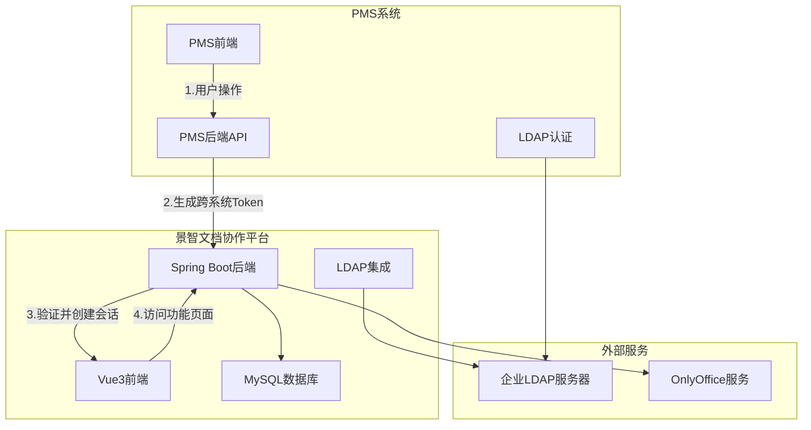
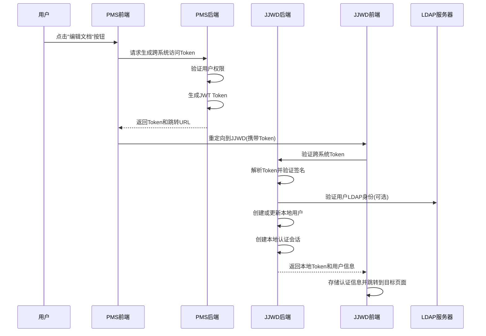

# PMS系统与景智文档协作平台对接技术方案

## 1. 需求背景分析

### 1.1 系统现状

**PMS系统**：
- 基于LDAP认证的项目管理系统
- 用户身份和权限已通过LDAP验证
- 需要唤起文档协作平台的特定功能页面

**景智文档协作平台（JJWD）**：
- 自建用户体系，支持LDAP账号密码验证并自动注册
- 数据结构：产品分类 -> 项目 -> 文档的层级关系
- 基于Vue3 + Spring Boot的单体应用架构
- 当前使用localStorage存储token进行身份验证

### 1.2 核心需求

1. **跨系统身份认证**：PMS系统用户能够无缝访问文档平台功能
2. **数据层级传递**：正确传递分类、项目、文档的层级关系
3. **权限控制一致性**：确保跨系统访问的权限控制
4. **避免登录拦截**：防止因token缺失导致的登录页面跳转
5. **数据同步**：支持项目和文档变更同步回PMS系统

### 1.3 APP key认证方案问题分析

**APP Key认证方案的局限性**：
- APP Key只能验证系统身份，无法传递具体用户信息
- 无法解决用户级别的权限控制问题
- 前端Vue3路由守卫会检查localStorage中的token，APP Key无法绕过
- 不符合"分类->项目->文档"的用户权限体系

**前端状态管理问题**：
- Vue3无状态管理，跨系统状态同步困难
- localStorage token检查与跨系统认证冲突
- 401拦截机制阻止跨系统访问

## 2. 整体架构设计

### 2.1 技术架构图



### 2.2 核心设计原则

1. **安全第一**：所有跨系统通信使用HTTPS + JWT签名
2. **无状态设计**：使用JWT Token传递用户状态，避免Session依赖
3. **权限最小化**：用户只能访问其在PMS中有权限的资源
4. **可扩展性**：支持未来更多系统的接入

## 3. 认证授权方案设计

### 3.1 混合认证模式

采用 **JWT Token + 系统签名** 的混合认证模式：

- **系统签名**：用于验证请求来源的合法性，防止伪造请求
- **JWT Token**：用于用户级别的身份和权限传递，包含完整的用户信息和权限

### 3.2 Token结构设计

```json
{
  "header": {
    "alg": "HS256",
    "typ": "JWT"
  },
  "payload": {
    "iss": "PMS-System",
    "sub": "username",
    "aud": "JJWD-Platform",
    "iat": 1640995200,
    "exp": 1640998800,
    "jti": "unique-token-id",
    "user_info": {
      "username": "zhangsan",
      "display_name": "张三",
      "email": "zhangsan@company.com",
      "department": "技术部",
      "employee_id": "E001"
    },
    "permissions": {
      "categories": ["CAT001", "CAT002"],
      "projects": ["PROJ001", "PROJ002"],
      "actions": ["READ", "WRITE", "EDIT"]
    },
    "context": {
      "target_page": "document_edit",
      "category_id": "CAT001",
      "project_id": "PROJ001",
      "document_id": "DOC001",
      "source_system": "PMS"
    }
  }
}
```

### 3.3 认证流程设计



## 4. 详细实现方案

### 4.1 PMS系统实现

#### 4.1.1 跨系统Token生成服务

```java
@Service
public class CrossSystemTokenService {

    @Value("${jjwd.app.secret}")
    private String jwtSecret;

    @Value("${jjwd.app.key}")
    private String jjwdAppKey;

    @Autowired
    private LdapUserService ldapUserService;

    /**
     * 生成跨系统访问Token
     */
    public CrossSystemToken generateToken(String username, CrossSystemRequest request) {
        // 验证用户权限
        User user = ldapUserService.getUserByUsername(username);
        if (user == null) {
            throw new UserNotFoundException("用户不存在");
        }

        // 验证用户对目标资源的访问权限
        validateUserPermissions(user, request);

        // 构建用户信息
        Map<String, Object> userInfo = buildUserInfo(user);

        // 构建权限信息
        Map<String, Object> permissions = buildPermissions(user, request);

        // 构建上下文信息
        Map<String, Object> context = buildContext(request);

        // 生成JWT Token
        String token = Jwts.builder()
            .setIssuer("PMS-System")
            .setSubject(username)
            .setAudience("JJWD-Platform")
            .setIssuedAt(new Date())
            .setExpiration(new Date(System.currentTimeMillis() + 3600000)) // 1小时
            .setId(UUID.randomUUID().toString())
            .claim("user_info", userInfo)
            .claim("permissions", permissions)
            .claim("context", context)
            .signWith(SignatureAlgorithm.HS256, jwtSecret)
            .compact();

        // 构建跳转URL
        String redirectUrl = buildRedirectUrl(request, token);

        return CrossSystemToken.builder()
            .token(token)
            .redirectUrl(redirectUrl)
            .expiresIn(3600)
            .build();
    }

    private void validateUserPermissions(User user, CrossSystemRequest request) {
        // 验证用户是否有权限访问指定的分类、项目、文档
        // 这里需要根据PMS的权限体系进行验证
    }

    private Map<String, Object> buildUserInfo(User user) {
        return Map.of(
            "username", user.getUsername(),
            "display_name", user.getDisplayName(),
            "email", user.getEmail(),
            "department", user.getDepartment(),
            "employee_id", user.getEmployeeId()
        );
    }

    private Map<String, Object> buildPermissions(User user, CrossSystemRequest request) {
        // 根据用户在PMS中的权限，构建在JJWD中的权限
        return Map.of(
            "categories", getUserCategories(user),
            "projects", getUserProjects(user),
            "actions", getUserActions(user, request)
        );
    }

    private Map<String, Object> buildContext(CrossSystemRequest request) {
        return Map.of(
            "target_page", request.getTargetPage(),
            "category_id", request.getCategoryId(),
            "project_id", request.getProjectId(),
            "document_id", request.getDocumentId(),
            "source_system", "PMS"
        );
    }

    private String buildRedirectUrl(CrossSystemRequest request, String token) {
        return String.format("%s/cross-system/auth?token=%s&target=%s",
            jjwdBaseUrl, token, request.getTargetPage());
    }
}
```

#### 4.1.2 前端调用实现

```javascript
// PMS前端调用示例
class CrossSystemService {

    /**
     * 唤起JJWD文档编辑功能
     */
    async openDocumentEditor(categoryId, projectId, documentId) {
        try {
            const request = {
                targetPage: 'document_edit',
                categoryId: categoryId,
                projectId: projectId,
                documentId: documentId,
                action: 'EDIT'
            };

            const response = await this.generateCrossSystemToken(request);

            if (response.success) {
                // 在新窗口中打开JJWD
                window.open(response.redirectUrl, '_blank');
            } else {
                this.$message.error(response.message);
            }
        } catch (error) {
            this.$message.error('唤起文档编辑器失败');
        }
    }

    /**
     * 生成跨系统访问Token
     */
    async generateCrossSystemToken(request) {
        return await this.$http.post('/api/cross-system/generate-token', request);
    }
}
```

#### 4.1.3 数据传输对象

```java
// 数据传输对象
@Data
@Builder
public class CrossSystemRequest {
    private String targetPage;
    private String categoryId;
    private String projectId;
    private String documentId;
    private String action;
    private Map<String, Object> extraParams;
}

@Data
@Builder
public class CrossSystemResponse {
    private boolean success;
    private String redirectUrl;
    private String token;
    private Integer expiresIn;
    private String message;
}

@Data
@Builder
public class CrossSystemToken {
    private String token;
    private String redirectUrl;
    private Integer expiresIn;
}
```

### 4.2 JJWD系统后端实现

#### 4.2.1 跨系统Token验证服务

```java
@Service
public class CrossSystemAuthService {

    @Value("${cross.system.jwt.secret}")
    private String jwtSecret;

    @Value("${cross.system.pms.app.key}")
    private String pmsAppKey;

    @Autowired
    private UserService userService;

    @Autowired
    private LdapService ldapService;

    /**
     * 验证并解析跨系统Token
     */
    public CrossSystemUserInfo validateAndParseToken(String token) {
        try {
            // 解析JWT Token
            Claims claims = Jwts.parser()
                .setSigningKey(jwtSecret)
                .parseClaimsJws(token)
                .getBody();

            // 验证Token基本信息
            validateTokenClaims(claims);

            // 检查Token是否已使用（防重放攻击）
            String tokenId = claims.getId();
            if (isTokenUsed(tokenId)) {
                throw new InvalidTokenException("Token已被使用");
            }

            // 标记Token为已使用
            markTokenAsUsed(tokenId, getTokenExpireSeconds(claims));

            // 提取用户信息
            return extractUserInfo(claims);

        } catch (Exception e) {
            throw new InvalidTokenException("Token验证失败: " + e.getMessage());
        }
    }

    /**
     * 创建或更新本地用户
     */
    public User createOrUpdateLocalUser(CrossSystemUserInfo userInfo) {
        User existingUser = userService.findByUsername(userInfo.getUsername());

        if (existingUser == null) {
            // 创建新用户
            User newUser = new User();
            newUser.setUsername(userInfo.getUsername());
            newUser.setDisplayName(userInfo.getDisplayName());
            newUser.setEmail(userInfo.getEmail());
            newUser.setDepartment(userInfo.getDepartment());
            newUser.setEmployeeId(userInfo.getEmployeeId());
            newUser.setSource("CROSS_SYSTEM");
            newUser.setEnabled(true);

            // 可选：验证LDAP身份
            if (ldapService.isEnabled()) {
                ldapService.validateUser(userInfo.getUsername());
            }

            return userService.save(newUser);
        } else {
            // 更新现有用户信息
            existingUser.setDisplayName(userInfo.getDisplayName());
            existingUser.setEmail(userInfo.getEmail());
            existingUser.setDepartment(userInfo.getDepartment());
            return userService.save(existingUser);
        }
    }

    private void validateTokenClaims(Claims claims) {
        // 验证Token基本信息
        if (claims.getExpiration().before(new Date())) {
            throw new InvalidTokenException("Token已过期");
        }

        if (!"PMS-System".equals(claims.getIssuer())) {
            throw new InvalidTokenException("Token发行者无效");
        }

        if (!"JJWD-Platform".equals(claims.getAudience())) {
            throw new InvalidTokenException("Token受众无效");
        }
    }

    private boolean isTokenUsed(String tokenId) {
        // 检查Redis中是否存在该Token ID
        return redisTemplate.hasKey("used_token:" + tokenId);
    }

    private void markTokenAsUsed(String tokenId, long expireSeconds) {
        // 在Redis中标记Token为已使用
        redisTemplate.opsForValue().set("used_token:" + tokenId, "1", expireSeconds, TimeUnit.SECONDS);
    }

    private CrossSystemUserInfo extractUserInfo(Claims claims) {
        Map<String, Object> userInfo = (Map<String, Object>) claims.get("user_info");
        Map<String, Object> permissions = (Map<String, Object>) claims.get("permissions");
        Map<String, Object> context = (Map<String, Object>) claims.get("context");

        return CrossSystemUserInfo.builder()
            .username((String) userInfo.get("username"))
            .displayName((String) userInfo.get("display_name"))
            .email((String) userInfo.get("email"))
            .department((String) userInfo.get("department"))
            .employeeId((String) userInfo.get("employee_id"))
            .categories((List<String>) permissions.get("categories"))
            .projects((List<String>) permissions.get("projects"))
            .actions((List<String>) permissions.get("actions"))
            .targetPage((String) context.get("target_page"))
            .categoryId((String) context.get("category_id"))
            .projectId((String) context.get("project_id"))
            .documentId((String) context.get("document_id"))
            .sourceSystem((String) context.get("source_system"))
            .build();
    }
}
```

#### 4.2.2 跨系统认证控制器

```java
@RestController
@RequestMapping("/api/cross-system")
public class CrossSystemAuthController {

    @Autowired
    private CrossSystemAuthService crossSystemAuthService;

    @Autowired
    private JwtTokenService jwtTokenService;

    /**
     * 跨系统认证入口
     */
    @GetMapping("/auth")
    public ResponseEntity<?> authenticate(
            @RequestParam String token,
            @RequestParam(required = false) String target,
            HttpServletRequest request,
            HttpServletResponse response) {

        try {
            // 验证跨系统Token
            CrossSystemUserInfo userInfo = crossSystemAuthService.validateAndParseToken(token);

            // 创建或更新本地用户
            User user = crossSystemAuthService.createOrUpdateLocalUser(userInfo);

            // 创建本地认证会话
            createLocalAuthSession(user, userInfo, request);

            // 生成本地JWT Token
            String localToken = jwtTokenService.generateToken(user);

            // 构建响应数据
            Map<String, Object> responseData = new HashMap<>();
            responseData.put("token", localToken);
            responseData.put("user", buildUserResponse(user, userInfo));
            responseData.put("permissions", buildPermissionsResponse(userInfo));
            responseData.put("context", buildContextResponse(userInfo));

            // 设置跨系统用户标识
            response.addHeader("X-Cross-System-User", "true");

            return ResponseEntity.ok(responseData);

        } catch (Exception e) {
            return ResponseEntity.status(HttpStatus.UNAUTHORIZED)
                .body(Map.of("error", "认证失败", "message", e.getMessage()));
        }
    }

    private void createLocalAuthSession(User user, CrossSystemUserInfo userInfo, HttpServletRequest request) {
        // 创建Spring Security认证对象
        List<GrantedAuthority> authorities = userInfo.getRoles().stream()
            .map(role -> new SimpleGrantedAuthority("ROLE_" + role))
            .collect(Collectors.toList());

        // 添加操作权限
        userInfo.getActions().forEach(action ->
            authorities.add(new SimpleGrantedAuthority("PERM_" + action)));

        // 创建自定义UserDetails
        CrossSystemUserDetails userDetails = new CrossSystemUserDetails(
            user.getUsername(),
            "N/A", // 跨系统用户无密码
            authorities,
            userInfo
        );

        // 创建认证Token
        UsernamePasswordAuthenticationToken authToken =
            new UsernamePasswordAuthenticationToken(userDetails, null, authorities);

        // 设置到SecurityContext
        SecurityContextHolder.getContext().setAuthentication(authToken);

        // 在Session中标记跨系统用户
        HttpSession session = request.getSession(true);
        session.setAttribute("CROSS_SYSTEM_USER", true);
        session.setAttribute("CROSS_SYSTEM_USER_INFO", userInfo);
    }
}
```

#### 4.2.3 跨系统权限拦截器

```java
@Component
public class CrossSystemPermissionInterceptor implements HandlerInterceptor {

    @Override
    public boolean preHandle(HttpServletRequest request, HttpServletResponse response,
                           Object handler) throws Exception {

        // 检查是否为跨系统用户
        HttpSession session = request.getSession(false);
        if (session == null || !Boolean.TRUE.equals(session.getAttribute("CROSS_SYSTEM_USER"))) {
            return true; // 非跨系统用户，使用正常权限控制
        }

        // 获取跨系统用户信息
        CrossSystemUserInfo userInfo = (CrossSystemUserInfo) session.getAttribute("CROSS_SYSTEM_USER_INFO");
        if (userInfo == null) {
            response.sendRedirect("/login?error=cross_system_session_expired");
            return false;
        }

        // 检查资源访问权限
        String requestURI = request.getRequestURI();
        if (!hasAccessToResource(userInfo, requestURI, request)) {
            response.sendError(HttpStatus.FORBIDDEN.value(), "跨系统用户无权限访问此资源");
            return false;
        }

        return true;
    }

    private boolean hasAccessToResource(CrossSystemUserInfo userInfo, String requestURI, HttpServletRequest request) {
        // 检查分类权限
        String categoryId = request.getParameter("categoryId");
        if (categoryId != null && !userInfo.getCategories().contains(categoryId)) {
            return false;
        }

        // 检查项目权限
        String projectId = request.getParameter("projectId");
        if (projectId != null && !userInfo.getProjects().contains(projectId)) {
            return false;
        }

        // 检查操作权限
        String method = request.getMethod();
        String requiredAction = mapHttpMethodToAction(method);
        if (!userInfo.getActions().contains(requiredAction)) {
            return false;
        }

        return true;
    }

    private String mapHttpMethodToAction(String method) {
        switch (method.toUpperCase()) {
            case "GET": return "READ";
            case "POST": return "CREATE";
            case "PUT": return "UPDATE";
            case "DELETE": return "DELETE";
            default: return "READ";
        }
    }
}
```

### 4.3 JJWD系统前端实现

#### 4.3.1 跨系统认证处理

```javascript
// 跨系统认证服务
class CrossSystemAuthService {

    /**
     * 处理跨系统认证
     */
    async handleCrossSystemAuth(token, target) {
        try {
            const response = await axios.get('/api/cross-system/auth', {
                params: { token, target }
            });

            if (response.status === 200) {
                const { token: localToken, user, permissions, context } = response.data;

                // 存储认证信息
                this.storeCrossSystemAuth(localToken, user, permissions, context);

                // 跳转到目标页面
                this.redirectToTargetPage(context.target_page, context);

                return true;
            }
        } catch (error) {
            console.error('跨系统认证失败:', error);
            this.$message.error('认证失败，请重新尝试');
            return false;
        }
    }

    /**
     * 存储跨系统认证信息
     */
    storeCrossSystemAuth(token, user, permissions, context) {
        // 存储到localStorage
        localStorage.setItem('auth_token', token);
        localStorage.setItem('user_info', JSON.stringify(user));
        localStorage.setItem('user_permissions', JSON.stringify(permissions));

        // 标记为跨系统用户
        sessionStorage.setItem('CROSS_SYSTEM_USER', 'true');
        sessionStorage.setItem('CROSS_SYSTEM_CONTEXT', JSON.stringify(context));
    }

    /**
     * 跳转到目标页面
     */
    redirectToTargetPage(targetPage, context) {
        const routes = {
            'document_edit': `/document/edit/${context.document_id}`,
            'document_view': `/document/view/${context.document_id}`,
            'project_manage': `/project/${context.project_id}`,
            'category_manage': `/category/${context.category_id}`
        };

        const targetRoute = routes[targetPage] || '/dashboard';
        this.$router.push(targetRoute);
    }
}
```

#### 4.3.2 路由守卫增强

```javascript
// router/index.js
import { createRouter, createWebHistory } from 'vue-router'
import { useAuthStore } from '@/store/auth'

const router = createRouter({
    history: createWebHistory(),
    routes: [
        // ... 路由配置
    ]
})

// 全局前置守卫
router.beforeEach((to, from, next) => {
    // 检查是否需要认证
    if (to.meta.requiresAuth) {
        const isAuthenticated = checkAuthentication()

        if (!isAuthenticated) {
            // 未认证，重定向到登录页
            next('/login')
            return
        }

        // 检查权限
        if (to.meta.requiredPermissions) {
            const hasPermission = checkPermissions(to.meta.requiredPermissions)

            if (!hasPermission) {
                // 无权限，显示403页面
                next('/403')
                return
            }
        }
    }

    next()
})

/**
 * 检查用户认证状态
 */
function checkAuthentication() {
    // 检查是否为跨系统用户
    const isCrossSystemUser = sessionStorage.getItem('CROSS_SYSTEM_USER') === 'true'

    if (isCrossSystemUser) {
        // 跨系统用户检查session
        return checkCrossSystemSession()
    } else {
        // 本地用户检查token
        return checkLocalToken()
    }
}

/**
 * 检查跨系统用户会话
 */
function checkCrossSystemSession() {
    const token = localStorage.getItem('auth_token')
    const userInfo = localStorage.getItem('user_info')
    const context = sessionStorage.getItem('CROSS_SYSTEM_CONTEXT')

    return token && userInfo && context
}

/**
 * 检查本地用户Token
 */
function checkLocalToken() {
    const token = localStorage.getItem('auth_token')
    if (!token) return false

    // 验证token是否过期
    try {
        const payload = JSON.parse(atob(token.split('.')[1]))
        return payload.exp > Date.now() / 1000
    } catch {
        return false
    }
}

/**
 * 检查用户权限
 */
function checkPermissions(requiredPermissions) {
    const isCrossSystemUser = sessionStorage.getItem('CROSS_SYSTEM_USER') === 'true'

    if (isCrossSystemUser) {
        return checkCrossSystemPermissions(requiredPermissions)
    } else {
        return checkLocalPermissions(requiredPermissions)
    }
}

/**
 * 检查跨系统用户权限
 */
function checkCrossSystemPermissions(requiredPermissions) {
    const permissions = JSON.parse(localStorage.getItem('user_permissions') || '{}')
    const context = JSON.parse(sessionStorage.getItem('CROSS_SYSTEM_CONTEXT') || '{}')

    // 检查操作权限
    if (requiredPermissions.actions) {
        const hasActions = requiredPermissions.actions.every(action =>
            permissions.actions.includes(action))
        if (!hasActions) return false
    }

    // 检查资源权限
    if (requiredPermissions.categoryId && context.category_id !== requiredPermissions.categoryId) {
        return false
    }

    if (requiredPermissions.projectId && context.project_id !== requiredPermissions.projectId) {
        return false
    }

    return true
}

export default router
```

#### 4.3.3 HTTP拦截器增强

```javascript
// utils/request.js
import axios from 'axios'
import { ElMessage } from 'element-plus'

// 创建axios实例
const service = axios.create({
    baseURL: process.env.VUE_APP_BASE_API,
    timeout: 10000
})

// 请求拦截器
service.interceptors.request.use(
    config => {
        const token = localStorage.getItem('auth_token')
        if (token) {
            config.headers['Authorization'] = `Bearer ${token}`
        }

        // 跨系统用户标识
        const isCrossSystemUser = sessionStorage.getItem('CROSS_SYSTEM_USER') === 'true'
        if (isCrossSystemUser) {
            config.headers['X-Cross-System-User'] = 'true'

            // 添加上下文信息
            const context = JSON.parse(sessionStorage.getItem('CROSS_SYSTEM_CONTEXT') || '{}')
            if (context.category_id) {
                config.headers['X-Category-Id'] = context.category_id
            }
            if (context.project_id) {
                config.headers['X-Project-Id'] = context.project_id
            }
        }

        return config
    },
    error => {
        return Promise.reject(error)
    }
)

// 响应拦截器
service.interceptors.response.use(
    response => {
        return response
    },
    error => {
        const { status, data } = error.response || {}

        if (status === 401) {
            // 检查是否为跨系统用户
            const isCrossSystemUser = sessionStorage.getItem('CROSS_SYSTEM_USER') === 'true'

            if (isCrossSystemUser) {
                // 跨系统用户认证失效，清除相关信息
                clearCrossSystemAuth()
                ElMessage.error('跨系统认证已失效，请重新从PMS系统访问')
                // 可以选择关闭当前窗口或跳转到提示页面
                window.close()
            } else {
                // 本地用户认证失效，跳转到登录页
                clearLocalAuth()
                router.push('/login')
            }
        } else if (status === 403) {
            ElMessage.error(data?.message || '无权限访问')
        } else {
            ElMessage.error(data?.message || '请求失败')
        }

        return Promise.reject(error)
    }
)

/**
 * 清除跨系统认证信息
 */
function clearCrossSystemAuth() {
    sessionStorage.removeItem('CROSS_SYSTEM_USER')
    sessionStorage.removeItem('CROSS_SYSTEM_CONTEXT')
    localStorage.removeItem('auth_token')
    localStorage.removeItem('user_info')
    localStorage.removeItem('user_permissions')
}

/**
 * 清除本地认证信息
 */
function clearLocalAuth() {
    localStorage.removeItem('auth_token')
    localStorage.removeItem('user_info')
    localStorage.removeItem('user_permissions')
}

export default service
```

## 5. 数据同步方案

### 5.1 数据模型映射

#### 5.1.1 PMS到JJWD的数据映射

```java
@Component
public class DataMappingService {

    /**
     * PMS项目映射到JJWD项目
     */
    public JjwdProject mapPmsProjectToJjwd(PmsProject pmsProject) {
        return JjwdProject.builder()
            .externalId(pmsProject.getId())
            .name(pmsProject.getName())
            .description(pmsProject.getDescription())
            .categoryId(mapPmsCategoryToJjwd(pmsProject.getCategoryId()))
            .status(mapProjectStatus(pmsProject.getStatus()))
            .createdBy(pmsProject.getCreatedBy())
            .createdTime(pmsProject.getCreatedTime())
            .sourceSystem("PMS")
            .build();
    }

    /**
     * PMS文档映射到JJWD文档
     */
    public JjwdDocument mapPmsDocumentToJjwd(PmsDocument pmsDocument) {
        return JjwdDocument.builder()
            .externalId(pmsDocument.getId())
            .name(pmsDocument.getName())
            .projectId(mapPmsProjectToJjwd(pmsDocument.getProjectId()))
            .content(pmsDocument.getContent())
            .version(pmsDocument.getVersion())
            .status(mapDocumentStatus(pmsDocument.getStatus()))
            .createdBy(pmsDocument.getCreatedBy())
            .lastModifiedBy(pmsDocument.getLastModifiedBy())
            .sourceSystem("PMS")
            .build();
    }
}
```

### 5.2 双向同步机制

#### 5.2.1 JJWD到PMS的同步接口

```java
@RestController
@RequestMapping("/api/sync")
public class DataSyncController {

    @Autowired
    private DataSyncService dataSyncService;

    /**
     * 同步项目变更到PMS
     */
    @PostMapping("/project/{projectId}")
    public ResponseEntity<?> syncProjectToPms(
            @PathVariable String projectId,
            @RequestBody ProjectSyncRequest request) {

        try {
            // 验证跨系统用户权限
            validateCrossSystemPermission(projectId);

            // 执行同步
            SyncResult result = dataSyncService.syncProjectToPms(projectId, request);

            return ResponseEntity.ok(result);
        } catch (Exception e) {
            return ResponseEntity.status(HttpStatus.INTERNAL_SERVER_ERROR)
                .body(Map.of("error", "同步失败", "message", e.getMessage()));
        }
    }

    /**
     * 同步文档变更到PMS
     */
    @PostMapping("/document/{documentId}")
    public ResponseEntity<?> syncDocumentToPms(
            @PathVariable String documentId,
            @RequestBody DocumentSyncRequest request) {

        try {
            // 验证跨系统用户权限
            validateCrossSystemPermission(documentId);

            // 执行同步
            SyncResult result = dataSyncService.syncDocumentToPms(documentId, request);

            return ResponseEntity.ok(result);
        } catch (Exception e) {
            return ResponseEntity.status(HttpStatus.INTERNAL_SERVER_ERROR)
                .body(Map.of("error", "同步失败", "message", e.getMessage()));
        }
    }
}
```

### 5.3 冲突解决策略

```java
@Service
public class ConflictResolutionService {

    /**
     * 解决数据冲突
     */
    public ConflictResolution resolveConflict(ConflictData conflictData) {
        switch (conflictData.getType()) {
            case VERSION_CONFLICT:
                return resolveVersionConflict(conflictData);
            case PERMISSION_CONFLICT:
                return resolvePermissionConflict(conflictData);
            case DATA_INTEGRITY_CONFLICT:
                return resolveDataIntegrityConflict(conflictData);
            default:
                throw new UnsupportedOperationException("不支持的冲突类型");
        }
    }

    private ConflictResolution resolveVersionConflict(ConflictData conflictData) {
        // 版本冲突解决策略：
        // 1. 最后修改时间优先
        // 2. 用户手动选择
        // 3. 合并策略
        return ConflictResolution.builder()
            .strategy(ConflictStrategy.LAST_MODIFIED_WINS)
            .resolvedData(conflictData.getLatestVersion())
            .build();
    }
}
```

## 6. 安全性保障

### 6.1 Token安全机制

1. **JWT签名验证**：使用HMAC-SHA256算法签名，防止Token篡改
2. **Token有效期控制**：设置较短的有效期（1小时），减少安全风险
3. **防重放攻击**：使用Redis存储已使用的Token ID，防止重复使用
4. **HTTPS传输**：所有跨系统通信必须使用HTTPS协议

### 6.2 权限控制机制

1. **最小权限原则**：用户只能访问其在PMS中有权限的资源
2. **细粒度权限控制**：支持分类、项目、文档级别的权限控制
3. **操作权限验证**：根据HTTP方法验证用户的操作权限
4. **会话隔离**：跨系统用户与本地用户的会话完全隔离

### 6.3 审计日志

```java
@Component
public class CrossSystemAuditLogger {

    @EventListener
    public void handleCrossSystemAuth(CrossSystemAuthEvent event) {
        AuditLog log = AuditLog.builder()
            .eventType("CROSS_SYSTEM_AUTH")
            .username(event.getUsername())
            .sourceSystem(event.getSourceSystem())
            .targetResource(event.getTargetResource())
            .timestamp(new Date())
            .ipAddress(event.getIpAddress())
            .userAgent(event.getUserAgent())
            .result(event.getResult())
            .build();

        auditLogService.save(log);
    }
}
```

## 7. 部署配置

### 7.1 配置文件

```yaml
# application.yml
cross-system:
  jwt:
    secret: ${CROSS_SYSTEM_JWT_SECRET:your-secret-key}
    expiration: 3600 # 1小时
  pms:
    app-key: ${PMS_APP_KEY:pms-app-key}
    base-url: ${PMS_BASE_URL:https://pms.company.com}
  jjwd:
    base-url: ${JJWD_BASE_URL:https://jjwd.company.com}

# Redis配置
spring:
  redis:
    host: ${REDIS_HOST:localhost}
    port: ${REDIS_PORT:6379}
    database: ${REDIS_DB:0}

# LDAP配置
ldap:
  enabled: ${LDAP_ENABLED:true}
  url: ${LDAP_URL:ldap://ldap.company.com:389}
  base-dn: ${LDAP_BASE_DN:dc=company,dc=com}
  user-dn: ${LDAP_USER_DN:cn=admin,dc=company,dc=com}
  password: ${LDAP_PASSWORD:admin-password}
```

### 7.2 安全配置

```java
@Configuration
@EnableWebSecurity
public class CrossSystemSecurityConfig {

    @Bean
    public SecurityFilterChain filterChain(HttpSecurity http) throws Exception {
        http
            .authorizeHttpRequests(authz -> authz
                .requestMatchers("/api/cross-system/auth").permitAll()
                .requestMatchers("/api/cross-system/**").authenticated()
                .anyRequest().authenticated()
            )
            .sessionManagement(session -> session
                .sessionCreationPolicy(SessionCreationPolicy.IF_REQUIRED)
            )
            .csrf(csrf -> csrf.disable())
            .cors(cors -> cors.configurationSource(corsConfigurationSource()));

        return http.build();
    }

    @Bean
    public CorsConfigurationSource corsConfigurationSource() {
        CorsConfiguration configuration = new CorsConfiguration();
        configuration.setAllowedOriginPatterns(Arrays.asList("https://*.company.com"));
        configuration.setAllowedMethods(Arrays.asList("GET", "POST", "PUT", "DELETE"));
        configuration.setAllowedHeaders(Arrays.asList("*"));
        configuration.setAllowCredentials(true);

        UrlBasedCorsConfigurationSource source = new UrlBasedCorsConfigurationSource();
        source.registerCorsConfiguration("/api/**", configuration);
        return source;
    }
}
```

## 8. 测试方案

### 8.1 单元测试

```java
@SpringBootTest
class CrossSystemAuthServiceTest {

    @Autowired
    private CrossSystemAuthService authService;

    @Test
    void testValidateAndParseToken_Success() {
        // 准备测试数据
        String validToken = generateValidToken();

        // 执行测试
        CrossSystemUserInfo userInfo = authService.validateAndParseToken(validToken);

        // 验证结果
        assertThat(userInfo.getUsername()).isEqualTo("testuser");
        assertThat(userInfo.getActions()).contains("READ", "WRITE");
    }

    @Test
    void testValidateAndParseToken_ExpiredToken() {
        // 准备过期Token
        String expiredToken = generateExpiredToken();

        // 执行测试并验证异常
        assertThatThrownBy(() -> authService.validateAndParseToken(expiredToken))
            .isInstanceOf(InvalidTokenException.class)
            .hasMessageContaining("Token已过期");
    }
}
```

### 8.2 集成测试

```java
@SpringBootTest(webEnvironment = SpringBootTest.WebEnvironment.RANDOM_PORT)
@AutoConfigureTestDatabase
class CrossSystemIntegrationTest {

    @Autowired
    private TestRestTemplate restTemplate;

    @Test
    void testCrossSystemAuthFlow() {
        // 1. 生成跨系统Token
        String token = generateCrossSystemToken();

        // 2. 调用认证接口
        ResponseEntity<Map> response = restTemplate.getForEntity(
            "/api/cross-system/auth?token=" + token, Map.class);

        // 3. 验证响应
        assertThat(response.getStatusCode()).isEqualTo(HttpStatus.OK);
        assertThat(response.getBody()).containsKey("token");
        assertThat(response.getBody()).containsKey("user");
    }
}
```

## 9. 监控告警

### 9.1 关键指标监控

```java
@Component
public class CrossSystemMetrics {

    private final MeterRegistry meterRegistry;
    private final Counter authSuccessCounter;
    private final Counter authFailureCounter;
    private final Timer authProcessingTime;

    public CrossSystemMetrics(MeterRegistry meterRegistry) {
        this.meterRegistry = meterRegistry;
        this.authSuccessCounter = Counter.builder("cross_system_auth_success")
            .description("跨系统认证成功次数")
            .register(meterRegistry);
        this.authFailureCounter = Counter.builder("cross_system_auth_failure")
            .description("跨系统认证失败次数")
            .register(meterRegistry);
        this.authProcessingTime = Timer.builder("cross_system_auth_processing_time")
            .description("跨系统认证处理时间")
            .register(meterRegistry);
    }

    public void recordAuthSuccess() {
        authSuccessCounter.increment();
    }

    public void recordAuthFailure() {
        authFailureCounter.increment();
    }

    public Timer.Sample startAuthTimer() {
        return Timer.start(meterRegistry);
    }
}
```

### 9.2 告警规则

```yaml
# Prometheus告警规则
groups:
  - name: cross-system-auth
    rules:
      - alert: CrossSystemAuthFailureRateHigh
        expr: rate(cross_system_auth_failure_total[5m]) > 0.1
        for: 2m
        labels:
          severity: warning
        annotations:
          summary: "跨系统认证失败率过高"
          description: "过去5分钟内跨系统认证失败率超过10%"

      - alert: CrossSystemAuthProcessingTimeSlow
        expr: histogram_quantile(0.95, rate(cross_system_auth_processing_time_bucket[5m])) > 2
        for: 1m
        labels:
          severity: warning
        annotations:
          summary: "跨系统认证处理时间过长"
          description: "95%的跨系统认证请求处理时间超过2秒"
```

## 10. 总结

本方案通过JWT Token + 系统签名的混合认证模式，解决了PMS系统与景智文档协作平台的跨系统对接问题。主要特点：

1. **安全可靠**：采用JWT签名验证、防重放攻击、HTTPS传输等多重安全机制
2. **权限精确**：支持分类、项目、文档级别的细粒度权限控制
3. **用户体验好**：用户无需重新登录，实现无缝跨系统访问
4. **可扩展性强**：支持未来更多系统的接入
5. **数据一致性**：提供双向数据同步和冲突解决机制

该方案避免了原APP Key方案的局限性，通过完整的用户身份和权限传递，实现了真正意义上的跨系统集成。