# 企业合同/标书/技术方案 **智能评审应用** 功能设计（重组与验证版）
*版本：2025-08-25*

> 目标：在“AI智能评审 + 企业内部专家人工评审”并行协同的前提下，围绕文档评审的**创建—协同—修订—验证—闭环—知识沉淀**全链路，落实图片中所有痛点，并补齐缺口。

---

## 1. 痛点与功能映射表（由源图像逐项抽取）

> 注：每条痛点均映射到本方案中的**模块 / 功能点**（见后文“结构化功能清单”中的模块编号）。

| 场景 | 源痛点 | 解决功能（模块/功能点） | 优先级 |
|---|---|---|---|
| 评审创建 | 需关联项目流程、填写复杂；紧急文档不想等立项 | **A1** 解耦项目的评审任务（标题/描述/文档类型/截止时间），**N1** 项目/流程可选而非必填 | P0 |
| 评审创建 | 多格式受限 | **B1** 文档多格式适配（PDF/DOCX/PPTX/XLSX/图片） | P0 |
| 评审创建 | 多文件上传麻烦/到处找文件 | **B2** 多文件上传、**B3** 勾选企业文档库（含在线盘/知识库/模板库） | P0 |
| 评审创建 | 评审时间不便调整 | **A2** 评审时间窗可调（进行中可延期/收紧，留痕） | P0 |
| 评审创建 | 文件发送后应锁定原文 | **B4** 评审中版本只读、只允许批注（启用评审快照） | P0 |
| 专家调度 | 人工挑选慢且不准 | **C1** AI专家推荐（技能/专业/历史贡献/匹配度） | P1 |
| 专家调度 | 忙闲不透明 | **C2** 专家工作量看板 | P1 |
| 专家调度 | 需要人工自选和转办 | **C3** 受邀专家可自选/转办（可配置审批） | P0 |
| 评审通知 | 通知易遗漏 | **D1** 多通道通知（KK/邮件/短信/站内）与重试 | P0 |
| 评审通知 | 参与意向确认慢 | **D2** 一键反馈（参加/不参加/转办） | P0 |
| 在线评审 | 关键点遗漏、基础问题占用专家精力 | **E1** AI自动扫描（格式/合规/术语一致/基础逻辑）+ 关注点推荐 + 意见草稿 | P0 |
| 在线评审 | 批注难以精准挂接原文 | **E2** 多格式原文可批注（Word/PPT/Excel/图片）与锚点定位 | P0 |
| 在线评审 | 问题需手填分类/严重度 | **F1** 严重等级/类别智能预测（可复核） | P1 |
| 在线评审 | 逐条手动指派修改人 | **F2** 快速/批量指派责任人（含默认编制人/团队） | P0 |
| 在线评审 | 同一问题被多位专家重复提 | **F3** 重复问题合并与去重提示（相似度/位置/上下文） | P1 |
| 在线评审 | 无法自动生成问题清单 | **F4** 批注⇄问题清单自动结构化（序号、类型、章节、描述、建议、分类、严重度、责任人、状态、解决方案、验证结果……） | P0 |
| 问题修改 | 修订后难对照“改前改后” | **G1** 修订-问题位点联动 + 原选区快照 + 差异高亮 | P0 |
| 问题修改 | 在清单与原文间来回跳 | **G2** 清单↔原文双向跳转、就地回复 | P0 |
| 问题修改 | 未逐条有效回复 | **G3** 未回复/未处理自动检测与提醒（与修订人绑定） | P0 |
| 问题修改 | 多专家意见时序不同导致顾此失彼 | **G4** 专家问题收敛闸门：汇总完成后再统一下发修订任务（可配等待时长） | P1 |
| 问题修改 | 多人协作易割裂 | **G5** 多维排序/视图（章节/分类/严重度/修订人/专家） | P0 |
| 验证管理 | 专家逐条点验证效率低 | **H1** 灵活验证模式（单条/批量/全选） | P0 |
| 验证管理 | 只看到结果看不到改动上下文 | **H2** 清单直达原文，展示修订差异对照 | P0 |
| 验证管理 | 遗漏或迟迟不验证 | **H3** 验证进度看板 + 催办 | P0 |
| 验证管理 | 未全量验证就关闭评审 | **H4** 全量通过校验才能关闭（可设例外流程） | P0 |
| 验证管理 | 验证通过后还停留在评审态 | **H5** 验证通过→自动定版与归档；DOCX自动切片入库 | P0 |
| 评审闭环 | 难以快速了解结论 | **I1** 评审结论建议生成（通过/有条件/重审） | P0 |
| 评审报告 | 手工汇总易错 | **I2** 可自定义模板、**I3** 一键生成结构化评审报告 | P1 |
| 知识沉淀 | 历史问题没形成可复用库 | **J1** 历史问题库自动汇总/增量更新（含评审类型/模板名称等） | P0 |
| 知识沉淀 | 常见问题缺乏前置提醒 | **J2** 评审要素提示词库（可按标准/常见问题自动推送） | P1 |
| 知识沉淀 | 未复用历史经验 | **J3** 问题智能归因与根因分类 | P1 |
| 知识沉淀 | 改进方向不明确 | **J4** TOP10 高频问题自动报告 | P1 |
| 知识沉淀 | 专家易漏看常见问题 | **J5** 历史修改建议库与“评审提示清单”双向推送（评审人/用户可见） | P2 |
| 专家评估 | 难以量化专家价值 | **K1** 专家贡献度看板（参与度/质量/效率/规模） | P2 |
| 专家评估 | 缺少考核依据 | **K2** 专家贡献度报告/排名（个人/团队/时间段/权重） | P2 |
| 统计分析 | 无法总览评审态势 | **L1** 总览仪表盘（总数、在审、周期、问题总量、解决率、按时率…） | P2 |
| 统计分析 | 难量化问题分布与效率 | **L2** 灵活多维报表与可视化（趋势/分布/效率/热力） | P2 |
| 通用治理 | 合规留痕与权限控制 | **M1** 审计日志、**M2** 角色/权限、**M3** 项目与文档库授权 | P0 |
| 集成适配 | 与现有平台/消息/SSO | **N2** ENS/LDAP/KK/邮件/SMS/OnlyOffice/知识库/ES 的集成适配 | P0 |

---

## 2. 差距与合理性检验

### 2.1 识别出的差距（基于源图像 ⇄ 现有能力）
1. **图片批注能力不足**（平台暂不支持图片类文件）。→ 在 **E2** 中补齐图片批注与锚点定位，优先级 **P0**。  
2. **问题清单字段不全**（责任人/状态/解决方案/验证结果等）。→ 在 **F4** 中补全字段模型与状态机，优先级 **P0**。  
3. **自动分类与严重度** 仍需AI能力支撑。→ **F1** 引入预测与复核流，优先级 **P1**。  
4. **重复问题去重** 尚缺。→ **F3** 引入相似度与上下文比对合并机制，优先级 **P1**。  
5. **未回复检测与提醒** 需系统化。→ **G3** 上线规则引擎与消息路由，优先级 **P0**。  
6. **专家意见收敛闸门**（等专家提完统一下发修订）缺失。→ **G4** 新增评审闸门，优先级 **P1**。  
7. **自动定版与知识入库** 的流水线需端到端打通 OnlyOffice/切片/知识库。→ **H5/N2** 合作实现，优先级 **P0**。  
8. **报表/分析/专家评估** 仍为增强项。→ **I2/I3/J2–J5/K1–K2/L1–L2** 分期交付。

### 2.2 合理性检验
- 本方案的每一项功能均直接对应至少一条源痛点（见映射表）。  
- 对与痛点相关性弱的通用能力（如审计、权限、集成），以“平台治理/合规”的**底座能力**形式保留（**M/N 模块，P0**），保证企业级可落地与合规性。

---

## 3. 最终模块架构图（Mermaid）

```mermaid
flowchart LR
  subgraph A[评审启动层]
    A1(创建解耦项目的评审任务)
    A2(可调整的时间窗)
  end

  subgraph B[文档接入与版本层]
    B1(多格式适配: PDF/DOCX/PPTX/XLSX/图片)
    B2(多文件上传)
    B3(文档库勾选)
    B4(评审快照: 评审中只读/可批注)
  end

  subgraph C[专家编组与调度层]
    C1(AI专家推荐)
    C2(专家工作量看板)
    C3(自选与转办机制)
  end

  subgraph D[通知与确认层]
    D1(多通道通知)
    D2(参与意向一键反馈)
  end

  subgraph E[AI+人工协同评审层]
    E1(AI扫描与意见草稿)
    E2(多格式原文批注与锚点)
  end

  subgraph F[问题结构化与指派层]
    F1(严重度/分类预测)
    F2(快速/批量指派责任人)
    F3(重复问题合并去重)
    F4(批注->结构化问题清单)
  end

  subgraph G[修订协作层]
    G1(修订-问题位点联动与差异)
    G2(清单<->原文双向跳转)
    G3(未回复/未处理提醒)
    G4(专家意见收敛闸门)
    G5(多维排序/视图)
  end

  subgraph H[验证与定版层]
    H1(单条/批量验证)
    H2(原文差异对照)
    H3(进度看板与催办)
    H4(全量通过校验)
    H5(定版归档+自动切片入库)
  end

  subgraph I[闭环与报告层]
    I1(结论建议生成)
    I2(自定义模板)
    I3(结构化评审报告)
  end

  subgraph J[知识沉淀与复用层]
    J1(历史问题库汇总)
    J2(评审要素提示词库)
    J3(智能归因/根因)
    J4(TOP10高频问题)
    J5(修改建议库与提示清单推送)
  end

  subgraph K[专家评估层]
    K1(贡献度看板)
    K2(贡献度报告/排名)
  end

  subgraph L[统计分析层]
    L1(总览仪表盘)
    L2(多维报表与可视化)
  end

  subgraph M[平台治理底座]
    M1(审计日志)
    M2(角色/权限)
    M3(项目/文档库授权)
  end

  subgraph N[集成与适配]
    N1(项目可选/解耦)
    N2(ENS/LDAP/KK/邮件/SMS/OnlyOffice/知识库/ES)
  end

  A --> B --> C --> D --> E --> F --> G --> H --> I --> J --> L
  C --> D
  E --> F
  H --> I
  I --> J
  M --- A
  M --- B
  M --- E
  N --- B
  N --- D
  N --- H
```

---

## 4. 结构化功能清单（职责/功能/优先级/依赖）

> 说明：优先级沿用 P0=首期必须、P1=关键增值（3个月内）、P2=增强优化；依赖以模块编号表示。

### A. 评审启动层（P0）
- **职责**：快速、低门槛创建评审。
- **功能**：A1 任务创建（解耦项目）；A2 时间窗可调（留痕）；业务关联：支持关联工单号、需求编号、合同编号。
- **依赖**：M1–M3。

### B. 文档接入与版本层（P0）
- **职责**：多格式接入、评审版控与只读快照。
- **功能**：B1 多格式适配；B2 多文件上传；B3 文档库选择；B4 评审快照与批注开关。
- **依赖**：A、M、N2（OnlyOffice/存储/预览）。

### C. 专家编组与调度层（P0/P1）
- **职责**：匹配合适专家并可转办；实现回避规则：作者不能审核自己的文档，同团队成员审核限制。
- **功能**：C1 AI推荐，专业匹配：根据审核人员专业领域和文档内容匹配；冲突自动回避：系统自动排除有冲突的审核人员（P1）；C2 工作量看板（P1）；C3 自选与转办（P0）。
- **依赖**：M、N2（用户中心/组织）。

### D. 通知与确认层（P0）
- **职责**：可靠触达与意向确认。
- **功能**：D1 多通道通知；D2 一键反馈。
- **依赖**：C、N2（消息渠道/ENS/KK/邮件/SMS）。

### E. AI+人工协同评审层（P0）
- **职责**：AI先行减负 + 专家聚焦要点。
- **功能**：E1 AI扫描与草稿；E2 多格式批注（含图片）。
- **依赖**：B、N2（模型/OnlyOffice）。

### F. 问题结构化与指派层（P0/P1）
- **职责**：将批注转为可跟踪问题并快速派发。
- **功能**：F1 严重度/类别预测（P1）；F2 批量指派；F3 去重合并（P1）；F4 结构化问题清单（补齐字段与状态机）。
- **依赖**：E、M。

### G. 修订协作层（P0/P1）
- **职责**：围绕问题位点的高效修订与回复闭环。
- **功能**：G1 位点联动与差异；G2 双向跳转；G3 未回复提醒；G4 收敛闸门（P1）；G5 多维视图。
- **依赖**：F、B。

### H. 验证与定版层（P0）
- **职责**：高效验证并自动定版入库。
- **功能**：H1 批量验证；H2 原文差异对照；H3 进度看板；H4 全量通过校验；H5 自动定版与知识切片入库。
- **依赖**：G、N2（OnlyOffice/知识库/切片服务）。

### I. 闭环与报告层（P0/P1）
- **职责**：生成结论与标准化报告。
- **功能**：I1 结论建议（P0）；I2 模板（P1）；I3 结构化报告（P1）。
- **依赖**：H、M。

### J. 知识沉淀与复用层（P0/P1/P2）
- **职责**：将问题与建议转为组织知识并前置提醒。
- **功能**：J1 历史问题库（P0）；J2 提示词库（P1）；J3 根因/归因（P1）；J4 高频问题报告（P1）；J5 提示清单推送（P2）。
- **依赖**：I、N2（知识库/搜索/ES）。

### K. 专家评估层（P2）
- **职责**：量化专家价值与激励。
- **功能**：K1 贡献度看板；K2 报告/排名。
- **依赖**：J、L、M。

### L. 统计分析层（P2）
- **职责**：治理级洞察与趋势分析。
- **功能**：L1 总览仪表盘；L2 多维报表与可视化。
- **依赖**：全链路数据。

### M. 平台治理底座（P0）
- **职责**：合规、权限与审计。
- **功能**：M1 审计日志；M2 角色/权限；M3 项目与文档库授权。
- **依赖**：—

### N. 集成与适配（P0）
- **职责**：对接组织、编辑器、消息、SSO 与知识库。
- **功能**：N1 项目可选/解耦；N2 ENS/LDAP/KK/邮件/SMS/OnlyOffice/知识库/ES。
- **依赖**：—

---

## 5. 痛点解决说明（按模块）

- **A 评审启动**：解决“创建复杂/必须依赖项目”的门槛问题，通过解耦与可选关联实现紧急评审即刻发起。  
- **B 文档接入**：解决“多格式/多文件/找文件难/版本不可控”，通过多格式引擎、文档库选择与评审快照确保一致性。  
- **C 专家调度**：解决“匹配不准、忙闲不明、无法转办”，提升命中率并缩短等待。  
- **D 通知确认**：解决“触达遗漏、确认慢”，实现闭环响应。  
- **E 协同评审**：AI预扫覆盖基础问题，专家聚焦复杂要点；图片批注补齐短板。  
- **F 结构化与指派**：把零散批注变为可治理的问题项，并通过预测/去重与批量指派降本增效。  
- **G 修订协作**：以“问题位点”为中心组织修订，防漏改/误改，并通过收敛闸门避免顾此失彼。  
- **H 验证与定版**：提供批量验证、差异对比、强校验与自动归档入库，形成真正闭环。  
- **I 闭环与报告**：标准化导出、复盘与对外支撑。  
- **J 知识沉淀**：把一次次评审沉淀为问题库/建议库/提示清单，实现“前置预防”。  
- **K 专家评估**：让贡献“可见、可量化、可激励”。  
- **L 统计分析**：提供组织级视角，度量质量、效率与趋势。  
- **M/N 治理与集成**：保障安全合规与企业级落地。

---

## 6. 交付与优先级梳理（首期必交 & 分期）

- **首期必交（P0）**：A、B、C3、D、E、F2、F4、G1–G3、H、I1、J1、M、N。  
- **三个月内（P1）**：C1、C2、F1、F3、G4、I2–I3、J2–J4。  
- **长期优化（P2）**：J5、K1–K2、L1–L2。

---

> 本文件为“最终、经过验证”的功能设计方案。后续如需拆解到用户故事/接口定义/数据模型，可在此基础上继续迭代。
