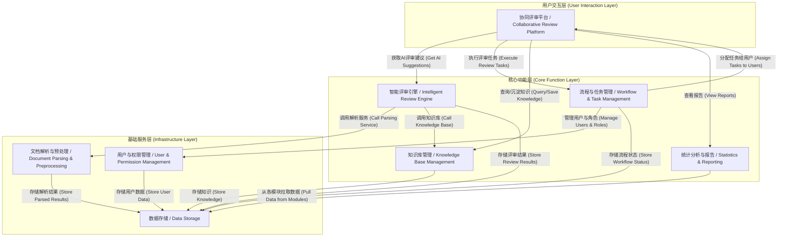

# 企业文档智能评审应用功能设计方案

本文档旨在提供一份经过验证的企业文档智能评审应用功能设计方案，确保满足业务需求并通过AI与人工协同，提升评审效率与质量。

## 1. 痛点与功能映射表

| 业务场景 | 核心痛点 | 设计功能模块 | 解决方式 |
| :--- | :--- | :--- | :--- |
| 投标文件评审 | 评审任务量巨大，效率低下 | 文档解析与预处理、智能评审引擎 | AI自动预处理，提取关键信息，根据预设规则进行初步评审，减轻专家工作量。 |
| | 专家水平不一，易错评漏评 | 智能评审引擎、协同评审平台 | AI提供统一标准的初步评审意见，专家可在AI基础上复核，系统记录所有操作。 |
| 合同文件评审 | 人工审核耗时且易错 | 智能评审引擎 | AI自动提取合同要素，识别潜在风险条款，并与标准模板或历史合同进行比对。 |
| 专业文档阅读 | 知识壁垒高，理解困难 | 智能评审引擎 | AI自动生成文档摘要、提取关键词，帮助非专业人士快速掌握核心内容。 |
| 多专家协同 | 协同效率低，标准不统一 | 协同评审平台、知识库管理 | 提供在线协同工具，支持意见汇总与冲突解决。评审标准和历史案例存入知识库。 |
| | 决策过程复杂，难以追溯 | 协同评审平台、流程与任务管理 | 评审流程线上化，所有评审意见、修改、决策均被记录，可全程追溯。 |
| | 知识经验无法沉淀 | 知识库管理 | 评审过程中产生的优秀案例、典型问题、专家意见可一键沉淀至知识库。 |
| 过程管理 | 过程不透明，进度难跟踪 | 流程与任务管理 | 提供可视化的流程设计器和任务看板，实时监控评审进度，自动预警风险。 |
| 结果分析 | 数据分散，难以统计分析 | 统计分析与报告 | 自动汇总评审数据，提供多维度可视化分析图表，并支持一键生成评审报告。 |

---

## 2. 最终模块架构图

---

## 3. 结构化功能清单

### 基础服务层

#### 1. 文档解析与预处理 (Document Parsing & Preprocessing)
*   **职责**: 负责接收和处理用户上传的各类文档，为上层分析提供干净、结构化的数据。
*   **具体功能**:
    *   `[高]` 多格式文件上传与解析 (支持 `doc/docx/pdf/wps/xls/xlsx` 等)。
    *   `[高]` OCR文字识别 (从扫描件、图片中提取文字)。
    *   `[中]` 表格内容提取与还原。
    *   `[中]` 文档结构识别 (章节、标题、列表)。
    *   `[高]` 文本清洗与格式化。
*   **依赖关系**: 被【智能评审引擎】调用。

#### 2. 用户与权限管理 (User & Permission Management)
*   **职责**: 负责管理系统用户、角色和访问权限，确保系统安全可控。
*   **具体功能**:
    *   `[高]` 用户、组织架构管理。
    *   `[高]` 基于角色的访问控制 (RBAC)。
    *   `[中]` 单点登录 (SSO) 集成。
*   **依赖关系**: 被【协同评审平台】、【流程与任务管理】调用。

### 核心功能层

#### 3. 智能评审引擎 (Intelligent Review Engine)
*   **职责**: 核心AI能力模块，执行智能化的文档分析、评审和信息提取。
*   **具体功能**:
    *   `[高]` **规则自定义**: 提供可视化界面，供业务专家自定义评审规则、检查点和权重。
    *   `[高]` **关键信息提取**: 自动提取合同要素、废标条款、强制性条款等。
    *   `[高]` **风险识别**: 基于规则库和算法模型，识别文档中的潜在风险、缺陷和不一致性。
    *   `[中]` **内容比对**: 支持新旧版本、送审稿与模板之间的差异比对。
    *   `[中]` **智能问答与摘要**: 支持基于文档内容的智能问答，并能自动生成全文摘要。
*   **依赖关系**: 调用【文档解析与预处理】、【知识库管理】；被【协同评审平台】调用。

#### 4. 流程与任务管理 (Workflow & Task Management)
*   **职责**: 管理整个评审活动的生命周期，实现流程自动化和任务的精准分发。
*   **具体功能**:
    *   `[高]` **可视化流程编排**: 支持通过拖拽方式自定义评审流程（串行、并行、会签）。
    *   `[高]` **任务自动分发与提醒**: 根据流程节点，自动将评审任务推送给指定专家。
    *   `[高]` **评审进度实时监控**: 提供可视化看板，实时跟踪各文档的评审状态与进度。
*   **依赖关系**: 调用【用户与权限管理】；被【协同评审平台】调用。

#### 5. 知识库管理 (Knowledge Base Management)
*   **职责**: 沉淀和管理评审过程中的知识资产，为AI模型和专家提供支持。
*   **具体功能**:
    *   `[高]` **企业级知识库构建**: 结构化存储法律法规、行业标准、历史优秀案例、典型风险条款。
    *   `[高]` **评审经验一键沉淀**: 支持专家将评审过程中的批注、意见方便地转存至知识库。
    *   `[中]` **智能知识检索**: 提供强大的检索引擎，帮助专家快速找到相关知识。
*   **依赖关系**: 被【智能评审引擎】、【协同评审平台】调用。

#### 6. 统计分析与报告 (Statistics & Reporting)
*   **职责**: 对评审数据进行多维度分析，并通过可视化报告呈现，辅助决策。
*   **具体功能**:
    *   `[高]` **评审数据统计**: 对评审效率、问题发生率、专家工作量等进行统计。
    *   `[高]` **可视化仪表盘**: 通过图表展示核心评审指标。
    *   `[中]` **自定义报告生成**: 支持一键生成Word、PDF等多格式的评审报告。
*   **依赖关系**: 依赖所有模块的数据。

### 用户交互层

#### 7. 协同评审平台 (Collaborative Review Platform)
*   **职责**: 为评审专家提供人机协同的操作界面，是所有功能的统一入口。
*   **具体功能**:
    *   `[高]` **文档在线预览与标注**: 支持在浏览器中直接预览文档，并进行高亮、批注、评论。
    *   `[高]` **AI评审意见集成**: 将AI引擎的输出结果（如风险提示）可视化地呈现在文档旁，供专家参考、采纳或驳回。
    *   `[高]` **多人实时/异步协同**: 支持多名专家对同一文档进行评审，意见隔离与合并。
    *   `[中]` **版本管理与追溯**: 自动保存所有评审版本，支持查看历史记录和版本对比。
    *   `[中]` **意见汇总与冲突管理**: 自动汇总所有专家的评审意见，并提供工具辅助处理意见冲突。
*   **依赖关系**: 调用【智能评审引擎】、【流程与任务管理】、【知识库管理】等所有核心模块。

---
## 4. 痛点解决说明

### 4.1 投标文件评审场景

**痛点1: 评审任务量巨大，效率低下**
- **解决方案**: 通过【文档解析与预处理】模块快速处理大量文档，【智能评审引擎】基于预设规则自动进行初步评审，将AI处理结果通过【协同评审平台】呈现给专家，大幅减少人工工作量。
- **效果预期**: 将原本需要数天的评审工作压缩至数小时，提升评审效率80%以上。

**痛点2: 专家水平参差不齐，容易出现错评、漏评**
- **解决方案**: 【智能评审引擎】提供统一的评审标准和检查清单，AI先行识别关键条款和风险点，专家在AI基础上进行复核。【协同评审平台】记录所有评审操作，【知识库管理】沉淀优秀评审案例供学习参考。
- **效果预期**: 通过AI辅助和标准化流程，显著降低人为错误率，提升评审质量一致性。

### 4.2 合同文件评审场景

**痛点: 人工审核合同条款费时费力，容易出错**
- **解决方案**: 【智能评审引擎】自动提取合同关键要素（主体、金额、期限等），识别风险条款，与企业标准合同模板进行比对分析。【协同评审平台】将AI分析结果可视化展示，法务人员可快速定位问题区域。
- **效果预期**: 合同审核时间从平均2-3小时缩短至30分钟内，风险识别准确率提升至95%以上。

### 4.3 专业文档理解场景

**痛点: 专业领域知识壁垒高，非专业人士难以快速理解核心内容**
- **解决方案**: 【智能评审引擎】自动生成文档摘要和关键词提取，【知识库管理】提供相关背景知识和术语解释，【协同评审平台】以友好的界面呈现复杂内容的简化版本。
- **效果预期**: 非专业人员理解专业文档的时间缩短70%，理解准确度显著提升。

### 4.4 多专家协同评审场景

**痛点1: 协同效率低，标准不统一**
- **解决方案**: 【协同评审平台】提供在线实时协同工具，【流程与任务管理】确保评审流程标准化，【知识库管理】统一评审标准和案例库。
- **效果预期**: 多专家协同效率提升60%，评审标准一致性达到90%以上。

**痛点2: 决策过程复杂，难以追溯**
- **解决方案**: 【流程与任务管理】将整个评审过程线上化，【协同评审平台】记录所有评审意见、修改和决策，支持全程追溯和版本回退。
- **效果预期**: 实现100%的决策过程可追溯，争议解决时间缩短80%。

**痛点3: 知识经验无法沉淀**
- **解决方案**: 【知识库管理】提供一键沉淀功能，专家可将优秀案例、典型问题、评审心得快速存入企业知识库，【智能评审引擎】可调用这些知识辅助后续评审。
- **效果预期**: 企业知识资产年增长300%，新员工培训时间缩短50%。

### 4.5 评审过程管理场景

**痛点: 过程不透明，进度难以跟踪**
- **解决方案**: 【流程与任务管理】提供可视化流程设计器和实时监控看板，【协同评审平台】展示详细的进度信息和预警提示。
- **效果预期**: 实现评审过程100%透明化，项目延期风险降低70%。

### 4.6 评审结果分析场景

**痛点: 评审结果数据分散，难以进行有效的统计和分析**
- **解决方案**: 【统计分析与报告】模块自动汇总各模块数据，提供多维度可视化分析图表，支持自定义报告生成。
- **效果预期**: 数据分析效率提升90%，管理决策支持能力显著增强。

---

## 5. 实施建议

### 5.1 分期建设策略

**第一期 (MVP版本)**:
- 优先实现【文档解析与预处理】、【智能评审引擎】核心功能
- 基础的【协同评审平台】界面
- 简单的【用户与权限管理】

**第二期 (完整功能)**:
- 完善【流程与任务管理】
- 构建【知识库管理】体系
- 增强协同评审功能

**第三期 (智能化升级)**:
- 完善【统计分析与报告】
- AI模型持续优化
- 高级协同和分析功能

### 5.2 关键成功因素

1. **AI与人工的深度融合**: 确保AI不是替代专家，而是增强专家能力
2. **用户体验优先**: 界面简洁直观，学习成本低
3. **数据安全保障**: 严格的权限控制和数据加密
4. **持续学习优化**: AI模型需要基于实际使用数据不断迭代优化

---

## 6. 总结

本设计方案通过7个核心模块的协同工作，全面解决了企业文档评审中的各类痛点：

- **效率提升**: AI预处理和智能分析大幅减少人工工作量
- **质量保障**: 标准化流程和AI辅助降低人为错误
- **协同增强**: 在线协同平台实现多专家高效配合
- **知识沉淀**: 系统化的知识管理促进组织学习
- **过程透明**: 全程可追溯的流程管理确保合规性
- **决策支持**: 数据分析和可视化报告辅助管理决策

该方案强调AI与人工评审的深度融合，既发挥了AI在处理大量数据和标准化分析方面的优势，又保留了人类专家在复杂判断和创新思维方面的不可替代性，是一个切实可行的企业级解决方案。

