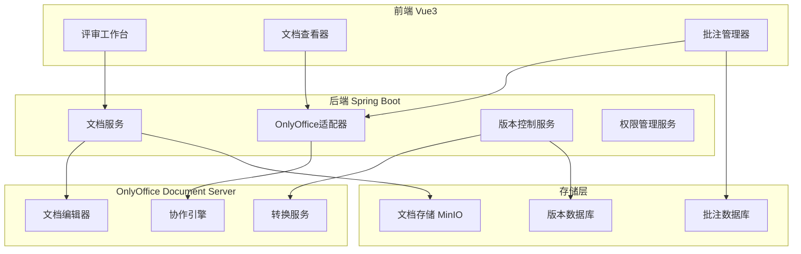

# 企业文档质量评审子系统 - OnlyOffice集成方案

## 1. 集成架构设计

### 1.1 整体架构



### 1.2 核心集成点

1. **文档预览与编辑**：只读模式预览，评审模式批注
2. **版本控制**：评审快照，修订追踪
3. **协同批注**：多专家同时批注，实时同步
4. **权限控制**：基于角色的文档访问控制
5. **格式转换**：多格式文档统一处理

## 2. 后端集成实现

### 2.1 OnlyOffice配置服务

```java
@Service
@ConfigurationProperties(prefix = "onlyoffice")
public class OnlyOfficeConfigService {
    
    private String documentServerUrl;
    private String jwtSecret;
    private String callbackUrl;
    private String storageUrl;
    
    @Value("${app.file.storage.path}")
    private String storagePath;
    
    /**
     * 生成OnlyOffice编辑器配置
     */
    public OnlyOfficeConfig generateConfig(Long documentId, Long userId, ReviewMode mode) {
        Document document = documentService.getById(documentId);
        User user = userService.getById(userId);
        
        OnlyOfficeConfig config = new OnlyOfficeConfig();
        
        // 文档配置
        config.setDocument(DocumentConfig.builder()
            .fileType(getFileExtension(document.getFileName()))
            .key(generateDocumentKey(documentId, document.getVersion()))
            .title(document.getFileName())
            .url(generateDocumentUrl(documentId))
            .build());
        
        // 编辑器配置
        config.setEditorConfig(EditorConfig.builder()
            .mode(mode == ReviewMode.EDIT ? "edit" : "view")
            .lang("zh-CN")
            .callbackUrl(callbackUrl + "/api/v1/onlyoffice/callback/" + documentId)
            .user(UserConfig.builder()
                .id(userId.toString())
                .name(user.getUserName())
                .build())
            .customization(CustomizationConfig.builder()
                .autosave(true)
                .forcesave(true)
                .comments(mode == ReviewMode.REVIEW)
                .trackChanges(mode == ReviewMode.REVIEW)
                .build())
            .build());
        
        // 权限配置
        config.setPermissions(PermissionConfig.builder()
            .edit(mode == ReviewMode.EDIT)
            .comment(mode == ReviewMode.REVIEW || mode == ReviewMode.EDIT)
            .download(hasDownloadPermission(userId, documentId))
            .print(hasPrintPermission(userId, documentId))
            .build());
        
        // JWT签名
        if (StringUtils.hasText(jwtSecret)) {
            config.setToken(generateJWT(config));
        }
        
        return config;
    }
    
    /**
     * 生成文档唯一键
     */
    private String generateDocumentKey(Long documentId, String version) {
        return DigestUtils.md5Hex(documentId + "_" + version + "_" + System.currentTimeMillis());
    }
    
    /**
     * 生成JWT令牌
     */
    private String generateJWT(OnlyOfficeConfig config) {
        return Jwts.builder()
            .setPayload(JsonUtils.toJson(config))
            .signWith(SignatureAlgorithm.HS256, jwtSecret.getBytes())
            .compact();
    }
}
```

### 2.2 文档回调处理器

```java
@RestController
@RequestMapping("/api/v1/onlyoffice")
@Slf4j
public class OnlyOfficeCallbackController {
    
    @Autowired
    private OnlyOfficeCallbackService callbackService;
    
    @Autowired
    private DocumentVersionService versionService;
    
    /**
     * OnlyOffice回调接口
     */
    @PostMapping("/callback/{documentId}")
    public ResponseEntity<CallbackResponse> handleCallback(
            @PathVariable Long documentId,
            @RequestBody CallbackRequest request,
            HttpServletRequest httpRequest) {
        
        try {
            // 验证JWT签名
            if (!validateJWT(httpRequest)) {
                return ResponseEntity.status(HttpStatus.FORBIDDEN)
                    .body(CallbackResponse.error("Invalid JWT"));
            }
            
            log.info("OnlyOffice callback for document {}: status={}", documentId, request.getStatus());
            
            CallbackResponse response = new CallbackResponse();
            
            switch (request.getStatus()) {
                case 1: // 文档正在编辑
                    response.setError(0);
                    break;
                    
                case 2: // 文档准备保存
                case 3: // 文档保存出错
                    response.setError(0);
                    break;
                    
                case 4: // 文档关闭，无修改
                    response.setError(0);
                    break;
                    
                case 6: // 文档正在编辑，但当前用户已断开连接
                case 7: // 强制保存文档
                    handleDocumentSave(documentId, request);
                    response.setError(0);
                    break;
                    
                default:
                    response.setError(1);
                    response.setMessage("Unknown status: " + request.getStatus());
            }
            
            return ResponseEntity.ok(response);
            
        } catch (Exception e) {
            log.error("Error handling OnlyOffice callback for document " + documentId, e);
            return ResponseEntity.status(HttpStatus.INTERNAL_SERVER_ERROR)
                .body(CallbackResponse.error("Internal server error"));
        }
    }
    
    /**
     * 处理文档保存
     */
    private void handleDocumentSave(Long documentId, CallbackRequest request) {
        if (StringUtils.hasText(request.getUrl())) {
            // 下载修改后的文档
            byte[] documentContent = downloadDocument(request.getUrl());
            
            // 创建新版本
            DocumentVersion newVersion = versionService.createVersion(
                documentId, 
                documentContent, 
                request.getUsers(),
                request.getActions()
            );
            
            // 处理批注和修订
            if (request.getActions() != null) {
                callbackService.processDocumentActions(documentId, request.getActions());
            }
            
            // 通知相关用户
            callbackService.notifyDocumentUpdated(documentId, newVersion);
        }
    }
    
    /**
     * 下载文档内容
     */
    private byte[] downloadDocument(String url) {
        try {
            RestTemplate restTemplate = new RestTemplate();
            ResponseEntity<byte[]> response = restTemplate.getForEntity(url, byte[].class);
            return response.getBody();
        } catch (Exception e) {
            throw new RuntimeException("Failed to download document from: " + url, e);
        }
    }
}
```

### 2.3 批注同步服务

```java
@Service
@Transactional
public class AnnotationSyncService {
    
    @Autowired
    private ReviewCommentRepository commentRepository;
    
    @Autowired
    private WebSocketService webSocketService;
    
    /**
     * 同步OnlyOffice批注到系统
     */
    public void syncAnnotationsFromOnlyOffice(Long documentId, List<OnlyOfficeComment> comments) {
        for (OnlyOfficeComment comment : comments) {
            // 检查是否已存在
            Optional<ReviewComment> existing = commentRepository
                .findByOnlyOfficeCommentId(comment.getId());
            
            if (existing.isPresent()) {
                // 更新现有批注
                updateExistingComment(existing.get(), comment);
            } else {
                // 创建新批注
                createNewComment(documentId, comment);
            }
        }
    }
    
    /**
     * 同步系统批注到OnlyOffice
     */
    public void syncAnnotationsToOnlyOffice(Long documentId, ReviewComment comment) {
        OnlyOfficeComment onlyOfficeComment = convertToOnlyOfficeComment(comment);
        
        // 通过OnlyOffice API添加批注
        onlyOfficeApiClient.addComment(documentId, onlyOfficeComment);
        
        // 实时通知其他用户
        webSocketService.broadcastAnnotationUpdate(documentId, comment);
    }
    
    private ReviewComment createNewComment(Long documentId, OnlyOfficeComment comment) {
        ReviewComment reviewComment = new ReviewComment();
        reviewComment.setReviewTaskId(getReviewTaskIdByDocument(documentId));
        reviewComment.setAuthorId(Long.valueOf(comment.getAuthor().getId()));
        reviewComment.setContent(comment.getText());
        reviewComment.setCommentType(ReviewComment.CommentType.GENERAL);
        reviewComment.setPositionInfo(JsonUtils.toJson(comment.getPosition()));
        reviewComment.setQuotedText(comment.getQuoteText());
        reviewComment.setOnlyOfficeCommentId(comment.getId());
        
        return commentRepository.save(reviewComment);
    }
    
    private OnlyOfficeComment convertToOnlyOfficeComment(ReviewComment comment) {
        return OnlyOfficeComment.builder()
            .id(comment.getOnlyOfficeCommentId())
            .text(comment.getContent())
            .author(OnlyOfficeUser.builder()
                .id(comment.getAuthorId().toString())
                .name(comment.getAuthor().getUserName())
                .build())
            .position(JsonUtils.fromJson(comment.getPositionInfo(), CommentPosition.class))
            .quoteText(comment.getQuotedText())
            .build();
    }
}
```

## 3. 前端集成实现

### 3.1 OnlyOffice编辑器组件

```vue
<template>
  <div class="onlyoffice-editor">
    <div id="onlyoffice-container" ref="editorContainer"></div>
    
    <!-- 批注同步状态 -->
    <div v-if="syncStatus.syncing" class="sync-indicator">
      <el-icon class="is-loading"><Loading /></el-icon>
      正在同步批注...
    </div>
  </div>
</template>

<script setup lang="ts">
import { ref, onMounted, onUnmounted, nextTick } from 'vue'
import { useOnlyOfficeEditor } from '@/composables/useOnlyOfficeEditor'

interface Props {
  documentId: number
  mode: 'view' | 'edit' | 'review'
  readonly?: boolean
}

const props = defineProps<Props>()
const emit = defineEmits(['document-ready', 'annotation-added', 'document-saved'])

const editorContainer = ref<HTMLElement>()
const {
  editor,
  config,
  syncStatus,
  initEditor,
  destroyEditor,
  addAnnotation,
  syncAnnotations
} = useOnlyOfficeEditor()

onMounted(async () => {
  await nextTick()
  await initEditor(editorContainer.value!, props.documentId, props.mode)
  
  // 监听编辑器事件
  setupEditorEvents()
})

onUnmounted(() => {
  destroyEditor()
})

const setupEditorEvents = () => {
  if (!editor.value) return
  
  // 文档就绪事件
  editor.value.attachEvent('onDocumentReady', () => {
    emit('document-ready')
  })
  
  // 批注添加事件
  editor.value.attachEvent('onCommentAdd', (comment: any) => {
    emit('annotation-added', comment)
    syncAnnotations()
  })
  
  // 文档保存事件
  editor.value.attachEvent('onDocumentSave', () => {
    emit('document-saved')
  })
  
  // 协作用户变化
  editor.value.attachEvent('onCollaborativeChanges', (changes: any) => {
    handleCollaborativeChanges(changes)
  })
}

const handleCollaborativeChanges = (changes: any) => {
  // 处理协作变更
  console.log('Collaborative changes:', changes)
}

// 暴露方法给父组件
defineExpose({
  addAnnotation,
  syncAnnotations
})
</script>
```

### 3.2 OnlyOffice编辑器Composable

```typescript
// composables/useOnlyOfficeEditor.ts
import { ref } from 'vue'
import { onlyOfficeApi } from '@/api/onlyoffice'

export function useOnlyOfficeEditor() {
  const editor = ref<any>(null)
  const config = ref<any>(null)
  const syncStatus = ref({
    syncing: false,
    lastSync: null
  })

  const initEditor = async (container: HTMLElement, documentId: number, mode: string) => {
    try {
      // 获取OnlyOffice配置
      const response = await onlyOfficeApi.getEditorConfig(documentId, mode)
      config.value = response.data

      // 初始化编辑器
      editor.value = new window.DocsAPI.DocEditor(container.id, {
        ...config.value,
        events: {
          onDocumentReady: () => {
            console.log('Document ready')
          },
          onError: (error: any) => {
            console.error('OnlyOffice error:', error)
          },
          onWarning: (warning: any) => {
            console.warn('OnlyOffice warning:', warning)
          }
        }
      })

    } catch (error) {
      console.error('Failed to initialize OnlyOffice editor:', error)
      throw error
    }
  }

  const destroyEditor = () => {
    if (editor.value) {
      editor.value.destroyEditor()
      editor.value = null
    }
  }

  const addAnnotation = async (annotation: any) => {
    if (!editor.value) return

    try {
      // 通过OnlyOffice API添加批注
      await editor.value.insertComment(annotation)
    } catch (error) {
      console.error('Failed to add annotation:', error)
    }
  }

  const syncAnnotations = async () => {
    if (syncStatus.value.syncing) return

    syncStatus.value.syncing = true
    try {
      // 同步批注到后端
      await onlyOfficeApi.syncAnnotations(config.value.document.key)
      syncStatus.value.lastSync = new Date()
    } catch (error) {
      console.error('Failed to sync annotations:', error)
    } finally {
      syncStatus.value.syncing = false
    }
  }

  return {
    editor,
    config,
    syncStatus,
    initEditor,
    destroyEditor,
    addAnnotation,
    syncAnnotations
  }
}
```

## 4. 版本控制集成

### 4.1 文档版本管理

```java
@Service
public class DocumentVersionService {
    
    @Autowired
    private DocumentVersionRepository versionRepository;
    
    @Autowired
    private FileStorageService fileStorageService;
    
    /**
     * 创建评审快照
     */
    public DocumentVersion createReviewSnapshot(Long documentId, Long reviewTaskId) {
        Document document = documentService.getById(documentId);
        
        // 创建只读快照
        String snapshotPath = fileStorageService.createSnapshot(document.getFilePath());
        
        DocumentVersion snapshot = new DocumentVersion();
        snapshot.setDocumentId(documentId);
        snapshot.setReviewTaskId(reviewTaskId);
        snapshot.setVersionType(VersionType.REVIEW_SNAPSHOT);
        snapshot.setFilePath(snapshotPath);
        snapshot.setVersionNumber(generateVersionNumber(documentId));
        snapshot.setIsReadonly(true);
        snapshot.setCreatedBy(SecurityUtils.getCurrentUserId());
        
        return versionRepository.save(snapshot);
    }
    
    /**
     * 创建修订版本
     */
    public DocumentVersion createRevisionVersion(Long documentId, byte[] content, 
                                               List<String> userIds, List<DocumentAction> actions) {
        DocumentVersion revision = new DocumentVersion();
        revision.setDocumentId(documentId);
        revision.setVersionType(VersionType.REVISION);
        revision.setContent(content);
        revision.setModifiedBy(String.join(",", userIds));
        revision.setChangeLog(JsonUtils.toJson(actions));
        revision.setVersionNumber(generateVersionNumber(documentId));
        
        // 保存文件
        String filePath = fileStorageService.saveFile(content, generateFileName(documentId, revision.getVersionNumber()));
        revision.setFilePath(filePath);
        
        return versionRepository.save(revision);
    }
    
    /**
     * 比较版本差异
     */
    public VersionDiff compareVersions(Long version1Id, Long version2Id) {
        DocumentVersion version1 = versionRepository.findById(version1Id).orElseThrow();
        DocumentVersion version2 = versionRepository.findById(version2Id).orElseThrow();
        
        // 使用OnlyOffice比较服务
        return onlyOfficeCompareService.compare(version1.getFilePath(), version2.getFilePath());
    }
}
```

## 5. 权限控制集成

### 5.1 文档访问控制

```java
@Component
public class OnlyOfficePermissionHandler {
    
    @Autowired
    private ReviewTaskService reviewTaskService;
    
    @Autowired
    private UserPermissionService permissionService;
    
    /**
     * 检查文档访问权限
     */
    public boolean checkDocumentAccess(Long documentId, Long userId, AccessType accessType) {
        // 检查基础文档权限
        if (!permissionService.hasDocumentPermission(userId, documentId, accessType)) {
            return false;
        }
        
        // 检查评审任务权限
        Optional<ReviewTask> activeTask = reviewTaskService.getActiveTaskByDocument(documentId);
        if (activeTask.isPresent()) {
            return checkReviewTaskPermission(activeTask.get(), userId, accessType);
        }
        
        return true;
    }
    
    private boolean checkReviewTaskPermission(ReviewTask task, Long userId, AccessType accessType) {
        switch (accessType) {
            case READ:
                return isTaskParticipant(task, userId) || isTaskCreator(task, userId);
            case comment:
                return isAssignedReviewer(task, userId);
            case edit:
                return isTaskCreator(task, userId) && task.getStatus() == ReviewTaskStatus.DRAFT;
            default:
                return false;
        }
    }
    
    /**
     * 生成OnlyOffice权限配置
     */
    public PermissionConfig generatePermissionConfig(Long documentId, Long userId) {
        return PermissionConfig.builder()
            .edit(checkDocumentAccess(documentId, userId, AccessType.EDIT))
            .comment(checkDocumentAccess(documentId, userId, AccessType.COMMENT))
            .download(checkDocumentAccess(documentId, userId, AccessType.DOWNLOAD))
            .print(checkDocumentAccess(documentId, userId, AccessType.PRINT))
            .build();
    }
}
```

## 6. 实时协作支持

### 6.1 WebSocket协作通知

```java
@Component
public class OnlyOfficeCollaborationHandler {
    
    @Autowired
    private SimpMessagingTemplate messagingTemplate;
    
    /**
     * 广播文档协作状态
     */
    public void broadcastCollaborationStatus(Long documentId, CollaborationEvent event) {
        messagingTemplate.convertAndSend(
            "/topic/document/" + documentId + "/collaboration",
            event
        );
    }
    
    /**
     * 通知用户加入协作
     */
    public void notifyUserJoined(Long documentId, Long userId, String userName) {
        CollaborationEvent event = CollaborationEvent.builder()
            .type(EventType.USER_JOINED)
            .userId(userId)
            .userName(userName)
            .timestamp(LocalDateTime.now())
            .build();
            
        broadcastCollaborationStatus(documentId, event);
    }
    
    /**
     * 通知批注更新
     */
    public void notifyAnnotationUpdate(Long documentId, ReviewComment comment) {
        CollaborationEvent event = CollaborationEvent.builder()
            .type(EventType.ANNOTATION_UPDATED)
            .userId(comment.getAuthorId())
            .data(comment)
            .timestamp(LocalDateTime.now())
            .build();
            
        broadcastCollaborationStatus(documentId, event);
    }
}
```

## 7. 配置示例

### 7.1 application.yml配置

```yaml
onlyoffice:
  document-server-url: http://localhost:8080
  jwt-secret: ${ONLYOFFICE_JWT_SECRET:your-secret-key}
  callback-url: ${APP_BASE_URL:http://localhost:8080}
  storage-url: ${APP_BASE_URL:http://localhost:8080}/api/v1/files
  
app:
  file:
    storage:
      path: /data/documents
      max-size: 100MB
    allowed-extensions:
      - pdf
      - docx
      - xlsx
      - pptx
```

### 7.2 前端环境配置

```typescript
// config/onlyoffice.ts
export const onlyOfficeConfig = {
  documentServerUrl: import.meta.env.VITE_ONLYOFFICE_URL || 'http://localhost:8080',
  apiUrl: import.meta.env.VITE_API_URL || 'http://localhost:8080/api/v1',
  wsUrl: import.meta.env.VITE_WS_URL || 'ws://localhost:8080/ws'
}
```
