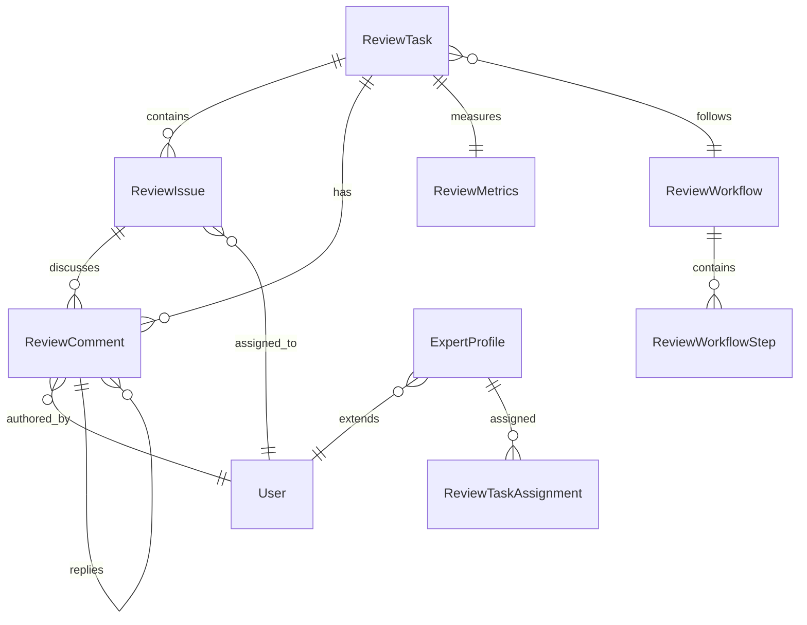

# 企业文档质量评审子系统 - 扩展数据模型设计

## 1. 核心实体扩展

### 1.1 ReviewTask 扩展（基于现有实体）

```java
// 新增字段
@Column(name = "review_template_id")
private Long reviewTemplateId;

@Column(name = "business_type")
@Enumerated(EnumType.STRING)
private BusinessType businessType; // 合同、标书、技术方案等

@Column(name = "confidentiality_level")
@Enumerated(EnumType.STRING)
private ConfidentialityLevel confidentialityLevel;

@Column(name = "auto_assignment_enabled")
private Boolean autoAssignmentEnabled = true;

@Column(name = "convergence_gate_enabled")
private Boolean convergenceGateEnabled = false;

@Column(name = "convergence_deadline")
private LocalDateTime convergenceDeadline;

@Column(name = "review_conclusion")
@Enumerated(EnumType.STRING)
private ReviewConclusion reviewConclusion;

// 新增枚举
public enum BusinessType {
    CONTRACT("合同"), TENDER("标书"), TECHNICAL_PROPOSAL("技术方案"), 
    POLICY("政策文件"), MANUAL("操作手册"), OTHER("其他");
}

public enum ConfidentialityLevel {
    PUBLIC("公开"), INTERNAL("内部"), CONFIDENTIAL("机密"), SECRET("秘密");
}

public enum ReviewConclusion {
    APPROVED("通过"), CONDITIONAL_APPROVED("有条件通过"), 
    REJECTED("拒绝"), NEED_MAJOR_REVISION("需要重大修订");
}
```

### 1.2 新增实体：ReviewWorkflow（评审流程模板）

```java
@Entity
@Table(name = "review_workflows")
public class ReviewWorkflow extends BaseEntity {
    
    @Column(name = "workflow_name", nullable = false)
    private String workflowName;
    
    @Column(name = "workflow_description")
    private String workflowDescription;
    
    @Column(name = "business_type")
    @Enumerated(EnumType.STRING)
    private BusinessType businessType;
    
    @Column(name = "workflow_type")
    @Enumerated(EnumType.STRING)
    private WorkflowType workflowType; // LINEAR, PARALLEL, CONDITIONAL
    
    @Column(name = "is_active")
    private Boolean isActive = true;
    
    @Column(name = "version")
    private String version;
    
    @OneToMany(mappedBy = "workflow", cascade = CascadeType.ALL)
    private List<ReviewWorkflowStep> steps;
    
    public enum WorkflowType {
        LINEAR("线性流程"), PARALLEL("并行流程"), CONDITIONAL("条件流程");
    }
}
```

### 1.3 新增实体：ReviewWorkflowStep（流程步骤）

```java
@Entity
@Table(name = "review_workflow_steps")
public class ReviewWorkflowStep extends BaseEntity {
    
    @Column(name = "workflow_id", nullable = false)
    private Long workflowId;
    
    @Column(name = "step_name", nullable = false)
    private String stepName;
    
    @Column(name = "step_order", nullable = false)
    private Integer stepOrder;
    
    @Column(name = "step_type")
    @Enumerated(EnumType.STRING)
    private StepType stepType;
    
    @Column(name = "required_role")
    private String requiredRole;
    
    @Column(name = "required_skills", columnDefinition = "TEXT")
    private String requiredSkills; // JSON格式存储技能要求
    
    @Column(name = "sla_hours")
    private Integer slaHours;
    
    @Column(name = "is_mandatory")
    private Boolean isMandatory = true;
    
    @Column(name = "approval_threshold")
    private Integer approvalThreshold; // 并行审核时的通过阈值
    
    @Column(name = "condition_expression", columnDefinition = "TEXT")
    private String conditionExpression; // 条件流程的判断表达式
    
    public enum StepType {
        AI_ANALYSIS("AI分析"), EXPERT_REVIEW("专家评审"), 
        COMPLIANCE_CHECK("合规检查"), FINAL_APPROVAL("最终审批");
    }
}
```

### 1.4 新增实体：ExpertProfile（专家档案）

```java
@Entity
@Table(name = "expert_profiles")
public class ExpertProfile extends BaseEntity {
    
    @Column(name = "user_id", nullable = false)
    private Long userId;
    
    @Column(name = "expertise_areas", columnDefinition = "TEXT")
    private String expertiseAreas; // JSON格式存储专业领域
    
    @Column(name = "skill_tags", columnDefinition = "TEXT")
    private String skillTags; // JSON格式存储技能标签
    
    @Column(name = "certification_level")
    @Enumerated(EnumType.STRING)
    private CertificationLevel certificationLevel;
    
    @Column(name = "current_workload")
    private Integer currentWorkload = 0;
    
    @Column(name = "max_concurrent_reviews")
    private Integer maxConcurrentReviews = 5;
    
    @Column(name = "average_review_time")
    private Double averageReviewTime; // 小时
    
    @Column(name = "quality_score")
    private Double qualityScore = 5.0; // 1-10分
    
    @Column(name = "total_reviews_completed")
    private Integer totalReviewsCompleted = 0;
    
    @Column(name = "is_available")
    private Boolean isAvailable = true;
    
    public enum CertificationLevel {
        JUNIOR("初级"), INTERMEDIATE("中级"), SENIOR("高级"), EXPERT("专家");
    }
}
```

### 1.5 扩展实体：ReviewComment（基于现有实体）

```java
// 新增字段
@Column(name = "ai_generated")
private Boolean aiGenerated = false;

@Column(name = "ai_confidence_score")
private Double aiConfidenceScore;

@Column(name = "category")
@Enumerated(EnumType.STRING)
private CommentCategory category;

@Column(name = "suggested_action")
@Enumerated(EnumType.STRING)
private SuggestedAction suggestedAction;

@Column(name = "evidence_links", columnDefinition = "TEXT")
private String evidenceLinks; // JSON格式存储证据链接

@Column(name = "duplicate_of_comment_id")
private Long duplicateOfCommentId; // 重复问题合并

@Column(name = "estimated_effort_hours")
private Integer estimatedEffortHours;

// 新增枚举
public enum CommentCategory {
    FORMAT("格式问题"), COMPLIANCE("合规问题"), CONTENT("内容问题"), 
    LOGIC("逻辑问题"), REFERENCE("引用问题"), SECURITY("安全问题");
}

public enum SuggestedAction {
    MODIFY("修改"), DELETE("删除"), ADD("添加"), CLARIFY("澄清"), VERIFY("验证");
}
```

## 2. 新增支撑实体

### 2.1 ReviewIssue（问题清单）

```java
@Entity
@Table(name = "review_issues")
public class ReviewIssue extends BaseEntity {
    
    @Column(name = "review_task_id", nullable = false)
    private Long reviewTaskId;
    
    @Column(name = "issue_number", nullable = false)
    private String issueNumber; // 自动生成的问题编号
    
    @Column(name = "title", nullable = false)
    private String title;
    
    @Column(name = "description", columnDefinition = "TEXT")
    private String description;
    
    @Column(name = "category")
    @Enumerated(EnumType.STRING)
    private IssueCategory category;
    
    @Column(name = "severity")
    @Enumerated(EnumType.STRING)
    private IssueSeverity severity;
    
    @Column(name = "status")
    @Enumerated(EnumType.STRING)
    private IssueStatus status = IssueStatus.OPEN;
    
    @Column(name = "assigned_to_id")
    private Long assignedToId;
    
    @Column(name = "reporter_id", nullable = false)
    private Long reporterId;
    
    @Column(name = "position_info", columnDefinition = "TEXT")
    private String positionInfo; // 文档位置信息
    
    @Column(name = "original_text", columnDefinition = "TEXT")
    private String originalText;
    
    @Column(name = "suggested_text", columnDefinition = "TEXT")
    private String suggestedText;
    
    @Column(name = "resolution", columnDefinition = "TEXT")
    private String resolution;
    
    @Column(name = "verification_result")
    @Enumerated(EnumType.STRING)
    private VerificationResult verificationResult;
    
    @Column(name = "due_date")
    private LocalDateTime dueDate;
    
    @Column(name = "resolved_at")
    private LocalDateTime resolvedAt;
    
    public enum IssueCategory {
        FORMAT, COMPLIANCE, CONTENT, LOGIC, REFERENCE, SECURITY, OTHER;
    }
    
    public enum IssueSeverity {
        INFO, LOW, MEDIUM, HIGH, CRITICAL;
    }
    
    public enum IssueStatus {
        OPEN, IN_PROGRESS, RESOLVED, VERIFIED, CLOSED, DEFERRED;
    }
    
    public enum VerificationResult {
        PENDING, ACCEPTED, REJECTED, PARTIALLY_ACCEPTED;
    }
}
```

### 2.2 ReviewMetrics（评审指标）

```java
@Entity
@Table(name = "review_metrics")
public class ReviewMetrics extends BaseEntity {
    
    @Column(name = "review_task_id", nullable = false)
    private Long reviewTaskId;
    
    @Column(name = "total_issues_found")
    private Integer totalIssuesFound = 0;
    
    @Column(name = "critical_issues_count")
    private Integer criticalIssuesCount = 0;
    
    @Column(name = "high_issues_count")
    private Integer highIssuesCount = 0;
    
    @Column(name = "medium_issues_count")
    private Integer mediumIssuesCount = 0;
    
    @Column(name = "low_issues_count")
    private Integer lowIssuesCount = 0;
    
    @Column(name = "issues_resolved_count")
    private Integer issuesResolvedCount = 0;
    
    @Column(name = "ai_analysis_duration_minutes")
    private Integer aiAnalysisDurationMinutes;
    
    @Column(name = "expert_review_duration_minutes")
    private Integer expertReviewDurationMinutes;
    
    @Column(name = "total_review_duration_minutes")
    private Integer totalReviewDurationMinutes;
    
    @Column(name = "quality_score")
    private Double qualityScore;
    
    @Column(name = "compliance_score")
    private Double complianceScore;
    
    @Column(name = "expert_satisfaction_score")
    private Double expertSatisfactionScore;
}
```

## 3. 数据关系图



## 4. 索引策略

```sql
-- 性能优化索引
CREATE INDEX idx_review_task_status ON review_tasks(status);
CREATE INDEX idx_review_task_business_type ON review_tasks(business_type);
CREATE INDEX idx_review_task_deadline ON review_tasks(deadline);

CREATE INDEX idx_review_issue_status ON review_issues(status);
CREATE INDEX idx_review_issue_severity ON review_issues(severity);
CREATE INDEX idx_review_issue_assigned_to ON review_issues(assigned_to_id);

CREATE INDEX idx_expert_profile_available ON expert_profiles(is_available);
CREATE INDEX idx_expert_profile_workload ON expert_profiles(current_workload);

-- 复合索引
CREATE INDEX idx_review_task_status_priority ON review_tasks(status, priority);
CREATE INDEX idx_review_issue_task_status ON review_issues(review_task_id, status);
```
