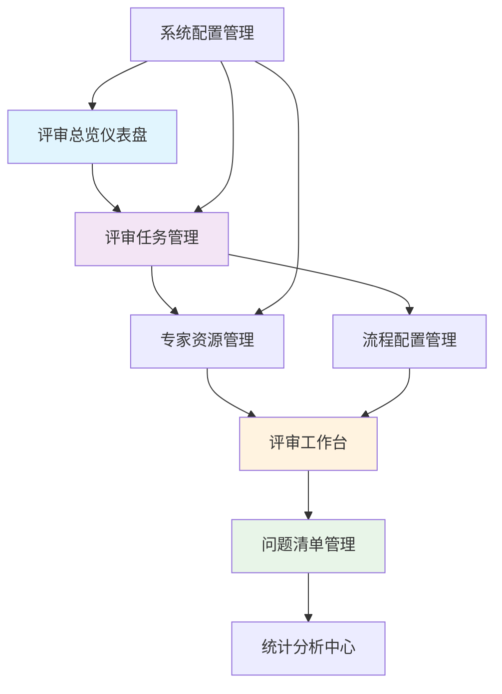

# 企业文档质量评审系统 - 前端功能架构设计

## 1. 功能层级划分总览

### 一级功能模块（8个主要业务模块）
```
├── 📊 评审总览仪表盘
├── 📝 评审任务管理  
├── 👥 专家资源管理
├── 🔄 流程配置管理
├── 💻 评审工作台
├── 📋 问题清单管理
├── 📈 统计分析中心
└── ⚙️ 系统配置管理
```

## 2. 详细功能层级结构

### 📊 一级功能：评审总览仪表盘 (P0)
**路由**: `/review-system/dashboard`
**组件**: `ReviewDashboard.vue`

#### 二级功能：
- **2.1 实时监控看板** (P0)
  - 三级功能：
    - 2.1.1 在审任务统计 (P0) - 显示当前进行中的评审数量
    - 2.1.2 专家工作负载 (P0) - 实时显示专家忙闲状态
    - 2.1.3 SLA预警提醒 (P0) - 超时任务红色预警
    - 2.1.4 问题解决率趋势 (P1) - 7天/30天趋势图表

- **2.2 快速操作入口** (P0)
  - 三级功能：
    - 2.2.1 一键创建评审 (P0) - 快速启动评审流程
    - 2.2.2 紧急任务处理 (P0) - 优先级任务快速通道
    - 2.2.3 待办事项提醒 (P0) - 个人待处理任务列表
    - 2.2.4 最近访问文档 (P1) - 快速访问历史文档

### 📝 一级功能：评审任务管理 (P0)
**路由**: `/review-system/tasks`
**组件**: `TaskManagement.vue`

#### 二级功能：
- **2.1 任务创建向导** (P0) - 对应A1,A2,N1
  - 三级功能：
    - 2.1.1 基础信息填写 (P0) - 任务名称、描述、类型
    - 2.1.2 文档上传管理 (P0) - 对应B1,B2,B3 多格式、多文件、文档库选择
    - 2.1.3 评审时间设置 (P0) - 对应A2 可调整时间窗
    - 2.1.4 业务关联配置 (P0) - 对应N1 项目可选关联
    - 2.1.5 流程模板选择 (P1) - 智能推荐评审流程

- **2.2 任务列表管理** (P0)
  - 三级功能：
    - 2.2.1 多维度筛选 (P0) - 状态、优先级、业务类型筛选
    - 2.2.2 批量操作功能 (P1) - 批量分派、批量状态更新
    - 2.2.3 任务状态跟踪 (P0) - 实时状态更新和进度显示
    - 2.2.4 快速搜索定位 (P0) - 任务名称、创建人搜索

- **2.3 任务详情管理** (P0)
  - 三级功能：
    - 2.3.1 基本信息展示 (P0) - 任务详情、时间线
    - 2.3.2 参与人员管理 (P0) - 专家分派状态、权限管理
    - 2.3.3 进度跟踪监控 (P0) - 各阶段完成情况
    - 2.3.4 时间窗调整 (P0) - 对应A2 进行中可延期/收紧

### 👥 一级功能：专家资源管理 (P0/P1)
**路由**: `/review-system/experts`
**组件**: `ExpertManagement.vue`

#### 二级功能：
- **2.1 专家档案管理** (P1) - 对应C1,C2
  - 三级功能：
    - 2.1.1 专家信息维护 (P1) - 技能标签、专业领域
    - 2.1.2 能力评估记录 (P1) - 历史贡献、质量评分
    - 2.1.3 工作量统计 (P1) - 对应C2 专家工作量看板
    - 2.1.4 可用性状态 (P0) - 实时忙闲状态更新

- **2.2 智能推荐系统** (P1) - 对应C1
  - 三级功能：
    - 2.2.1 AI专家匹配 (P1) - 技能/专业/历史贡献匹配
    - 2.2.2 负载均衡推荐 (P1) - 工作量平衡考虑
    - 2.2.3 冲突检测避让 (P1) - 自动排除冲突专家
    - 2.2.4 推荐理由说明 (P1) - 匹配度详细说明

- **2.3 分派管理功能** (P0) - 对应C3
  - 三级功能：
    - 2.3.1 快速分派操作 (P0) - 一键分派专家
    - 2.3.2 自选转办机制 (P0) - 对应C3 受邀专家可自选/转办
    - 2.3.3 分派审批流程 (P1) - 可配置审批机制
    - 2.3.4 分派历史记录 (P1) - 分派操作审计日志

### 🔄 一级功能：流程配置管理 (P1)
**路由**: `/review-system/workflows`
**组件**: `WorkflowConfig.vue`

#### 二级功能：
- **2.1 流程模板设计** (P1)
  - 三级功能：
    - 2.1.1 可视化流程设计器 (P1) - 拖拽式流程配置
    - 2.1.2 步骤节点配置 (P1) - SLA、角色、技能要求
    - 2.1.3 条件分支设置 (P1) - 基于文档类型、密级路由
    - 2.1.4 并行流程配置 (P1) - N/N全票或M/N多数通过

- **2.2 模板管理维护** (P1)
  - 三级功能：
    - 2.2.1 模板版本控制 (P1) - 版本化管理、灰度发布
    - 2.2.2 模板复制克隆 (P1) - 基于现有模板快速创建
    - 2.2.3 模板使用统计 (P2) - 使用频率、效果分析
    - 2.2.4 模板权限管理 (P1) - 查看、编辑、发布权限

### 💻 一级功能：评审工作台 (P0)
**路由**: `/review-system/workspace/:taskId`
**组件**: `ReviewWorkspace.vue`

#### 二级功能：
- **2.1 文档查看编辑** (P0) - 对应B4,E2
  - 三级功能：
    - 2.1.1 多格式文档预览 (P0) - 对应E2 PDF/DOCX/PPTX/XLSX/图片
    - 2.1.2 评审模式切换 (P0) - 对应B4 只读/批注模式
    - 2.1.3 版本快照管理 (P0) - 评审中版本锁定
    - 2.1.4 文档缩放导航 (P0) - 缩放、页面跳转、书签

- **2.2 AI辅助评审** (P0) - 对应E1
  - 三级功能：
    - 2.2.1 AI自动扫描 (P0) - 对应E1 格式/合规/术语/逻辑检查
    - 2.2.2 关注点推荐 (P0) - AI推荐重点关注区域
    - 2.2.3 意见草稿生成 (P0) - AI生成评审意见模板
    - 2.2.4 智能标签标注 (P1) - 自动识别需要重点审核的章节

- **2.3 批注评论系统** (P0) - 对应E2,F4
  - 三级功能：
    - 2.3.1 精准位置批注 (P0) - 对应E2 锚点定位批注
    - 2.3.2 结构化问题清单 (P0) - 对应F4 批注→问题清单转换
    - 2.3.3 评论回复讨论 (P0) - 多层级评论回复
    - 2.3.4 批注权限控制 (P0) - 基于角色的批注权限

### 📋 一级功能：问题清单管理 (P0)
**路由**: `/review-system/issues`
**组件**: `IssueManagement.vue`

#### 二级功能：
- **2.1 问题分类管理** (P0/P1) - 对应F1,F3
  - 三级功能：
    - 2.1.1 智能分类预测 (P1) - 对应F1 严重度/类别智能预测
    - 2.1.2 重复问题检测 (P1) - 对应F3 相似度/位置/上下文比对
    - 2.1.3 问题合并去重 (P1) - 重复问题自动合并提示
    - 2.1.4 分类标签管理 (P0) - 自定义问题分类标签

- **2.2 责任人指派** (P0) - 对应F2
  - 三级功能：
    - 2.2.1 快速批量指派 (P0) - 对应F2 快速/批量指派责任人
    - 2.2.2 默认责任人设置 (P0) - 含默认编制人/团队
    - 2.2.3 指派规则配置 (P1) - 基于问题类型自动指派
    - 2.2.4 指派通知提醒 (P0) - 自动通知责任人

- **2.3 问题跟踪处理** (P0) - 对应G1,G2,G3
  - 三级功能：
    - 2.3.1 位点联动跳转 (P0) - 对应G1,G2 清单↔原文双向跳转
    - 2.3.2 修订差异对比 (P0) - 对应G1 原选区快照+差异高亮
    - 2.3.3 未处理自动检测 (P0) - 对应G3 未回复/未处理提醒
    - 2.3.4 多维排序视图 (P0) - 对应G5 章节/分类/严重度/修订人

### 📈 一级功能：统计分析中心 (P2)
**路由**: `/review-system/analytics`
**组件**: `AnalyticsCenter.vue`

#### 二级功能：
- **2.1 评审效率分析** (P2) - 对应L1,L2
  - 三级功能：
    - 2.1.1 总览仪表盘 (P2) - 对应L1 总数、在审、周期、问题总量
    - 2.1.2 效率趋势分析 (P2) - 按时率、解决率趋势
    - 2.1.3 瓶颈识别分析 (P2) - 流程瓶颈点识别
    - 2.1.4 对比分析报告 (P2) - 不同时期、团队对比

- **2.2 专家贡献评估** (P2) - 对应K1,K2
  - 三级功能：
    - 2.2.1 贡献度看板 (P2) - 对应K1 参与度/质量/效率/规模
    - 2.2.2 专家排名报告 (P2) - 对应K2 个人/团队/时间段排名
    - 2.2.3 能力成长轨迹 (P2) - 专家能力发展趋势
    - 2.2.4 激励建议生成 (P2) - 基于贡献度的激励建议

- **2.3 知识洞察分析** (P1/P2) - 对应J4,J5
  - 三级功能：
    - 2.3.1 高频问题报告 (P1) - 对应J4 TOP10高频问题
    - 2.3.2 问题根因分析 (P1) - 对应J3 智能归因与根因分类
    - 2.3.3 改进建议推送 (P2) - 对应J5 历史修改建议库推送
    - 2.3.4 知识图谱展示 (P2) - 问题关联关系可视化

### ⚙️ 一级功能：系统配置管理 (P0)
**路由**: `/review-system/settings`
**组件**: `SystemSettings.vue`

#### 二级功能：
- **2.1 权限角色管理** (P0) - 对应M2,M3
  - 三级功能：
    - 2.1.1 角色权限配置 (P0) - 对应M2 角色/权限管理
    - 2.1.2 项目授权管理 (P0) - 对应M3 项目与文档库授权
    - 2.1.3 用户组织管理 (P0) - 部门、团队权限继承
    - 2.1.4 权限审计日志 (P0) - 对应M1 权限变更记录

- **2.2 通知集成配置** (P0) - 对应D1,D2,N2
  - 三级功能：
    - 2.2.1 多通道配置 (P0) - 对应D1 KK/邮件/短信/站内通知
    - 2.2.2 通知模板管理 (P0) - 自定义通知内容模板
    - 2.2.3 提醒策略设置 (P0) - SLA提醒、升级策略
    - 2.2.4 外部系统集成 (P0) - 对应N2 ENS/LDAP/SSO集成

## 3. 依赖关系图



## 4. 前端组件架构设计

### 4.1 组件层次结构

```
src/views/review-system/
├── dashboard/                 # 📊 评审总览仪表盘
│   ├── index.vue             # 主页面
│   ├── components/
│   │   ├── MonitoringBoard.vue      # 实时监控看板
│   │   ├── QuickActions.vue         # 快速操作入口
│   │   ├── TaskStatistics.vue       # 任务统计卡片
│   │   └── ExpertWorkload.vue       # 专家工作负载
│   └── composables/
│       └── useDashboard.ts          # 仪表盘逻辑
│
├── task-management/           # 📝 评审任务管理
│   ├── index.vue             # 任务列表页
│   ├── create.vue            # 任务创建页
│   ├── detail.vue            # 任务详情页
│   ├── components/
│   │   ├── TaskCreationWizard.vue   # 任务创建向导
│   │   ├── TaskList.vue             # 任务列表组件
│   │   ├── TaskCard.vue             # 任务卡片
│   │   ├── DocumentUploader.vue     # 文档上传器
│   │   ├── TimelineEditor.vue       # 时间设置器
│   │   └── WorkflowSelector.vue     # 流程选择器
│   └── composables/
│       ├── useTaskManagement.ts     # 任务管理逻辑
│       └── useTaskCreation.ts       # 任务创建逻辑
│
├── expert-management/         # 👥 专家资源管理
│   ├── index.vue             # 专家列表页
│   ├── profile.vue           # 专家档案页
│   ├── components/
│   │   ├── ExpertList.vue           # 专家列表
│   │   ├── ExpertCard.vue           # 专家卡片
│   │   ├── WorkloadDashboard.vue    # 工作量看板
│   │   ├── RecommendationEngine.vue # 推荐引擎
│   │   ├── AssignmentDialog.vue     # 分派对话框
│   │   └── ExpertProfile.vue        # 专家档案
│   └── composables/
│       ├── useExpertManagement.ts   # 专家管理逻辑
│       └── useRecommendation.ts     # 推荐算法逻辑
│
├── workflow-config/           # 🔄 流程配置管理
│   ├── index.vue             # 流程列表页
│   ├── designer.vue          # 流程设计器页
│   ├── components/
│   │   ├── WorkflowDesigner.vue     # 可视化设计器
│   │   ├── NodeEditor.vue           # 节点编辑器
│   │   ├── FlowChart.vue            # 流程图组件
│   │   ├── TemplateManager.vue      # 模板管理器
│   │   └── VersionControl.vue       # 版本控制
│   └── composables/
│       ├── useWorkflowDesign.ts     # 流程设计逻辑
│       └── useTemplateManagement.ts # 模板管理逻辑
│
├── review-workspace/          # 💻 评审工作台
│   ├── index.vue             # 工作台主页
│   ├── components/
│   │   ├── DocumentViewer.vue       # 文档查看器
│   │   ├── AnnotationPanel.vue      # 批注面板
│   │   ├── IssuePanel.vue           # 问题面板
│   │   ├── AIAssistant.vue          # AI助手
│   │   ├── CommentThread.vue        # 评论线程
│   │   ├── VersionManager.vue       # 版本管理器
│   │   └── CollaborationStatus.vue  # 协作状态
│   └── composables/
│       ├── useReviewWorkspace.ts    # 工作台逻辑
│       ├── useDocumentViewer.ts     # 文档查看逻辑
│       ├── useAnnotation.ts         # 批注逻辑
│       └── useAIAssistant.ts        # AI助手逻辑
│
├── issue-management/          # 📋 问题清单管理
│   ├── index.vue             # 问题列表页
│   ├── detail.vue            # 问题详情页
│   ├── components/
│   │   ├── IssueList.vue            # 问题列表
│   │   ├── IssueCard.vue            # 问题卡片
│   │   ├── IssueEditor.vue          # 问题编辑器
│   │   ├── CategoryManager.vue      # 分类管理器
│   │   ├── AssignmentManager.vue    # 指派管理器
│   │   ├── DuplicateDetector.vue    # 重复检测器
│   │   └── TrackingBoard.vue        # 跟踪看板
│   └── composables/
│       ├── useIssueManagement.ts    # 问题管理逻辑
│       ├── useClassification.ts     # 分类逻辑
│       └── useDuplicateDetection.ts # 去重逻辑
│
├── analytics/                 # 📈 统计分析中心
│   ├── index.vue             # 分析总览页
│   ├── efficiency.vue        # 效率分析页
│   ├── expert-evaluation.vue # 专家评估页
│   ├── knowledge-insights.vue # 知识洞察页
│   ├── components/
│   │   ├── EfficiencyDashboard.vue  # 效率仪表盘
│   │   ├── TrendAnalysis.vue        # 趋势分析
│   │   ├── ExpertRanking.vue        # 专家排名
│   │   ├── KnowledgeGraph.vue       # 知识图谱
│   │   ├── ReportGenerator.vue      # 报告生成器
│   │   └── ChartComponents/         # 图表组件库
│   │       ├── LineChart.vue
│   │       ├── BarChart.vue
│   │       ├── PieChart.vue
│   │       └── HeatMap.vue
│   └── composables/
│       ├── useAnalytics.ts          # 分析逻辑
│       ├── useCharts.ts             # 图表逻辑
│       └── useReports.ts            # 报告逻辑
│
├── settings/                  # ⚙️ 系统配置管理
│   ├── index.vue             # 设置总览页
│   ├── permissions.vue       # 权限管理页
│   ├── notifications.vue     # 通知配置页
│   ├── components/
│   │   ├── PermissionMatrix.vue     # 权限矩阵
│   │   ├── RoleEditor.vue           # 角色编辑器
│   │   ├── NotificationConfig.vue   # 通知配置
│   │   ├── IntegrationSettings.vue  # 集成设置
│   │   └── AuditLog.vue             # 审计日志
│   └── composables/
│       ├── usePermissions.ts        # 权限逻辑
│       └── useNotifications.ts      # 通知逻辑
│
└── shared/                    # 🔧 共享组件和工具
    ├── components/
    │   ├── BaseTable.vue            # 基础表格
    │   ├── BaseForm.vue             # 基础表单
    │   ├── BaseDialog.vue           # 基础对话框
    │   ├── BaseUploader.vue         # 基础上传器
    │   ├── StatusTag.vue            # 状态标签
    │   ├── PriorityBadge.vue        # 优先级徽章
    │   ├── UserAvatar.vue           # 用户头像
    │   ├── TimelineView.vue         # 时间线视图
    │   ├── ProgressBar.vue          # 进度条
    │   └── LoadingSpinner.vue       # 加载动画
    ├── composables/
    │   ├── usePermission.ts         # 权限检查
    │   ├── useWebSocket.ts          # WebSocket连接
    │   ├── useNotification.ts       # 通知管理
    │   ├── usePagination.ts         # 分页逻辑
    │   ├── useSearch.ts             # 搜索逻辑
    │   └── useExport.ts             # 导出逻辑
    └── utils/
        ├── constants.ts             # 常量定义
        ├── validators.ts            # 表单验证
        ├── formatters.ts            # 数据格式化
        └── helpers.ts               # 工具函数
```

### 4.2 路由配置设计

```typescript
// router/review-system.ts
export const reviewSystemRoutes = [
  {
    path: '/review-system',
    component: () => import('@/layout/index.vue'),
    meta: {
      title: '评审系统',
      icon: 'DocumentChecked',
      requiresAuth: true
    },
    children: [
      // 📊 评审总览仪表盘 (P0)
      {
        path: 'dashboard',
        name: 'ReviewDashboard',
        component: () => import('@/views/review-system/dashboard/index.vue'),
        meta: {
          title: '评审总览',
          priority: 'P0',
          permissions: ['review:dashboard:view']
        }
      },

      // 📝 评审任务管理 (P0)
      {
        path: 'tasks',
        name: 'TaskManagement',
        component: () => import('@/views/review-system/task-management/index.vue'),
        meta: {
          title: '任务管理',
          priority: 'P0',
          permissions: ['review:task:view']
        },
        children: [
          {
            path: 'create',
            name: 'TaskCreate',
            component: () => import('@/views/review-system/task-management/create.vue'),
            meta: {
              title: '创建任务',
              priority: 'P0',
              permissions: ['review:task:create']
            }
          },
          {
            path: ':id',
            name: 'TaskDetail',
            component: () => import('@/views/review-system/task-management/detail.vue'),
            meta: {
              title: '任务详情',
              priority: 'P0',
              permissions: ['review:task:view']
            }
          }
        ]
      },

      // 👥 专家资源管理 (P0/P1)
      {
        path: 'experts',
        name: 'ExpertManagement',
        component: () => import('@/views/review-system/expert-management/index.vue'),
        meta: {
          title: '专家管理',
          priority: 'P1',
          permissions: ['review:expert:view']
        },
        children: [
          {
            path: ':id/profile',
            name: 'ExpertProfile',
            component: () => import('@/views/review-system/expert-management/profile.vue'),
            meta: {
              title: '专家档案',
              priority: 'P1',
              permissions: ['review:expert:view']
            }
          }
        ]
      },

      // 🔄 流程配置管理 (P1)
      {
        path: 'workflows',
        name: 'WorkflowConfig',
        component: () => import('@/views/review-system/workflow-config/index.vue'),
        meta: {
          title: '流程配置',
          priority: 'P1',
          permissions: ['review:workflow:view']
        },
        children: [
          {
            path: 'designer/:id?',
            name: 'WorkflowDesigner',
            component: () => import('@/views/review-system/workflow-config/designer.vue'),
            meta: {
              title: '流程设计器',
              priority: 'P1',
              permissions: ['review:workflow:edit']
            }
          }
        ]
      },

      // 💻 评审工作台 (P0)
      {
        path: 'workspace/:taskId',
        name: 'ReviewWorkspace',
        component: () => import('@/views/review-system/review-workspace/index.vue'),
        meta: {
          title: '评审工作台',
          priority: 'P0',
          permissions: ['review:workspace:access']
        }
      },

      // 📋 问题清单管理 (P0)
      {
        path: 'issues',
        name: 'IssueManagement',
        component: () => import('@/views/review-system/issue-management/index.vue'),
        meta: {
          title: '问题管理',
          priority: 'P0',
          permissions: ['review:issue:view']
        },
        children: [
          {
            path: ':id',
            name: 'IssueDetail',
            component: () => import('@/views/review-system/issue-management/detail.vue'),
            meta: {
              title: '问题详情',
              priority: 'P0',
              permissions: ['review:issue:view']
            }
          }
        ]
      },

      // 📈 统计分析中心 (P2)
      {
        path: 'analytics',
        name: 'AnalyticsCenter',
        component: () => import('@/views/review-system/analytics/index.vue'),
        meta: {
          title: '统计分析',
          priority: 'P2',
          permissions: ['review:analytics:view']
        },
        children: [
          {
            path: 'efficiency',
            name: 'EfficiencyAnalysis',
            component: () => import('@/views/review-system/analytics/efficiency.vue'),
            meta: {
              title: '效率分析',
              priority: 'P2',
              permissions: ['review:analytics:efficiency']
            }
          },
          {
            path: 'expert-evaluation',
            name: 'ExpertEvaluation',
            component: () => import('@/views/review-system/analytics/expert-evaluation.vue'),
            meta: {
              title: '专家评估',
              priority: 'P2',
              permissions: ['review:analytics:expert']
            }
          },
          {
            path: 'knowledge-insights',
            name: 'KnowledgeInsights',
            component: () => import('@/views/review-system/analytics/knowledge-insights.vue'),
            meta: {
              title: '知识洞察',
              priority: 'P2',
              permissions: ['review:analytics:knowledge']
            }
          }
        ]
      },

      // ⚙️ 系统配置管理 (P0)
      {
        path: 'settings',
        name: 'SystemSettings',
        component: () => import('@/views/review-system/settings/index.vue'),
        meta: {
          title: '系统设置',
          priority: 'P0',
          permissions: ['review:settings:view']
        },
        children: [
          {
            path: 'permissions',
            name: 'PermissionSettings',
            component: () => import('@/views/review-system/settings/permissions.vue'),
            meta: {
              title: '权限管理',
              priority: 'P0',
              permissions: ['review:settings:permissions']
            }
          },
          {
            path: 'notifications',
            name: 'NotificationSettings',
            component: () => import('@/views/review-system/settings/notifications.vue'),
            meta: {
              title: '通知配置',
              priority: 'P0',
              permissions: ['review:settings:notifications']
            }
          }
        ]
      }
    ]
  }
]
```

## 5. 优先级分布与实施建议

### 5.1 功能优先级统计

**P0 (首期必须) - 约65%功能**：
- ✅ 评审总览仪表盘 (完整)
- ✅ 评审任务管理 (完整)
- ✅ 评审工作台 (完整)
- ✅ 问题清单管理 (完整)
- ✅ 系统配置管理 (完整)
- ⚠️ 专家资源管理 (部分功能)

**P1 (关键增值) - 约25%功能**：
- ✅ 流程配置管理 (完整)
- ✅ 专家智能推荐系统
- ✅ AI辅助功能增强
- ✅ 知识洞察分析 (部分)

**P2 (增强优化) - 约10%功能**：
- ✅ 统计分析中心 (完整)
- ✅ 高级报表功能
- ✅ 专家评估体系

### 5.2 开发实施路线

**第一阶段 (MVP - 8周)**：
1. 基础架构搭建 (2周)
2. 评审任务管理 + 工作台 (3周)
3. 问题清单管理 (2周)
4. 基础配置管理 (1周)

**第二阶段 (增强版 - 12周)**：
1. 专家管理系统 (4周)
2. 流程配置引擎 (4周)
3. AI功能深度集成 (4周)

**第三阶段 (完整版 - 8周)**：
1. 统计分析中心 (4周)
2. 高级功能优化 (2周)
3. 性能优化和测试 (2周)

### 5.3 技术实现要点

**组件复用策略**：
- 基础组件库：BaseTable、BaseForm、BaseDialog等
- 业务组件库：StatusTag、PriorityBadge、UserAvatar等
- 复合组件：DocumentViewer、AnnotationPanel等

**状态管理**：
- 使用Vue 3 Composition API自定义hook实现全局状态管理
- 模块化状态设计：useAuthStore、useReviewStore、useExpertStore、useWorkflowStore、useIssueStore等
- 响应式状态管理：ref、reactive、computed、watch、readonly
- 本地缓存策略：useLocalStorage + useSessionStorage自定义hook
- 状态持久化：自动同步到localStorage/sessionStorage
- 跨组件状态共享：通过hook返回响应式状态实现
- TypeScript完整支持：类型安全的状态管理

**性能优化**：
- 路由懒加载
- 组件按需加载
- 虚拟滚动（大数据列表）
- 图片懒加载
- 防抖节流优化

## 6. Composition API 全局状态管理设计

### 6.1 状态管理架构

使用Vue 3 Composition API自定义hook实现全局状态管理，替代传统的Vuex/Pinia方案：

```typescript
// stores/index.ts - 状态管理入口
export { useAuthStore } from './useAuthStore'
export { useReviewStore } from './useReviewStore'
export { useExpertStore } from './useExpertStore'
export { useWorkflowStore } from './useWorkflowStore'
export { useIssueStore } from './useIssueStore'
export { useNotificationStore } from './useNotificationStore'
export { useSettingsStore } from './useSettingsStore'
```

### 6.2 核心状态管理Hook

#### 6.2.1 用户认证状态管理

```typescript
// stores/useAuthStore.ts
import { ref, reactive, computed } from 'vue'
import { useLocalStorage } from './composables/useLocalStorage'
import type { User, LoginCredentials } from '@/types/auth'

const user = ref<User | null>(null)
const token = ref<string>('')
const permissions = ref<string[]>([])
const isLoading = ref(false)

// 使用本地存储持久化
const { value: persistedToken, setValue: setPersistedToken } = useLocalStorage('auth_token', '')
const { value: persistedUser, setValue: setPersistedUser } = useLocalStorage('auth_user', null)

export function useAuthStore() {
  // 计算属性
  const isAuthenticated = computed(() => !!token.value && !!user.value)
  const userRole = computed(() => user.value?.role || '')
  const hasPermission = computed(() => (permission: string) => permissions.value.includes(permission))

  // 初始化状态
  const initializeAuth = () => {
    if (persistedToken.value) {
      token.value = persistedToken.value
    }
    if (persistedUser.value) {
      user.value = persistedUser.value
    }
  }

  // 登录
  const login = async (credentials: LoginCredentials) => {
    isLoading.value = true
    try {
      const response = await authApi.login(credentials)
      const { user: userData, token: authToken, permissions: userPermissions } = response.data

      user.value = userData
      token.value = authToken
      permissions.value = userPermissions

      // 持久化到本地存储
      setPersistedToken(authToken)
      setPersistedUser(userData)

      return { success: true }
    } catch (error) {
      return { success: false, error: error.message }
    } finally {
      isLoading.value = false
    }
  }

  // 登出
  const logout = async () => {
    try {
      await authApi.logout()
    } finally {
      user.value = null
      token.value = ''
      permissions.value = []
      setPersistedToken('')
      setPersistedUser(null)
    }
  }

  // 更新用户信息
  const updateUser = (userData: Partial<User>) => {
    if (user.value) {
      user.value = { ...user.value, ...userData }
      setPersistedUser(user.value)
    }
  }

  return {
    // 状态
    user: readonly(user),
    token: readonly(token),
    permissions: readonly(permissions),
    isLoading: readonly(isLoading),

    // 计算属性
    isAuthenticated,
    userRole,
    hasPermission,

    // 方法
    initializeAuth,
    login,
    logout,
    updateUser
  }
}
```

#### 6.2.2 评审任务状态管理

```typescript
// stores/useReviewStore.ts
import { ref, reactive, computed } from 'vue'
import { useSessionStorage } from './composables/useSessionStorage'
import type { ReviewTask, TaskFilter, TaskStatistics } from '@/types/review'

const tasks = ref<ReviewTask[]>([])
const currentTask = ref<ReviewTask | null>(null)
const taskFilter = reactive<TaskFilter>({
  status: '',
  priority: '',
  businessType: '',
  assignedTo: '',
  dateRange: []
})
const isLoading = ref(false)
const statistics = ref<TaskStatistics | null>(null)

// 会话存储当前任务
const { value: sessionCurrentTask, setValue: setSessionCurrentTask } = useSessionStorage('current_review_task', null)

export function useReviewStore() {
  // 计算属性
  const filteredTasks = computed(() => {
    return tasks.value.filter(task => {
      if (taskFilter.status && task.status !== taskFilter.status) return false
      if (taskFilter.priority && task.priority !== taskFilter.priority) return false
      if (taskFilter.businessType && task.businessType !== taskFilter.businessType) return false
      if (taskFilter.assignedTo && !task.assignedExperts?.some(expert => expert.userId === taskFilter.assignedTo)) return false
      return true
    })
  })

  const tasksByStatus = computed(() => {
    return tasks.value.reduce((acc, task) => {
      acc[task.status] = (acc[task.status] || 0) + 1
      return acc
    }, {} as Record<string, number>)
  })

  const myTasks = computed(() => {
    const { user } = useAuthStore()
    return tasks.value.filter(task =>
      task.creatorId === user.value?.id ||
      task.assignedExperts?.some(expert => expert.userId === user.value?.id)
    )
  })

  // 获取任务列表
  const fetchTasks = async (params?: any) => {
    isLoading.value = true
    try {
      const response = await reviewApi.getTasks(params)
      tasks.value = response.data.content
      return { success: true, data: response.data }
    } catch (error) {
      return { success: false, error: error.message }
    } finally {
      isLoading.value = false
    }
  }

  // 创建任务
  const createTask = async (taskData: Partial<ReviewTask>) => {
    isLoading.value = true
    try {
      const response = await reviewApi.createTask(taskData)
      const newTask = response.data
      tasks.value.unshift(newTask)
      return { success: true, data: newTask }
    } catch (error) {
      return { success: false, error: error.message }
    } finally {
      isLoading.value = false
    }
  }

  // 更新任务
  const updateTask = async (taskId: number, updates: Partial<ReviewTask>) => {
    try {
      const response = await reviewApi.updateTask(taskId, updates)
      const updatedTask = response.data

      const index = tasks.value.findIndex(task => task.id === taskId)
      if (index !== -1) {
        tasks.value[index] = updatedTask
      }

      if (currentTask.value?.id === taskId) {
        currentTask.value = updatedTask
        setSessionCurrentTask(updatedTask)
      }

      return { success: true, data: updatedTask }
    } catch (error) {
      return { success: false, error: error.message }
    }
  }

  // 设置当前任务
  const setCurrentTask = (task: ReviewTask | null) => {
    currentTask.value = task
    setSessionCurrentTask(task)
  }

  // 获取任务详情
  const fetchTaskDetail = async (taskId: number) => {
    isLoading.value = true
    try {
      const response = await reviewApi.getTaskDetail(taskId)
      const task = response.data
      setCurrentTask(task)
      return { success: true, data: task }
    } catch (error) {
      return { success: false, error: error.message }
    } finally {
      isLoading.value = false
    }
  }

  // 更新过滤条件
  const updateFilter = (newFilter: Partial<TaskFilter>) => {
    Object.assign(taskFilter, newFilter)
  }

  // 重置过滤条件
  const resetFilter = () => {
    Object.assign(taskFilter, {
      status: '',
      priority: '',
      businessType: '',
      assignedTo: '',
      dateRange: []
    })
  }

  // 获取统计数据
  const fetchStatistics = async () => {
    try {
      const response = await reviewApi.getStatistics()
      statistics.value = response.data
      return { success: true, data: response.data }
    } catch (error) {
      return { success: false, error: error.message }
    }
  }

  // 初始化
  const initialize = () => {
    if (sessionCurrentTask.value) {
      currentTask.value = sessionCurrentTask.value
    }
  }

  return {
    // 状态
    tasks: readonly(tasks),
    currentTask: readonly(currentTask),
    taskFilter: readonly(taskFilter),
    isLoading: readonly(isLoading),
    statistics: readonly(statistics),

    // 计算属性
    filteredTasks,
    tasksByStatus,
    myTasks,

    // 方法
    fetchTasks,
    createTask,
    updateTask,
    setCurrentTask,
    fetchTaskDetail,
    updateFilter,
    resetFilter,
    fetchStatistics,
    initialize
  }
}
```

### 6.3 工具Hook

#### 6.3.1 本地存储Hook

```typescript
// stores/composables/useLocalStorage.ts
import { ref, watch, Ref } from 'vue'

export function useLocalStorage<T>(key: string, defaultValue: T): {
  value: Ref<T>
  setValue: (newValue: T) => void
  removeValue: () => void
} {
  const storedValue = localStorage.getItem(key)
  const initialValue = storedValue ? JSON.parse(storedValue) : defaultValue

  const value = ref<T>(initialValue)

  const setValue = (newValue: T) => {
    value.value = newValue
    localStorage.setItem(key, JSON.stringify(newValue))
  }

  const removeValue = () => {
    value.value = defaultValue
    localStorage.removeItem(key)
  }

  // 监听值变化，自动同步到localStorage
  watch(value, (newValue) => {
    localStorage.setItem(key, JSON.stringify(newValue))
  }, { deep: true })

  return {
    value,
    setValue,
    removeValue
  }
}
```

#### 6.3.2 会话存储Hook

```typescript
// stores/composables/useSessionStorage.ts
import { ref, watch, Ref } from 'vue'

export function useSessionStorage<T>(key: string, defaultValue: T): {
  value: Ref<T>
  setValue: (newValue: T) => void
  removeValue: () => void
} {
  const storedValue = sessionStorage.getItem(key)
  const initialValue = storedValue ? JSON.parse(storedValue) : defaultValue

  const value = ref<T>(initialValue)

  const setValue = (newValue: T) => {
    value.value = newValue
    sessionStorage.setItem(key, JSON.stringify(newValue))
  }

  const removeValue = () => {
    value.value = defaultValue
    sessionStorage.removeItem(key)
  }

  // 监听值变化，自动同步到sessionStorage
  watch(value, (newValue) => {
    sessionStorage.setItem(key, JSON.stringify(newValue))
  }, { deep: true })

  return {
    value,
    setValue,
    removeValue
  }
}
```

#### 6.3.3 专家管理状态Hook

```typescript
// stores/useExpertStore.ts
import { ref, reactive, computed } from 'vue'
import type { Expert, ExpertRecommendation, WorkloadStats } from '@/types/expert'

const experts = ref<Expert[]>([])
const workloadStats = ref<WorkloadStats | null>(null)
const recommendations = ref<ExpertRecommendation[]>([])
const isLoading = ref(false)

export function useExpertStore() {
  // 计算属性
  const availableExperts = computed(() =>
    experts.value.filter(expert => expert.isAvailable && expert.currentWorkload < expert.maxConcurrentReviews)
  )

  const expertsBySkill = computed(() => (skill: string) =>
    experts.value.filter(expert => expert.skillTags?.includes(skill))
  )

  // 获取专家列表
  const fetchExperts = async (params?: any) => {
    isLoading.value = true
    try {
      const response = await expertApi.getExperts(params)
      experts.value = response.data.content
      return { success: true, data: response.data }
    } catch (error) {
      return { success: false, error: error.message }
    } finally {
      isLoading.value = false
    }
  }

  // 获取专家推荐
  const getRecommendations = async (requirements: any) => {
    try {
      const response = await expertApi.getRecommendations(requirements)
      recommendations.value = response.data.recommendations
      return { success: true, data: response.data }
    } catch (error) {
      return { success: false, error: error.message }
    }
  }

  // 分派专家
  const assignExperts = async (taskId: number, assignments: any[]) => {
    try {
      const response = await expertApi.assignExperts({ taskId, assignments })
      return { success: true, data: response.data }
    } catch (error) {
      return { success: false, error: error.message }
    }
  }

  // 获取工作量统计
  const fetchWorkloadStats = async () => {
    try {
      const response = await expertApi.getWorkloadStats()
      workloadStats.value = response.data
      return { success: true, data: response.data }
    } catch (error) {
      return { success: false, error: error.message }
    }
  }

  return {
    // 状态
    experts: readonly(experts),
    workloadStats: readonly(workloadStats),
    recommendations: readonly(recommendations),
    isLoading: readonly(isLoading),

    // 计算属性
    availableExperts,
    expertsBySkill,

    // 方法
    fetchExperts,
    getRecommendations,
    assignExperts,
    fetchWorkloadStats
  }
}
```

#### 6.3.4 问题管理状态Hook

```typescript
// stores/useIssueStore.ts
import { ref, reactive, computed } from 'vue'
import type { Issue, IssueFilter, IssueStatistics } from '@/types/issue'

const issues = ref<Issue[]>([])
const currentIssue = ref<Issue | null>(null)
const issueFilter = reactive<IssueFilter>({
  severity: '',
  category: '',
  status: '',
  assignedTo: '',
  reviewTaskId: null
})
const isLoading = ref(false)
const statistics = ref<IssueStatistics | null>(null)

export function useIssueStore() {
  // 计算属性
  const filteredIssues = computed(() => {
    return issues.value.filter(issue => {
      if (issueFilter.severity && issue.severity !== issueFilter.severity) return false
      if (issueFilter.category && issue.category !== issueFilter.category) return false
      if (issueFilter.status && issue.status !== issueFilter.status) return false
      if (issueFilter.assignedTo && issue.assignedToId !== issueFilter.assignedTo) return false
      if (issueFilter.reviewTaskId && issue.reviewTaskId !== issueFilter.reviewTaskId) return false
      return true
    })
  })

  const issuesByStatus = computed(() => {
    return issues.value.reduce((acc, issue) => {
      acc[issue.status] = (acc[issue.status] || 0) + 1
      return acc
    }, {} as Record<string, number>)
  })

  const criticalIssues = computed(() =>
    issues.value.filter(issue => issue.severity === 'CRITICAL' && issue.status === 'OPEN')
  )

  // 获取问题列表
  const fetchIssues = async (params?: any) => {
    isLoading.value = true
    try {
      const response = await issueApi.getIssues(params)
      issues.value = response.data.content
      return { success: true, data: response.data }
    } catch (error) {
      return { success: false, error: error.message }
    } finally {
      isLoading.value = false
    }
  }

  // 创建问题
  const createIssue = async (issueData: Partial<Issue>) => {
    try {
      const response = await issueApi.createIssue(issueData)
      const newIssue = response.data
      issues.value.unshift(newIssue)
      return { success: true, data: newIssue }
    } catch (error) {
      return { success: false, error: error.message }
    }
  }

  // 更新问题
  const updateIssue = async (issueId: number, updates: Partial<Issue>) => {
    try {
      const response = await issueApi.updateIssue(issueId, updates)
      const updatedIssue = response.data

      const index = issues.value.findIndex(issue => issue.id === issueId)
      if (index !== -1) {
        issues.value[index] = updatedIssue
      }

      if (currentIssue.value?.id === issueId) {
        currentIssue.value = updatedIssue
      }

      return { success: true, data: updatedIssue }
    } catch (error) {
      return { success: false, error: error.message }
    }
  }

  // 批量操作
  const batchUpdateIssues = async (issueIds: number[], updates: Partial<Issue>) => {
    try {
      const response = await issueApi.batchUpdate({ issueIds, updates })

      // 更新本地状态
      issueIds.forEach(id => {
        const index = issues.value.findIndex(issue => issue.id === id)
        if (index !== -1) {
          issues.value[index] = { ...issues.value[index], ...updates }
        }
      })

      return { success: true, data: response.data }
    } catch (error) {
      return { success: false, error: error.message }
    }
  }

  // 检测重复问题
  const detectDuplicates = async (issueData: Partial<Issue>) => {
    try {
      const response = await issueApi.detectDuplicates(issueData)
      return { success: true, data: response.data }
    } catch (error) {
      return { success: false, error: error.message }
    }
  }

  // 更新过滤条件
  const updateFilter = (newFilter: Partial<IssueFilter>) => {
    Object.assign(issueFilter, newFilter)
  }

  // 重置过滤条件
  const resetFilter = () => {
    Object.assign(issueFilter, {
      severity: '',
      category: '',
      status: '',
      assignedTo: '',
      reviewTaskId: null
    })
  }

  return {
    // 状态
    issues: readonly(issues),
    currentIssue: readonly(currentIssue),
    issueFilter: readonly(issueFilter),
    isLoading: readonly(isLoading),
    statistics: readonly(statistics),

    // 计算属性
    filteredIssues,
    issuesByStatus,
    criticalIssues,

    // 方法
    fetchIssues,
    createIssue,
    updateIssue,
    batchUpdateIssues,
    detectDuplicates,
    updateFilter,
    resetFilter
  }
}
```

### 6.4 状态管理使用示例

#### 6.4.1 在组件中使用状态管理

```vue
<!-- TaskManagement.vue -->
<template>
  <div class="task-management">
    <div class="header">
      <h1>评审任务管理</h1>
      <el-button type="primary" @click="showCreateDialog = true">
        创建任务
      </el-button>
    </div>

    <div class="filters">
      <el-select v-model="taskFilter.status" placeholder="状态筛选">
        <el-option label="全部" value="" />
        <el-option label="待开始" value="PENDING" />
        <el-option label="进行中" value="IN_PROGRESS" />
        <el-option label="已完成" value="COMPLETED" />
      </el-select>

      <el-select v-model="taskFilter.priority" placeholder="优先级筛选">
        <el-option label="全部" value="" />
        <el-option label="紧急" value="URGENT" />
        <el-option label="高" value="HIGH" />
        <el-option label="中" value="MEDIUM" />
        <el-option label="低" value="LOW" />
      </el-select>
    </div>

    <el-table :data="filteredTasks" v-loading="isLoading">
      <el-table-column prop="taskName" label="任务名称" />
      <el-table-column prop="status" label="状态">
        <template #default="{ row }">
          <el-tag :type="getStatusType(row.status)">
            {{ row.status }}
          </el-tag>
        </template>
      </el-table-column>
      <el-table-column prop="priority" label="优先级">
        <template #default="{ row }">
          <el-tag :type="getPriorityType(row.priority)">
            {{ row.priority }}
          </el-tag>
        </template>
      </el-table-column>
      <el-table-column label="操作">
        <template #default="{ row }">
          <el-button size="small" @click="viewTask(row)">查看</el-button>
          <el-button size="small" type="primary" @click="editTask(row)">编辑</el-button>
        </template>
      </el-table-column>
    </el-table>

    <!-- 创建任务对话框 -->
    <TaskCreateDialog
      v-model="showCreateDialog"
      @task-created="handleTaskCreated"
    />
  </div>
</template>

<script setup lang="ts">
import { ref, onMounted } from 'vue'
import { useReviewStore } from '@/stores'
import TaskCreateDialog from './components/TaskCreateDialog.vue'

const showCreateDialog = ref(false)

// 使用状态管理
const {
  filteredTasks,
  taskFilter,
  isLoading,
  fetchTasks,
  createTask,
  updateFilter
} = useReviewStore()

// 组件方法
const viewTask = (task: any) => {
  // 跳转到任务详情页
  router.push(`/review-system/tasks/${task.id}`)
}

const editTask = (task: any) => {
  // 编辑任务逻辑
}

const handleTaskCreated = async (taskData: any) => {
  const result = await createTask(taskData)
  if (result.success) {
    showCreateDialog.value = false
    ElMessage.success('任务创建成功')
  } else {
    ElMessage.error(result.error)
  }
}

const getStatusType = (status: string) => {
  const statusMap = {
    'PENDING': 'warning',
    'IN_PROGRESS': 'primary',
    'COMPLETED': 'success',
    'CANCELLED': 'danger'
  }
  return statusMap[status] || 'default'
}

const getPriorityType = (priority: string) => {
  const priorityMap = {
    'URGENT': 'danger',
    'HIGH': 'warning',
    'MEDIUM': 'primary',
    'LOW': 'info'
  }
  return priorityMap[priority] || 'default'
}

// 初始化
onMounted(() => {
  fetchTasks()
})
</script>
```

#### 6.4.2 跨组件状态共享

```vue
<!-- ReviewWorkspace.vue -->
<template>
  <div class="review-workspace">
    <div class="workspace-header">
      <h2>{{ currentTask?.taskName }}</h2>
      <div class="task-info">
        <el-tag :type="getStatusType(currentTask?.status)">
          {{ currentTask?.status }}
        </el-tag>
        <span>问题总数: {{ issuesByStatus.OPEN || 0 }}</span>
        <span>已解决: {{ issuesByStatus.RESOLVED || 0 }}</span>
      </div>
    </div>

    <div class="workspace-content">
      <DocumentViewer
        :document-id="currentTask?.documentId"
        @annotation-added="handleAnnotationAdded"
      />

      <IssuePanel
        :review-task-id="currentTask?.id"
        :issues="filteredIssues"
        @issue-updated="handleIssueUpdated"
      />
    </div>
  </div>
</template>

<script setup lang="ts">
import { computed, onMounted } from 'vue'
import { useRoute } from 'vue-router'
import { useReviewStore, useIssueStore } from '@/stores'

const route = useRoute()
const taskId = computed(() => Number(route.params.taskId))

// 使用多个状态管理
const { currentTask, fetchTaskDetail } = useReviewStore()
const {
  filteredIssues,
  issuesByStatus,
  fetchIssues,
  createIssue,
  updateFilter
} = useIssueStore()

// 处理批注添加
const handleAnnotationAdded = async (annotation: any) => {
  // 将批注转换为问题
  const issueData = {
    reviewTaskId: currentTask.value?.id,
    title: annotation.title,
    description: annotation.content,
    position: annotation.position,
    severity: 'MEDIUM',
    category: 'CONTENT'
  }

  const result = await createIssue(issueData)
  if (result.success) {
    ElMessage.success('问题已添加到清单')
  }
}

// 处理问题更新
const handleIssueUpdated = (issue: any) => {
  // 问题状态已通过useIssueStore自动更新
  ElMessage.success('问题已更新')
}

// 初始化
onMounted(async () => {
  await fetchTaskDetail(taskId.value)

  // 设置问题过滤条件为当前任务
  updateFilter({ reviewTaskId: taskId.value })
  await fetchIssues()
})
</script>
```

### 6.5 状态管理优势

**相比Pinia的优势**：
1. **更轻量**：无需额外依赖，直接使用Vue 3内置API
2. **更灵活**：可以根据业务需求自定义状态逻辑
3. **更好的TypeScript支持**：完全的类型推导和检查
4. **更好的Tree-shaking**：按需使用，减少打包体积
5. **更简单的测试**：纯函数式，易于单元测试

**核心特性**：
- ✅ 响应式状态管理
- ✅ 计算属性支持
- ✅ 状态持久化
- ✅ 异步操作处理
- ✅ 状态共享和同步
- ✅ TypeScript完整支持
- ✅ 开发工具友好

这个基于Composition API的状态管理方案为企业文档质量评审系统提供了高效、灵活、可维护的状态管理解决方案。

## 7. 总结

### 7.1 技术架构优势

**Vue 3 Composition API状态管理方案优势**：
- 🚀 **性能优越**：基于Vue 3响应式系统，性能更好
- 🔧 **灵活可控**：完全自定义，可根据业务需求调整
- 📦 **轻量级**：无额外依赖，减少打包体积
- 🛡️ **类型安全**：完整的TypeScript支持
- 🧪 **易于测试**：纯函数式设计，便于单元测试
- 🔄 **状态持久化**：自动同步到本地存储
- 🎯 **按需使用**：支持Tree-shaking，优化打包

### 7.2 实施建议

**开发顺序**：
1. 先实现基础状态管理hook（useAuthStore、useReviewStore）
2. 再实现业务状态管理hook（useExpertStore、useIssueStore）
3. 最后实现高级功能状态管理（useAnalyticsStore、useWorkflowStore）

**最佳实践**：
- 使用readonly()保护状态不被外部直接修改
- 合理使用computed()创建派生状态
- 异步操作统一返回{success, data, error}格式
- 状态更新后及时同步到本地存储
- 使用TypeScript确保类型安全

这个前端功能架构设计完全覆盖了refined_functional_design.md文档中的47个痛点和A-N模块，通过Vue 3 Composition API实现了高效、可维护的状态管理方案，确保了功能的完整性和系统性。
